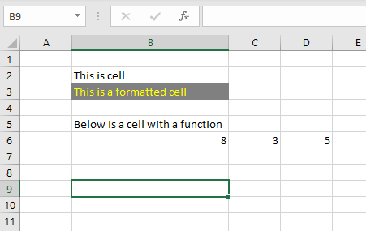

Data are everywhere, and more abundant than ever. An obvious explanation for this is the ease with which we can collect data today. In fact, most of us always walk around with a data collection device in our pockets. This device (your mobile phone) records and stores data about you throughout the day. Much of this data is readily available to us because data privacy policies regard it as personal [^3]. With some effort, you can extract your data from your mobile phone to explore, for example, your daily step count. I discovered that my phone has been collecting data for me since 2016, and I tend to walk fewer steps on Sundays than Saturdays (see Figure @fig-iphone).


[^3]: See e.g. [Apples Privacy Policy](https://www.apple.com/legal/privacy/en-ww/).

```{r}
#| label: fig-iphone
#| fig-align: 'center'
#| fig-height: 8
#| fig-width: 8
#| echo: false
#| message: false
#| warning: false
#| fig-cap: "Step count data from my iPhone displayed as all avalable data points (A, after data cleaning) and average step per weekday, per year and season (B)."


library(tidyverse)
library(lubridate)
library(cowplot)


steps <- read_csv2("./data/steps.csv") %>%
  
  mutate(start = dmy_hm(Start), 
         finish = dmy_hm(Finish)) %>%
  

  dplyr::select(start, finish, steps = `Steps (count)`) %>%

  mutate(
    date = format(start, '%Y-%m-%d'),
    month = format(start, '%m'),
    span = (as.numeric(finish - start)/60)/60,
         
         year = format(start, '%Y'), 
         day_of_week = weekdays(start), 
         season = if_else(month %in% c("01", "02", "12"), "Winter", 
                          if_else(month %in% c("03", "04", "05"), "Spring", 
                          if_else(month %in% c("06", "07", "08"), "Summer", 
                          "Autumn")))) %>%
  
  # Remove records that span more than 9 hours
  filter(span < 9) 


steps_fig1 <- steps %>%
  mutate(date = ymd(date)) %>%
  filter(steps < 10000) %>%
  
  ggplot(aes(date, steps)) + geom_point(shape = 21, fill = "blue", alpha = 0.4) + 
  scale_y_continuous(limits = c(0, 2000)) +
  labs(y = "Step (counts)", 
       x = "Date") + 
  theme_minimal()


steps_fig2 <- steps %>%
  group_by(year, day_of_week, season, date) %>%
  summarise(steps = sum(steps)) %>%
  
  group_by(year, day_of_week, season) %>%
  summarise(steps = mean(steps)) %>%
  
  
  mutate(day_of_week = if_else(day_of_week == "mandag", "Monday", 
                               if_else(day_of_week == "tirsdag", "Tuesday",
                                       if_else(day_of_week == "onsdag", "Wednesday",
                                               if_else(day_of_week == "torsdag", "Thursday",
                                                       if_else(day_of_week == "fredag", "Friday",
                                                               if_else(day_of_week == "lørdag", "Saturday","Sunday")))))),
         day_of_week = factor(day_of_week, levels = c("Monday",
                                         "Tuesday", 
                                         "Wednesday",
                                         "Thursday",
                                         "Friday",
                                         "Saturday",
                                         "Sunday")), 
         season = factor(season, levels = c("Winter", "Spring", "Summer", "Autumn"))) %>%
  
  filter(year != "2016") %>%

  ggplot(aes(day_of_week, steps, group = year)) + geom_line() + facet_grid(year ~ season) + 
  
  labs(y = "Average steps per day", 
       x = "Day of the week") + 
  scale_x_discrete()+ 
  theme_minimal() +
  theme(axis.text.x = element_text(size = 8, angle = 45, hjust = 1))
  
  
  plot_grid(steps_fig1, 
            steps_fig2, ncol = 1, 
            rel_heights = c(0.5, 1), 
            labels = "AUTO", 
            label_size = 12)


```


Data are also collected and stored in publicly available databases. Such databases are created for the purpose of storing specific types of data, such as soccer[^4] or biathlon results[^5], or biological information, such as gene sequences[^6]. Even data from scientific studies are often publicly available[^7], meaning we can perform scientific studies on unique data sets without collecting the data ourselves. 

[^4]: [understat.com](https://understat.com/) stores match specific data from major leagues. Data are available through software packages such as [`worldfootballR`](https://jaseziv.github.io/worldfootballR/index.html)

[^5]: [biathlonresults.com/](https://biathlonresults.com/) hosts results from the international biathlon federation. An example of analyzed data can be [seen here](https://sciathlon.github.io/post/biathlon_data_analysis/).

[^6]: [Ensembl](https://www.ensembl.org/) and the [National center for biotechnology information](https://www.ncbi.nlm.nih.gov/) are commonly used databases in the biomedical sciences.

[^7]: We published our raw data together with a recent paper (Mølmen et al 2021 [doi: 10.1186/s12967-021-02969-1.](https://translational-medicine.biomedcentral.com/articles/10.1186/s12967-021-02969-1)) together with code to analyze it in a [public repository](https://github.com/dhammarstrom/rnaseq-copd).

Clearly, the modern digital world provides us with many opportunities to analyze data, and with that, to learn more about our surroundings. However, our ability to learn from data is in many ways limited. Data may be recorded in a form that removes necessary details, data might be missing, or we might not know how the data collection process was carried out. In this chapter, we will discuss some fundamental concepts concerning data that we might want to analyze to learn more about the world.

## Data collection, measurements, and variables
In scientific studies, data collection is a central activity used to gather data for analysis. The data collection process may be more or less structured. For instance, an experiment is a type of structured data collection where data are recorded at specific time points with pre-determined measurements. In contrast to experimental research, some types of observational research may be characterized as less structured, for example, when a researcher might write field notes after a day of observing some activity of interest, or when unstructured data, such as health records, are collected for subsequent analysis.

Once collected, the data usually needs some processing to go from raw data to analyzable data, where the latter allows for direct analysis of the data. For example, a lot of effort might go into converting field notes into analyzable data. Similarly, raw data from a physiological experiment may need substantial processing before any formal statistical treatment.

The goal of processing raw data is to construct variables of interest. For example, a VO2max test needs data cleaning to extract the highest recorded oxygen consumption during the test, often averaged over 30 seconds [@wasserman2005, pp. 80]. A variable can be defined as "a property with respect to which individuals in a sample differ in some ascertainable way" [@sokal2012, pp. 11]. Sokal and Rohlf point out that variation is a key characteristic of a variable; if the measurement cannot vary between individuals, it is not a variable [@sokal2012].

From the above discussion, we see that the variables that we are analyzing in our data sets are connected to the underlying phenomena that we are trying to study through multiple steps that include measurements or observations and data processing. Together, these steps can obscure the relationship between our data variable and the phenomena that give rise to the data. Another possibility is that we are not actually measuring what we think we are measuring at all. With some hard work, we can determine whether we are actually measuring what we want and whether we can do it reliably. We will discuss this in detail later in the course.

### Different kinds of variables
Depending on the type of data we are collecting, the resulting variable can be characterized in different ways. Categorical variables are variables that consist of discrete groups. For example, cars may be categorized into groups depending on their type of engine, such as gasoline, diesel, or electric. Athletes may be classified based on their main competitive event, such as long jump, distance running, or sprint running. Sex is another categorical variable, usually treated as a binary category with females and males in biomedical research. The above examples are categories without a natural order for sorting; distance running is not greater than long jump, just different. When a variable contains this kind of data, we usually call it a nominal variable.

When a categorical variable can be ordered, such as time points in a sequence of events, size categories of fish, or performance level of athletes (Olympic, world-class, national level), we call it an ordinal variable. Although the ordinal variable can be sorted based on some characteristic of the levels of the variable, we cannot be sure that categories are equally spaced. For example, the distance between levels 1 and 2 may not have the same magnitude as the distance between levels 2 and 3.

A variable that retains the same magnitude difference in equally spaced intervals is said to be on an interval scale. When we measure something using an interval scale, we use an arbitrary zero, such as temperature measured using the Celsius scale. In contrast, when we measure temperature on the Kelvin scale, we are using a ratio scale. This scale has an absolute zero, allowing us to calculate a ratio between two observations on the scale. 

There is a hierarchy of information in the four scales of measurement described above. We can easily transform a ratio scale measurement to an interval or ordinal scale. However, this transformation will lead to the loss of information. For example, if a VO<sub>2max</sub> measurement (L%times;min<sup>-1</sup>, ratio scale) is used to create ordered categories of low, mid, and high fitness, we are unable to recover the absolute magnitude difference between observations. We cannot move from a less informative scale to a scale that contains more information.

When discussing the values of each scale, it may be relevant to talk about qualitative and quantitative measurements. A qualitative measurement is recorded in a categorical variable, such as eye color or sex. A quantitative measurement can be recorded on a scale containing information of magnitude or order. Some quantitative variables are restricted to whole numbers, or integers, such as the number of fish caught in a fishing competition or the number of goals scored in a soccer game. Other measurements can be recorded using a continuous scale, such as elapsed time in a race or the weight of the fish caught in the above-mentioned fishing competition.

### Missing data
Sometimes data is missing from our data sets. Missing data can be a serious problem when we wish to draw conclusions from data. The reasons for the missingness are often valuable information when we want to assess if the missing data affects our findings in a meaningful way. As a first step, it may be useful to use a specific entry for missing data. Commonly used entries in datasets to signify missing data include NA, na, NaN, and N/A, which can be read "not available" or "not applicable". Sometimes, datasets contain entries like -999, which is not a good idea as it might be interpreted by your computer as the number -999 and not missing data. An alternative to using special symbols is to leave variable entries with missing values blank. This, too, is a bad option as it might indicate that whoever entered the data forgot to enter this specific data point. It is also good practice to include another variable in data sets where missing values might affect analysis, containing a description of why the data is missing. 

Different software is treating missing values differently. For example, adding "NA" to an Excel spreadsheet might affect computations in the spreadsheet. When importing a spreadsheet containing "NA" into JASP or R, it assigns the missing observation a special meaning of missingness, which can be considered a good thing. This is one of many reasons to plan ahead when collecting and entering data.

## Data in statistical software
In computer software designed for statistical analysis, variable types can be explicitly declared. This means that you can change the variable type from, for example, interval to categorical. In JASP, we can change the variable type by changing the column type in the Edit Data tab. Available alternatives include Scale, Ordinal, and Nominal. Changing between them will affect which analyses are possible to perform with the variable.

Similarly, using R, we can code variables of different types. A numerical variable (consisting of numbers) can be of type `<dbl>` for "double", indicating numeric values with decimal points. This variable can be converted to an integer variable `<int>`. A categorical variable is usually coded as a factor variable `<fct>`. Factors in R contain additional information, such as levels for ordering and labels for displaying additional descriptive information. Sometimes we need to construct a factor variable from a character variable (`<char>`). A character variable has no information on level, R regards it as a variable containing text. To convert between variables in R, there are special functions like `as.numeric`, `as.integer`, and `as.character`. A factor is created and manipulated using the `factor` function. 

Both JASP and R have very reasonable defaults for reading data and usually aim for the most informative type of variable when we import data. Things can go wrong when a data variable mixed data types, for example, numerical data with text. In such a case, R and JASP will resort to importing the variable to a text variable instead of a numeric variable. As mentioned above, planning for how to use the data in analysis is a good idea when collecting data, as this will affect how software like JASP and R will interpret imports. We will now take a step back and talk about data sets and how to organize them.


## Storing data in spreadsheets and understanding tabular data

We have previously mentioned spreadsheets like those created in Excel. These are great but not great for reproducible science or data analysis. This drawback is because they are not easily documented and scripted. The data is part of the analysis! Another danger with spreadsheets (like MS Excel) is that it re-formats your data. Re-formatting is such a big problem for scientists that they have started renaming genes to avoid confusion[^rename-genes]


[^rename-genes]: See [this](https://www.theverge.com/2020/8/6/21355674/human-genes-rename-microsoft-excel-misreading-dates). 

Errors are frequent in spreadsheets, not only because of renaming [@RN2927], but also because of wrong formatting of formulas [@RN2928]. These are both reasons for using spreadsheets only for what they do best: data input and storage [@RN2391]. Before going in to details about how to use your spreadsheet software and to avoid catastrophe, it's good to know a little about the capabilities of your spreadsheet software.

### Cells and simple functions

A spreadsheet consists of cells, these can contain values, such as text, numbers, formulas and functions. Cells may also be formatted with attributes such as color or text styles. Below is an example of some data entered in a spreadsheet (@fig-excel-spreadsheet).

{#fig-excel-spreadsheet}


Cell B6 contains a simple formula: `= C6 + D6`. This formula adds cells `C6` and `D6` resulting in the sum, 8. In formulas, mathematical operators can be used ($+, -, \times , \div$ ). Formulas can be also extended with inbuilt function such as showed in @tbl-excelfunctions.


| Function | English | Norwegian |
| --- | --- | --- |
| Sum   | `SUM()`| `SUMMER()`|
| Average         | `AVERAGE()`          | `GJENNOMSNITT()`  |
| Standard deviation   | `STDEV.S()`          | `STDEV.S()`  |
| Count             | `COUNT()`       | `ANTALL()` |
| Intercept |    `INTERCEPT()`       | `SKJÆRINGSPUNKT()` |
| Slope  | `SLOPE()` | `STIGNINGSTALL()` |
| If  | `IF()`  | `HVIS()`  |

: Often used functions in excel {#tbl-excelfunctions}

The sum, average, standard deviation, and count are simple functions for summarizing data. Intercept and slope are functions used to get simple associations from two sets of numbers (based on a regression model). The IF function is an example of a function that can be used to enter data in a cell conditionally. For example, IF cell A1 contains a certain number, then cell B1 should display another specified text.

When looking for tips and tricks online, you may come across functions for excel in other languages than what is installed on your computer. To translate functions and for a complete overview of functions included in Microsoft Excel, see this website [en.excel-translator.de/](https://en.excel-translator.de/).


### Tidy data and data storage

Hadley Wickham (the author of many commonly used R packages) quotes Tolstoy when describing the principle of tidy data [@RN1956]. This Tolstoy quote is so famous that it has given name to a principle. The principle in turn comes in many variants but basically states that there are endless possibilities for something to break but only a limited number of ways that same thing can work[^anna-karenina-principle]. This principle can be applied to data sets. There are endless ways that formatting of data sets can be problematic, but a limited set of ways that formatting will allow for analysis.    

[^anna-karenina-principle]: See https://en.wikipedia.org/wiki/Anna_Karenina_principle

::: {.column-margin}

```{r tolstoy, echo=FALSE, message=FALSE, fig.cap = "Leo Tolstoy, the author of the book Anna Karenina. (Source: https://en.wikipedia.org/wiki/Leo_Tolstoy)", fig.scap = "Leo Tolstoy", out.width="50%", fig.align='center'}

```


{width=50%}


:::

A tidy data set consists of *values* originating from *observations* and belonging to *variables*. A variable is a definition of the values based on attributes. An observation may consist of several variables [@RN1956]. A tidy data set typically has one observation per row and one variable per column.

Let's say that we want to collect data from a strength test. A participant (**participant** identification is a variable) in our study conducts tests before and after the intervention (**time** is a variable) in two exercises (**exercise** is a variable), and we record the maximal strength in kg (**load** is a variable). The data set will look like the table below (@tbl-tidydata).  


| Participant | Time| Exercise | Load |
| --- | --- | --- | --- |
| Bruce Wayne | pre | Bench press | 95 |
| Bruce Wayne | post | Bench press | 128 |
| Bruce Wayne | pre | Leg press | 180 |
| Bruce Wayne | post | Leg press | 280 |

: Example of tidy data {#tbl-tidydata}

Another example contains variables that actually carries two pieces of information in one variable. We again did a strength test, this time as maximal isometric contractions and in each test consisted of two attempts. We record this in two different variables, attempt 1 and 2. The resulting data set could look something like in Table @tbl-tidydata2.   

| Participant | Time | Exercise | Attempt1 | Attempt2 |
| --- |  --- | --- | --- | --- |
| Selina Kyle | pre  | Isometric | 81.3 | 92.5 |
| Selina Kyle | post | Isometric | 97.1| 114.1 |

: Another example of (almost) tidy data. {#tbl-tidydata2}


To make this data set tidy we need to extract the attempt information and record it in another variable as seen in @tbl-tidydata3.

| Participant | Time | Exercise | Attempt | load |
| --- | --- | --- | --- | --- |
| Selina Kyle | pre  | Isometric | 1 |  81.3 |  
| Selina Kyle | pre  | Isometric | 2 | 92.5 |
| Selina Kyle | post | Isometric | 1 | 97.1 |
| Selina Kyle | post | Isometric | 2 | 114.1|

: A third example of tidy data. {#tbl-tidydata3}

This transformation naturally gives additional rows to the data set. It is sometimes referred to as "long format" data instead of the structure where each attempt is given separate variables, called "wide format." You will notice during the course that the long format is convenient for most purposes. This is true when we create graphs and do statistical modelling. But sometimes, a variable must be structured in a wide format to allow certain operations.

If we follow what is recommended by Broman and Woo [@RN2391], it is clear that each cell in a spreadsheet should only contain one value. If we, for example, decide to format a cell to a certain colour, we add data to that cell on top of the actual data. You might add colour to a cell to remember to add or change data. However, this information is lost when you use the data set in other software. Instead, you should add another variable to allow such data to be properly recorded. Using a variable called `comments`, you can add text describing information about that particular observation, information that is not lost when you use the data set in another software. 

### Recording data

A trade secret[^trade-secret] from people who work all day with data and programming is that they are lazy. Lazy in the sense that you want to type as little as possible and avoid moving your arm to the computer mouse whenever possible. When recording data, we can be lazy too. We can do this by shortening variable names and not using CAPITAL letters when entering text in data storage. After a hard day at the keyboard, you will be happy to write `strtest` instead of `Strength Test`. The extra effort of using two capital letters might be the thing to tip you over the edge. However, we should not be too lazy either; variable names and values should be "short but meaningful" [@RN2391].


[^trade-secret]: A trade secret as in "not generally known to the public". See [en.wikipedia.org/wiki/Trade_secret](https://en.wikipedia.org/wiki/Trade_secret).


Data and variables should also be consistent. Do not mix data type; use a consistent way of entering e.g., dates and time, and do not use spaces or special characters. To enforce this, you might want to start your data collection by writing up a data dictionary describing all variables you collect. The dictionary can set the rules for your variables. This dictionary can also guide your data validation.

In Excel, you can use data validation to set rules for data entry. For example, if you have a numeric variable, you can set Excel only to accept numbers in a specified set of cells. Such rules make it harder to enter erroneous data.

### Saving data

Data from spreadsheets can be saved as special spreadsheet files, such as `.xlsx`. This format allows for functions, multiple spreadsheets in the same file (tabs), and cell formatting. You do not need this fancy format if you follow the tips described above and in [@RN2391]. Instead, you can store your data as a `.csv` file. This format may be read and edited with Excel (or another spreadsheet software) and in plain text. Data entered in this format (comma-separated values; csv) can look like this in a text editor:

```
 Participant;Time;Exercise;Attempt;load
 Selina Kyle;pre;Isometric;1;81.3  
 Selina Kyle;pre;Isometric;2;92.5
 Selina Kyle;post;Isometric;1;97.1
 Selina Kyle;post;Isometric;2;114.1
```

This format is quite lovely. The data takes little space; the simple format requires that data is well documented using e.g., a data dictionary; and it is available for many other software as the format is simple. You can document the data using a `README` file that could describe the purpose and methods of data collection, how the data is structured, and what kind of data the variables contains. A simple `README` file can be written in a text editor such as Notepad and saved as a `.txt` file. Later in this course, we will introduce a "markup" language often used to create `README` files containing a syntax that formats the text to a more pleasant style when converted to other formats.

