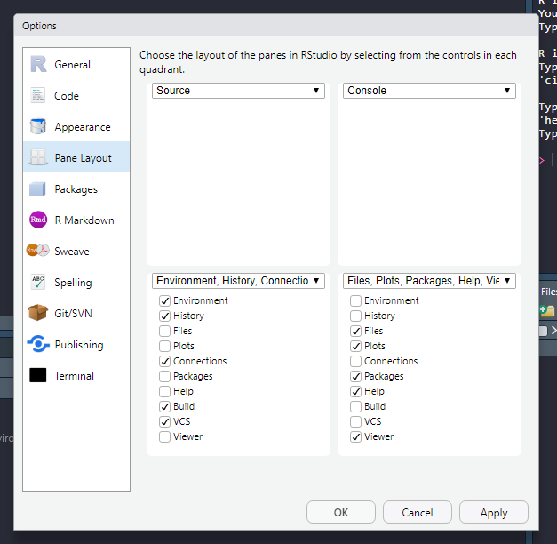

# Installing and starting up R (and R Studio)


This chapter contains step-by-step instructions for installing and running R and R Studio. It will also introduce you to some concepts when talking to R. By the end of this chapter you will be able to answer these questions:

- What is R and RStudio?
- How can I interact with R?
- What are the components of RStudio
- How do I maintain a reproducible work-flow in R and RStudio?

## Installing R

R is a free, [open-source](https://en.wikipedia.org/wiki/Open_source) software designed for statistical computing. We will use R as a part of a environment (using R Studio, introduced below). To download and install R:

1. Go to [https://cran.uib.no/](https://cran.uib.no/),
2. select your operating system (Download R for Windows, MacOS or Linux).
    - If you have Windows, choose `base`, click on "Download R (...) for windows", save and run the file. The installation process should be self explanatory.
    - If you have MacOS, download and install the latest release.
    
## Installing R Studio

[RStudio](https://www.rstudio.com/) is a software designed to make it easier to use R. It is free to download and use. It is designed as an integrated development environment that lets you organize your work together with R and other tools. Install it by going to [https://www.rstudio.com/](https://www.rstudio.com/). 

1. Select "Products" and RStudio
2. Go to desktop and select "DOWNLOAD RSTUDIO DESKTOP"
3. Select the free open source license and download the file made for your operating system (use the installers).


## Getting to know R and RStudio

R is a software used for scientific/statistical computing. If R is the engine, RStudio is the rest of the car. What does this mean?

When doing operations in R, you are actually interacting with R through RStudio. RStudio have some important components to help you interact with R.

### The source

The source is where you keep your code. When writing your code in a text-file, you can call it a script, this is essentially a computer program where you tell R what to do. It is executed from top to bottom. You can send one line of code, multiple lines or whole sections into R. In the image below, the source window is in the top left corner.

### Environment

The environment is where all your objects are located. Objects can be variables or data sets that you are working with. In RStudio the environment is listed under the environment tab (bottom left in the image).

Copy and run the code below.


```{r, eval = FALSE}

a <- c(1, 2, 4)

```

What happened in your environment?

### The console

Here you can directly interact with R. This is also where output from R is printed. In the image below, the console is in the top right corner.

### Files, plots, packages and help files

In RStudio files are accessible from the Files tab. When opening a project, the files tab shows the files in you root folder. Plots are displayed in the Plot tab. Packages are listed in the packages tab. If you access the help files, these will be displayed in the help tab. In the image below all these tabs are in the bottom right corner.

```{r rstudio-blank, echo=FALSE, message=FALSE, fig.cap = "RStudio when first opened up.", fig.scap = "A new RStudio session", out.width="50%", fig.align='center'}

knitr::include_graphics("./images/rstudio_blank.png")

```

### Customizing the apperance of RStudio

To access options for RStudio, go to Tools -> Global options

```{r rstudio-options, echo=FALSE, message=FALSE, fig.cap = "Accessing options for your RStudio IDE", fig.scap = "Access RStudio options", out.width="50%", fig.align='center'}

knitr::include_graphics("./images/rstudio_options1.png")

```


Under appearance you can customize the theme of RStudio, select something that is easy on the eye!


```{r rstudio-options2, echo=FALSE, message=FALSE, fig.cap = "Accessing options for your RStudio IDE and selection a theme", fig.scap = "Access RStudio apperance", out.width="50%", fig.align='center'}

knitr::include_graphics("./images/rstudio_options2.png")

```


Under pane layout, you can set where you want your tabs, I like to have the source on the left, above the environment. This way you can have the source window at full vertical size and still look at plots and the console to the right.


```{r rstudio-options3, echo=FALSE, message=FALSE, fig.cap = "Accessing options for your RStudio IDE and set the panes", fig.scap = "Access RStudio panes", out.width="50%", fig.align='center'}



```


## Reproducible computing

Computations are reproducible when you can show how they were performed. This is achieved by creating "programs" from where your analyses are done. In R, these programs are lines or R code stored in a text-file, either .R-files or .Rmd-files. .R-files are scripts only containing code and comments. A .Rmd-file is a special script combining text and computer code, when the Rmd-file is executed, it creates a report and outputs the results from the code.

This means that to work in a reproducible way, you need to script all your operations. 


```{r reproducible-computing, echo=FALSE, message=FALSE, fig.cap = "Reproducible vs. non-reproducible workflow", fig.scap = "Reproducible workflow", out.width="50%", fig.align='center'}


```


Importantly, in RStudio you can shut down storing temporary objects in a environment that is relaunched on start up. What is the consequence of having such a situation?

To disable this option, set save works pace to NEVER!

```{r settings-workspace, echo=FALSE, message=FALSE, fig.cap = "Set the workspace option to never save.", fig.scap = "Reproducible workflow without saving workspace", out.width="50%", fig.align='center'}


```


## Packages

The R ecosystem consists of packages. These are *functions* organized in a systematic manner. Functions are created to perform a specialized task. And packages often have many function used to do e.g. analyses of a specific kind of data, or more generl task such as making figures or handle data.  In this course we will use many different packages, for example [dplyr](https://dplyr.tidyverse.org/), [tidyr](https://tidyr.tidyverse.org/) and [ggplot2](https://ggplot2.tidyverse.org/). dplyr and tidyr are packages used to transform and clean data. ggplot2 is used for making figures.

To install a package, you use the `install.packages()` function. You only need to do this once on your computer (unless you re-install R). You can write the following code in your console to install dplyr.

```{r, eval = FALSE}
install.packages("dplyr")
```

Alternatively, click "Packages" and "Install" and search for the package you want to install. To use a package, you have to load it into your environment. Use the `library()` function to load a package.

```{r, eval = FALSE}
library("dplyr")
```


## Installing and using `swirl`

Swirl is a great way to get to know how to talk with R. Swirl consists of lessons created for different topics. Install swirl by typing the following into your console:

```{r, eval = FALSE}
install.packages("swirl")
```

Or select swirl in the Package/Install menu. 
