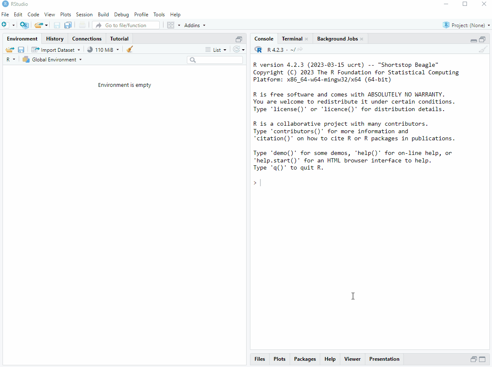
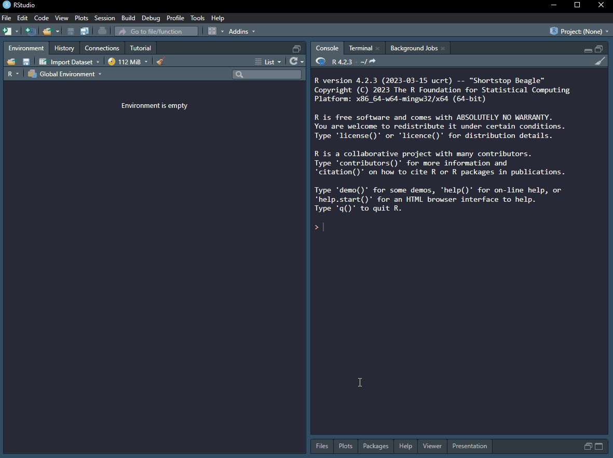
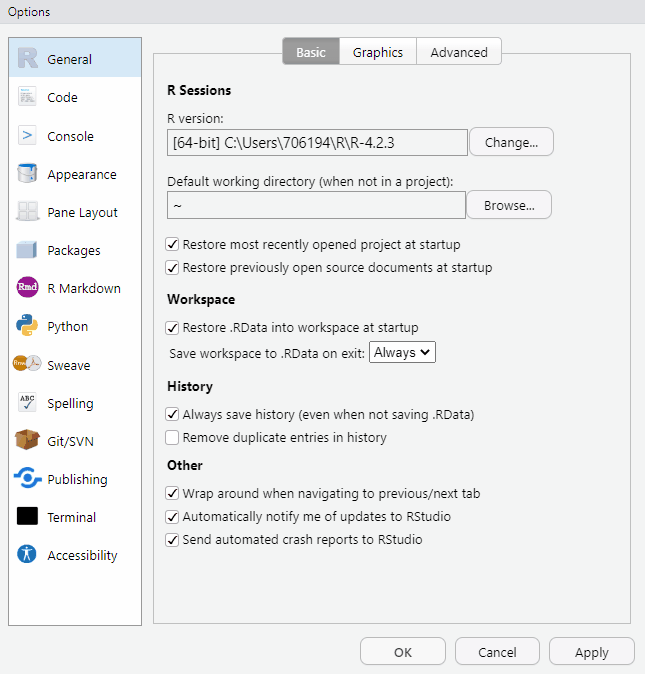
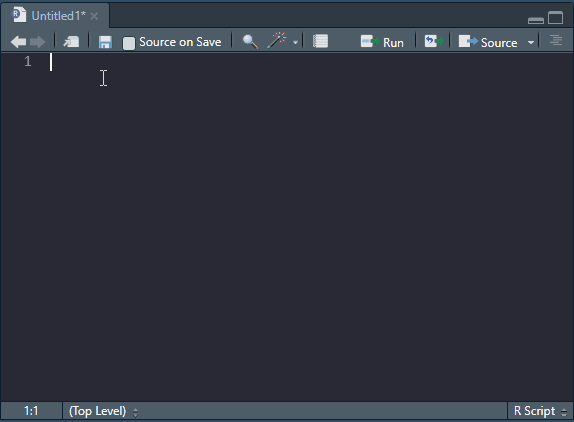
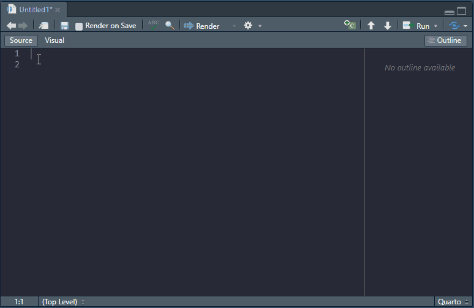

# Getting to know R and RStudio

In [Chapter 2](01-intro-to-data.qmd), we went through all the trouble of installing and setting up the tools needed to become data scientists. It is now assumed that everything was indeed installed and working. In this chapter we will introduce the usage of R and Rstudio. First we will set up and customize RStudio and then learn how to communicate with R.

## The Anatomy of RStudio

The appearance of RStudio can be changed for a more pleasant user experience. I like a dark theme as it is easier on the eye. We can also move the different components of RStudio. I like to have the console on the top right and the source on the top left. I think this makes it easier to see output when coding interactively. All this will be clearer as thing evolve, but for now, start R Studio, go to Tools > Global options and make it personal (see @fig-customize)!

{#fig-customize}

As you may have spotted in the image above, it is possible to change the font of your editor. I like [Fira code](https://github.com/tonsky/FiraCode/wiki/RStudio-instructions). 


::: {.callout-tip}
## Defining concepts

**Source editor**: Is where scripts are edited. 

**Environment**: In R, the environment is where data variables and structures are saved during execution of code.

**Script**: Your script is the document containing your computer code. This is your computer program (using a loose definition of a software program).

**Variables**: In R, variables are containers for data values. 

**Workspace**: This is your environments as represented on your computer. A workspace can be, but should not be saved between sessions.

:::

### The source editor

The source editor is where you edit your code. When writing your code in a text-file, you can call it a script, this is essentially a computer program where you tell R what to do. It is executed from top to bottom. You can send one line of code, multiple lines or whole sections into R. In the image below (@fig-interactionrstudio), the source window is in the top left corner.

### Environment

The environment is where all your objects are located. Objects can be variables or data sets that you are working with. In RStudio the environment is listed under the environment tab (bottom left in the image).

Copy the code below to a R script. To run it line by line, set your cursor on the first line a press Ctrl+Enter. What happened in your environment? Press Ctrl+Enter again and you will see a plot in the plot window. Amazing stuff! 

```{r, eval = FALSE}

a <- c(1, 2, 3, 4)

plot(a)

```


### The console

By pressing Ctrl+Enter from the script, as described above, you sent your code to the console. You can also interact with R directly here. By writing `a` in the console and hitting enter you will get the value from the object called a. This means that it is also where output from R is usually printed. In the image below, the console is in the top right corner.

### Files, plots, packages and help files

In RStudio files are accessible from the Files tab. The files tab shows the files in you root folder. The root folder is where R will search for files if you tell it to. We will talk more about the root folder later in connection with projects. Plots are displayed in the Plot tab. Packages are listed in the packages tab. If you access the help files, these will be displayed in the help tab. In the image below all these tabs are in the bottom right corner. More on help files and packages later.

{#fig-interactionrstudio}


## Reproducible data science using RStudio

When starting to work more systematically in RStudio we will set some rules that will allow for reproducible programming. Remember from [Chapter 2](01-intro-to-data.html#replication-and-reproducibility) that part of a fully reproducible study is software/code that produces the results. It turns out that when working interactively with R you can fool yourself to believe that you have included all steps needed to produce some results in your script. However, variables may be stored in your environment but not by assigning values to them in your script. This will become a problem if you want to share your code, a certain value/variable needed to make the program work may be missing from your script.

To avoid making such a mistake it is good practice not to save variables in your environment between sessions, everything should be scripted and documented and assumed not defined elsewhere. In RStudio we can make an explicit setting Not to save the workspace (See @fig-saveworkspace).

{#fig-saveworkspace}

## Basic R programming, first steps

You have already been asked to run commands in your version of RStudio, below we will run some very basic commands here on this website to get first hand experience with the R language. Below you will find several script boxes that you may edit before pressing *Run Code*. When you run code, the results you would see in your terminal will appear below the script.

### Objects and assignment

Everything in R are objects [@chambers2009]. What does this mean? Let's say that we want to store some information in R, this information is a value, let's say the number *12*. To store this information we will *assign* the value to an *object* and call this object `twelve`. An *object* is a container of data "of all kinds" [@chambers2009, p. 111] that we create in our working memory to hold our data (the value). We assign the value to our object by using an *assignment operator*. The most common assignment operator is `<-`. Think of the assignment operator as an arrow pointing from the value towards the object, like this:

```{r}
#| eval: false

twevle <- 12

```

We can also reverse the direction of the assignment operator and make the object and value change places. 

```{r}
#| eval: false

12 -> twelve

```

To call an object, or tell R that we want to look at our object, we would simply type the object name in our R console. We may try this in the R script box below. I have already entered some information in the script, these are comments starting with the hash symbol (`#`). The comments tells us what to do. You can enter R code on the line below the comments, R will ignore everything following a comment sign and start to interpret code again on the subsequent line. When you have entered your code, press "Run Code" to inspect the results.


```{webr-r}
# Store the value 12 in an object called twelve

# Call the object 'twelve'

```

It is also possible to use the equal sign (`=`) to assign data to objects. The equal sign used as an assignment operator, as in `twelve = 12`, is equivalent to `twelve <- 12`.

### R as a giant calculator

R can make use of all basic arithmetic operators like plus (`+`), minus (`-`), divided by (`*`) and multiplied by (`/`). These operators can be used on objects, and directly on values. In the script box below, try to calculate (and store) the following:

$$y = 5 * 2 + 1 * 0.5$$
Then use the object and add 10, store the new result in a new object called `z`.

```{webr-r}
# Use 'y <-' to assign the expression to the object y 
```

A possible solution to the above challenge would be

```{r}
#| echo: true

y <- 5 * 2 + 1 * 0.5

z <- y + 10

```

The result of your computations should be `r z`. In the above example we have discovered that mathematical expression can be written using values and objects already stored in the environment.

We can also use *functions* to perform mathematical operations on objects. Examples of such functions are `log()`, `exp()`, `abs()` and `sqrt()`. A function is a special object that itself can be use other objects (or variables/values) as input. A function often takes arguments, these arguments are supplied to the function inside its brackets. 

The `log()` function returns the natural logarithm of a numeric object. Mathematically, the log function returns the exponent ($x$) with the base $e$ that give us our input number $y$ ($e^x = y$). To get the natural logarithm of 100 we would use R and write `log(100)` which results in `r log(100)`. This corresponds to $100 = 2.718282 ^ {4.60517}$. The base $e$ must be raised to the power of 4.60517 to yield 100.

What is the natural logarithm of 50? Try to calculate it in the script box below.

```{webr-r}
# What is the natural logarithm of 50?


```

We can of course make similar computations on stored objects.

```{webr-r}
# What is the natural logarithm of 25?
my_object <- 25

log(my_object)
```

Above we have learned that numbers and objects that store numbers can be used in computations using basic arithmetic operators and functions that perform mathematical operations.

### Different types of data

Above we have worked on numeric data. These are values represented either as integers (whole numbers; e.g. 1, 2, 3) or what is sometimes called "double" or "numerical", i.e. decimal numbers (e.g. 1.2 or 2.781).

In the code example below we will store an integer and a double and inspect its "class", the class decides what R can do with an object.

```{r}
#| eval: false

num <- as.numeric(2.456)

int <- as.integer(2)

class(num)
class(int)


```

Use the script box below to test out the code example. What is the purpose of the `class` function?

```{webr-r}

```

There are other types of data that we can use in R, these are character, logical and complex (we will not discuss complex numbers further here).

A character or string value can be though of as text, e.g. `"this is a character"` could be the data contained in a character object. A logical value is either `TRUE` or `FALSE`. This type of data is also known as [Boolean](https://en.wikipedia.org/wiki/Boolean_data_type)

As mentioned above, the type of data restricts what operations that can be performed using the data. For example, we cannot do mathematical operations on characters or logicals. Try out the code below and inspect the results. What does the error message tells you?

```{webr-r}

char <- "a"

logic <- TRUE

num <- 3.456

int <- as.integer(2)


num + int

num + int + char + logic


```

We can define data types by using functions such as `as.numeric()` or `as.character()` these will tell R to try to convert data to a specific type. If this is not possible you will get an error message. Try the code below and inspect the error message. 

```{webr-r}

char <- "this is a string"

as.numeric(char)

```


The result of the conversion of a character to a numeric is `NA`, that can be read as **N**ot **A**vailable. `NA` is an example of a protected symbol in R. We cannot use this as a name of an object. It is used to indicate missingness, or missing values.

In the above section we have identified different type of data that are used in R


### Combining data

So far we have work on single valued objects. This is not very efficient. Conveniently, R has an efficient way of working with data using vectors. A vector is a structure for combining data of the same type. For example, we can construct a numeric vector of heights using the combine function `c()`. Let's say `height <- c(1.74, 1.81, 1.51, 1.92)`. An additional vector of weights can also be constructed as `weight <- c(85.1, 81.1, 48.9, 88.4)`. We can use these vector to do calculations, these calculations will be "vectorized".

The body mass index is calculated as 

$$BMI = \frac{\text{Weight (kg)}}{\text{Height (m)}^2}$$
Using vectorized operations we can calculate BMI for *each row* of the two vectors defined above simply using `BMI <- weight/height^2`. Modify the code below to inspect each vector and the resulting `BMI` vector.

```{webr-r}
weight <- c(85.1, 81.1, 48.9, 88.4)
height <- c(1.74, 1.81, 1.51, 1.92)

BMI <- weight/height^2

```

Vectors can be combined into data frames. These are convenient tabular two-dimensional representations of multiple, equal length vectors. To combine the vectors defined above into a data frame we could directly put them in a data frame. In the example below we use `df` to name the data frame. To add a new variable (or vector) to the data frame we can use the `$` operator which creates a new variable (or overwrites it!). Notice also that we access weight and height in the existing data.frame using the `$` operator.

```{webr-r}

df <- data.frame(weight = c(85.1, 81.1, 48.9, 88.4), 
                 height = c(1.74, 1.81, 1.51, 1.92))

df$BMI <- df$weight / df$height^2

```

Alternatively we may access specific rows and columns of data frames using brackets. The syntax is `df[`**row**`,`**column**`]`. To access all row of a specific column, for example "weight" we would write `df[,1]`since weight is the first column of the data frame called "df".

Try to calculate BMI using the row index method explained above.

A data frame can combine different data types in the same data structure. The data are, as indicate above related by row as one row contains e.g. weight and height from one individual. We might add information on the individuals by adding variables of different types. Modify and run the code below to inspect the data frame.


```{webr-r}

df <- data.frame(name = c("David", "Even", "Julie", "Hubert"), 
                 male = c(TRUE, TRUE, FALSE, TRUE), 
                 weight = c(85.1, 81.1, 48.9, 88.4), 
                 height = c(1.74, 1.81, 1.51, 1.92))


```

We can further combine data into a list. A list can contain different data structures or values/objects. A list can even contain other lists. To combine objects into a list we simply put them into the `list()` function. To access objects in lists we can use double brackets. E.g., using the code below we could access the second item in the list using `my_list[[2]]`. Objects in lists can also be named, in such cases we can use the `$` operator to access them. Modify the code below to explore this concept.

```{webr-r}

df <- data.frame(name = c("David", "Even", "Julie", "Hubert"), 
                 male = c(TRUE, TRUE, FALSE, TRUE), 
                 weight = c(85.1, 81.1, 48.9, 88.4), 
                 height = c(1.74, 1.81, 1.51, 1.92))

a_value <- 56

multiple_characters <- c("this", "is", "a", "string")

my_list <- list(df, a_value, characters = multiple_characters)


```


### Logical operations and conditions 


## Basics R programming, Installing and using `swirl`

Swirl is a great way to get to know how to talk with R. Swirl consists of lessons created for different topics. Install swirl by typing the following into your console:

```{r, eval = FALSE}
install.packages("swirl")
```

When `swirl`is installed you will need to load the package This means that all functions that are included in package becomes available to you in your R session. To load the package you use the `library` function.

```{r, eval = FALSE}
library("swirl")
```

When you run the above command in your console you will get a message saying to call `swirl()` when you are ready to learn. I would like you to run the course "R Programming: The basics of programming in R". Swirl will ask if you want to install it. After installation, just follow the instructions in the console. To get out of swirl, just press ESC.


## File formats for editing and executiong R code

### R scripts

RStudio has capabilities to highlight code for multiple languages. We will focus on R. The most basic file format for R code is an R script, as we have already touched upon. An R script contains code and comments. Code is executed by R and comments are ignored. Ideally, R scripts are commented to improve readability of what the do. Commenting code is also a good way of creating a roadmap of what you want to do. In the image below (@fig-rscript), R code is written based on a plan written with comments. Note that when a line starts with at least one `#` it is interpreted by R as a comment.     

{#fig-rscript}

Try the code for yourself to see what it produces. The details will be covered later.

```{r}
#| eval: false

## Create two vectors of random numbers
x <- rnorm(10, 0, 1)
y <- rnorm(10, 10, 10)

## Create an x-y plot of the two vectors
plot(x, y)

```


### R markdown and quarto files

The more advanced file formats for R are RMarkdown (`.rmd`) and quarto (`.qmd`) files. These have the capabilities of combining formatted text with computer code. The source document may contain multiple pieces of code organized in code chunks together with text formatted with markdown syntax. A meta data field in the top of the source file specifies settings for the conversion to output formats. Multiple output formats are available, including HTML, word and PDF. The image below shows the basic outline of a very simple quarto file destined to create a HTML document. 

Notice also that RStudio offers an visual editor where the output is approximated and formatting is available from a menu.

Adding headlines and makes it possible to navigate the document through the outline or the list of components in the bottom of the document.



[R markdown](https://rmarkdown.rstudio.com/) and [quarto](https://quarto.org/docs/guide/) have many similarities as the basic organization is similar between the two. The text parts are written using a special syntax, markdown. The point of markdown is that you will use the same syntax that is later possible to convert to multiple formats. The syntax let's you do all formatting explicitly, for example instead of getting your mouse to superscript some text you can add syntax `a^2^` to achieve a^2^.

A full guide to RMarkdown can be found on the official [R markdown web pages](https://rmarkdown.rstudio.com/lesson-1.html). I suggest you take the time to get an overview of this language as it will make you more fluent in the tools that enables reproducible computing. When writing R markdown, it is handy to have a *cheat sheet* close by when writing, [here is an example for Rmarkdown](https://www.rstudio.com/wp-content/uploads/2015/02/rmarkdown-cheatsheet.pdf), and here is [another one for quarto](https://rstudio.github.io/cheatsheets/html/quarto.html) [^1].

[^1]: Cheat sheets are available in R Studio: *Help \> Cheatsheets*

#### Microsoft Word intergration in R Markdown and Quarto

Sometimes it is useful to "knit" to a word file. For example when you want to share a report with fellow students who are not familiar with R. R Markdown/Quarto can be used as a source for word documents (.docx).

To create a word document from your Rmd-file/qmd-file you need a working installation of Microsoft Word. Settings for the output is specified in the YAML metadata field in the Rmd-file. This is the first section of a Rmd file, and when you want it to create a word file you specify it like this:

    ---
    title: "A title"
    author: Daniel Hammarström
    date: 2020-09-05
    output: word_document
    ---

The `output: word_document` (or `format: docx` when using quarto) tells R to create a word file. If you are not happy with the style of the word document (e.g. size and font of text) you can tell R to use a template file. Save a word file that you have knitted as `reference.docx` and use specify in the YAML field that you will use this as reference. [See here for the equivalent formatting of quarto documents](https://quarto.org/docs/reference/formats/docx.html)

    ---
    title: "A title"
    author: Daniel Hammarström
    date: 2020-09-05
    output: 
            word_document:
                    reference_docx: reference.docx
    ---

Edit styles (Stiler in Norwegian) used in the reference file (right click on the style and edit). For example, editing the "Title" style (Tittel in Norwegian) will change the main titel of the document. After you have edited the document, save it.

When you knit the document again, your updated styles will be used your word document.

[Here](https://rmarkdown.rstudio.com/articles_docx.html) you can read more about using R Markdown together with word. If you do not have word installed, you can also use Open Office. Read more about it [here](https://bookdown.org/yihui/rmarkdown/opendocument-text-document.html).

#### Adding references to R Markdown and Quarto files

References/citations can be added to the report using the `bibliography` option in the YAML field. Citations needs to be listed in a file, multiple formats are availiable. A convenient format is bibtex. When using this format, create a text file with the ending `.bib`, for example, `bibliography.bib`.

The `bibliography.bib`-file needs to be activated in the YAML-field. Do it by adding this information:

    ---
    title: "A title"
    author: Daniel Hammarström
    date: 2020-09-05
    output: 
            word_document:
                    reference_docx: reference.docx
    bibliography: bibliography.bib
    ---

Add citations to the file in bibtex-format. Here is an example:

    @Article{refID1,
       Author="Ellefsen, S.  and Hammarstrom, D.  and Strand, T. A.  and Zacharoff, E.  and Whist, J. E.  and Rauk, I.  and Nygaard, H.  and Vegge, G.  and Hanestadhaugen, M.  and Wernbom, M.  and Cumming, K. T.  and Rønning, R.  and Raastad, T.  and Rønnestad, B. R. ",
       Title="{Blood flow-restricted strength training displays high functional and biological efficacy in women: a within-subject comparison with high-load strength training}",
       Journal="Am. J. Physiol. Regul. Integr. Comp. Physiol.",
       Year="2015",
       Volume="309",
       Number="7",
       Pages="R767--779",
       Month="Oct"}

The part that says `refID1` can be edited to something appropriate. This is a reference identification, you use it to get the citation into the text. When citing you do it in the form

    Blood flow-restricted training leads to similar adaptations as traditional training [@refID1].

This will appear in text as:

> Blood flow-restricted training leads to similar adaptations as traditional training [@refID1].

The reference will end up in the end of the document (as on this webpage).

You can gather references in bibtex format from Oria (use the BIBTEX icon) and from PubMed using [TeXMed](https://www.bioinformatics.org/texmed/). You can also export reference in bibtex format from citation software like Endnote or Zotero. Make sure you check all references when entering them, especially MedTex gives some problems with "scandinavian" letters (å æ ä ø ö).

Recently RStudio added support for adding citations inside the visual markdown editor.


## Packages

The R ecosystem consists of packages. These are *functions* organized in a systematic manner. Functions are created to perform a specialized task. And packages often have many function used to do e.g. analyses of a specific kind of data, or more general task such as making figures or handle data.

In this course we will use many different packages, for example [dplyr](https://dplyr.tidyverse.org/), [tidyr](https://tidyr.tidyverse.org/) and [ggplot2](https://ggplot2.tidyverse.org/). dplyr and tidyr are packages used to transform and clean data. ggplot2 is used for making figures.

To install a package, you use the `install.packages()` function. You only need to do this once on your computer (unless you re-install R). You can write the following code in your console to install dplyr.

```{r, eval = FALSE}
install.packages("dplyr")
```

Alternatively, click "Packages" and "Install" and search for the package you want to install. To use a package, you have to load it into your environment. Use the `library()` function to load a package.

```{r, eval = FALSE}
library("dplyr")
```


