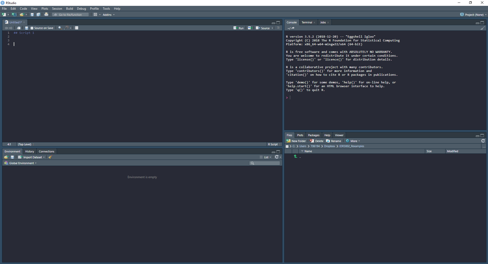

```{r nojekyll, message=FALSE, warning=FALSE, message=FALSE, echo = FALSE}
file.create('./docs/.nojekyll') # this makes hosting on github possible
```


# Introduction

Welcome to the course **Quantitative methods and Statistics (IDR4000)**. The course aims to give students an overview of methodological aspects within the field of sport and exercise-physiology. Specifically, planning, conducting and analyzing research projects with human participants will be covered. These course notes covers *almost* the entire course through the combination of video lectures, tutorials and references to the course literature and external resources.


<center>

<iframe width="450" height="300" frameborder="0" scrolling="auto" marginheight="0" marginwidth="0" src="https://media.inn.no/Mediasite/Play/a236796813414a89b4136a7f0978cc201d" allowfullscreen msallowfullscreen allow="fullscreen"></iframe>

</center>


## Quick links:

**[Study questions](#study-questions)**


## Practical information

### Learning objectives
Learning objectives can be read in Norwegian [here](https://www.inn.no/content/view/full/163709/language/nor-NO).

### Learning strategies
The course will include lectures, laboratory exercises, computer exercises, seminars and student presentations. Lectures will be held on-line (zoom), as pre-recorded in this book and in-person on campus. Due to the current pandemic, you are required to do laboratory exercises in your cohort. 
Computer exercises require that you have special computer software installed on your computer. The software is free (see specific chapters in these course notes).

Assignments will be presented in this text with information on how to hand them in. The whole course is evaluated based on a portfolio (see below).

### Course evaluation
As a student you can contribute to the quality of the course by engaging in course evaluation throughout the course. You will be asked to answer a pre-course questionnaire about your *expectations* and a post-course questionnaire about your *experiences*. You are also welcomed to take part in systematic discussions during the course about the quality of teaching and course material. With these notes I want to underline the importance of student participation in the continuous development of the course (and program) teaching/learning qualities.


### Lecturers and course administration

In order of appearance 

- Daniel Hammarström (daniel.hammarstrom@inn.no), is responsible for course administration and will be teaching statistics and molecular methods.
- Kristian Lian, Ingvill Odden and Lars Nymoen will act as teacher assistants in organizing methods in the physiology lab.
- Stein Olaf Olsen will act as a teacher assistant in the molecular lab.
- Prof. Carten Lundby will cover aspects CO<sub>2</sub> re-breathing techniques (physiology).
- Prof. Finnur Dellsén will cover philosophy of science. 
- Prof. Stian Ellefsen will teach molecular methods. 

### Updates, notifications and general communication

These course notes **will be** updated during the course. General information and last minute changes will be posted on Canvas, make sure to check it as part of your daily study routine. 


### Literature
A full list of recommended literature can be found [here](https://www.inn.no/pensum). Literature will be referenced in specific sections in these course notes.

### Grades
The course is graded pass/fail.

### Language 
My (Daniel) first language is Swedish, I'm sure most of you will understand what I'm talking about. However, due to the fact that we accept international students to the program, most written communication and some lectures will be in English. You are not expected to write in English, it is however possible!


## Assignments and Portfolio exam

The course is based on several assignments. Some of these assignments are to be handed in as part of a portfolio exam upon which your grade is based. 

Assignments that are due during the course (arbeidskrav) are expected to be further improved after feedback from fellow students and teachers before inclusion in your portfolio.

The table below shows all assignments that are part of the course. Some are not to be included in the portfolio and some assignments are group assignments (see Table).


|Assignment |Due date |Included in portfolio |Group assignment|
| :--- | :---: | ---:| ---:|
|Descriptive statistics, reliability and validity, tools for reproducible data science (See Chapter \@ref(assignment1))| 2021-09-10 |Yes|Yes|
|Regression models and prediction from data (See Chapter \@ref(assignment2))|2021-10-01|No|Yes|
|Extraction and analysis of DNA |2021-10-15|Optional^a^|Yes|
|Extraction of RNA and analysis of qPCR experiments|2021-10-|Optional^a^|Yes|
|Extraction and analysis of Protein|2021-10-|Optional^a^|Yes|
|Study designs|2021-10-01 |Yes|No|

|Drawing inference from statistical models|2021-10- |No|Yes|
|Statistical power and sample size calculations|2021-11-|Yes|Yes|
|Analyzing repeated measures experiments|2021-11-|Yes|No|
|Philosophy of science^b^|2021-11- |Yes|No|

 <font size="2">^a^ Select one laboratory assignments for your portfolio exam. ^b^ This assignment is presented in connection with lectures. 
 </font>

In addition to arbeidskrav/assignments, you are **required to contribute to the course wiki**. The wiki page is hosted at [github.com/dhammarstrom/IDR4000-2021/](https://github.com/dhammarstrom/IDR4000-2021/). In order to contribute you need to set up your own github account. The language of the wiki should be Norwegian.


Smaller assignments and quizzes are presented in this book, but you are not required to do them to pass the course.

## Other information


<!--chapter:end:index.Rmd-->

# Introduction to data science

## About data in the world of sport and exercise

<iframe width="450" height="300" frameborder="0" scrolling="auto" marginheight="0" marginwidth="0" src="https://media.inn.no/Mediasite/Play/351503c176514d4e86aa1f812e8444961d" allowfullscreen msallowfullscreen allow="fullscreen"></iframe>

Data is everywhere. Most of us walk around with a data collection device in our pockets all the time. This device (your mobile phone), records and store data about you all throughout the day. Such data are the basis of the *quantified self movement*[^1] that have grown in popularity as capabilities to record data from daily life has become better. People interested in quantifying their personal life does so for different reasons, but often with the intent to improve their health[^2]. 

[^1]: Read more about the quantified self movement [in this Wikipedia article](https://en.wikipedia.org/wiki/Quantified_self) 

[^2]: See this website for [intriguing examples](https://quantifiedself.com/show-and-tell/)

Much of these kind of data are readily available to us due to the fact we are protected by data privacy policies and regarded as personal data[^3]. With some effort you yourself can get your data out of your iphone to explore, for example, your daily step count. I discovered that my phone(s) has been collecting data for me since 2016 and I tend to walk less steps on Sundays compared to Saturdays (see Figure \@ref(fig:iphone-data)).

[^3]: See e.g. [Apples Privacy Policy](https://www.apple.com/legal/privacy/en-ww/).

```{r iphone-data, fig.align='center', fig.height=8, fig.width=8, echo=FALSE, message=FALSE, warning=FALSE, fig.cap="Step count data from my iPhone displayed as all avalable data points (A, after data cleaning) and average step per weekday, per year and season (B)."}


library(tidyverse)
library(lubridate)
library(cowplot)


steps <- read_csv2("./data/steps.csv") %>%
  
  mutate(start = dmy_hm(Start), 
         finish = dmy_hm(Finish)) %>%
  

  dplyr::select(start, finish, steps = `Steps (count)`) %>%

  mutate(
    date = format(start, '%Y-%m-%d'),
    month = format(start, '%m'),
    span = (as.numeric(finish - start)/60)/60,
         
         year = format(start, '%Y'), 
         day_of_week = weekdays(start), 
         season = if_else(month %in% c("01", "02", "12"), "Winter", 
                          if_else(month %in% c("03", "04", "05"), "Spring", 
                          if_else(month %in% c("06", "07", "08"), "Summer", 
                          "Autumn")))) %>%
  
  # Remove records that span more than 9 hours
  filter(span < 9) 


steps_fig1 <- steps %>%
  mutate(date = ymd(date)) %>%
  filter(steps < 10000) %>%
  
  ggplot(aes(date, steps)) + geom_point(shape = 21, fill = "blue", alpha = 0.4) + 
  scale_y_continuous(limits = c(0, 2000)) +
  labs(y = "Step (counts)", 
       x = "Date") + 
  theme_minimal()


steps_fig2 <- steps %>%
  group_by(year, day_of_week, season, date) %>%
  summarise(steps = sum(steps)) %>%
  
  group_by(year, day_of_week, season) %>%
  summarise(steps = mean(steps)) %>%
  
  
  mutate(day_of_week = if_else(day_of_week == "mandag", "Monday", 
                               if_else(day_of_week == "tirsdag", "Tuesday",
                                       if_else(day_of_week == "onsdag", "Wednesday",
                                               if_else(day_of_week == "torsdag", "Thursday",
                                                       if_else(day_of_week == "fredag", "Friday",
                                                               if_else(day_of_week == "lørdag", "Saturday","Sunday")))))),
         day_of_week = factor(day_of_week, levels = c("Monday",
                                         "Tuesday", 
                                         "Wednesday",
                                         "Thursday",
                                         "Friday",
                                         "Saturday",
                                         "Sunday")), 
         season = factor(season, levels = c("Winter", "Spring", "Summer", "Autumn"))) %>%
  
  filter(year != "2016") %>%

  ggplot(aes(day_of_week, steps, group = year)) + geom_line() + facet_grid(year ~ season) + 
  
  labs(y = "Average steps per day", 
       x = "Day of the week") + 
  scale_x_discrete()+ 
  theme_minimal() +
  theme(axis.text.x = element_text(size = 8, angle = 45, hjust = 1))
  
  
  plot_grid(steps_fig1, 
            steps_fig2, ncol = 1, 
            rel_heights = c(0.5, 1), 
            labels = "AUTO", 
            label_size = 12)


```

Data are also collected and stored in publicly available databases. Such databases are created for the purpose to store specific types of data, such as soccer[^4] or biathlon results[^5], or biological information such as gene sequences[^6]. Even data from scientific studies are now days often publicly available[^7] meaning that we can perform scientific studies on unique data sets without collecting the data ourselves. 

[^4]: [understat.com](https://understat.com/) stores match specific data from major leagues. Data are available through software packages such as [`worldfootballR`](https://jaseziv.github.io/worldfootballR/index.html)

[^5]: [biathlonresults.com/](https://biathlonresults.com/) hosts results from the international biathlon federation. An example of analyzed data can be [seen here](https://sciathlon.github.io/post/biathlon_data_analysis/).

[^6]: [Ensembl](https://www.ensembl.org/) and the [National center for biotechnology information](https://www.ncbi.nlm.nih.gov/) are commonly used databases in the biomedical sciences.

[^7]: We published our raw data together with a recent paper (Mølmen et al 2021 [doi: 10.1186/s12967-021-02969-1.](https://translational-medicine.biomedcentral.com/articles/10.1186/s12967-021-02969-1)) together with code to analyze it in a [public repository](https://github.com/dhammarstrom/rnaseq-copd).

The above examples shows that there are abundance of data around and available to us. The problem is that it is hard understand all this data. This is where data science and data literacy comes in. In the world of sport and exercise, regardless if you are interested in doing scientific investigations, coach a soccer-team or individual athletes or help patients recover from surgery using exercise therapy, you are faced with the problem of handling and make sense of data. Some of the key skills and deeper understanding about data science are very much transferable between such areas of practice.  

> **Think about the literature!**
  Spiegelhalter (The Art of Statistics, in the introduction chapter) talks about how statistics has evolved towards the broader field of data science. In data science, statistical theory and methods are just parts of the problem solving cycle. Try to think about how you would use the PPDAC cycle as a exercise coach and a scientist. What are the similarities and differences?

One broader aim of this course is for you to develop skills to better understand data.

## Replication and Reproducibility

In scientific research, replication is a way to confirm scientific claims. When a result can be confirmed by an independent group of researchers, the claim is likely "more true". Many results will however never be possible to replicate due to the size of trials, costs and urgency of the research question. A recent example could perhaps be the many vaccine trials performed to develop a vaccines against COVID-19[^8]. Other examples concern studies with unique study populations, such as large scale epidemiological studies [@RN1492], but the same could be said to be true for unique investigations in sport and exercise science.  

[^8]: https://www.evaluate.com/vantage/articles/news/snippets/its-official-covid-19-vaccine-trials-rank-among-largest

When studies are not likely to be *replicated*, *reproducibility* of the analyses and results has been suggested to be a minimum standard for scientific studies. Reproducibility means that given the same datas, similar results or conclusions can be drawn by independent researchers [@RN1492].

Peng et al. [@RN1492] suggests that a *fully reproducible* study has 

- Available data.
- Computer code (software) that produces the results of the study.
- Documentation that describes the software and data used in the study, and
- ways to share the data and code.

The above principally relates to the trust we can place in scientific results. However, the minimum standard of reproducibility has advantages also for the individual researcher (or master student)! When working with reproducible methods we will develop ways of documenting and automating our analyses. This will make it easier to collaborate with others. And, as it turns out, your most frequent collaborator is you, in the future!

A reproducible data analysis means that you will make it explicit and transparent. In a traditional data analysis, most activities are in the "black box". In order to avoid bias [@RN1953], the "black box" needs to be opened and you need to actively make transparent decisions all along the analytic pipeline [@RN1955]. This pipeline preferably involves the whole problem solving cycle described by Spiegelhalter [@RN2902]. However the tools that we will learn about in this course focuses primarily on the steps from the experimental design to presentation of statistical results [@RN1955]. These steps includes data collection (and storage), data cleaning, exploratory data analysis, statistical modelling and statistical inference (and communication) [@RN1955].

<iframe width="450" height="300" frameborder="0" scrolling="auto" marginheight="0" marginwidth="0" src="https://media.inn.no/Mediasite/Play/f88d96adf0d446ecab08e1657623d0231d" allowfullscreen msallowfullscreen allow="fullscreen"></iframe>

## Tools in data science

Ways to interpret and make sense of data involves different methods. These methods are now days often implemented in computer software. This means that when you as a practitioner (scientist, coach, analyst ...) want to understand data, you have to master some kind of computer software. The most common software used to understand data is probably Microsoft's Excel. You can do amazing stuff with Excel! In the world of sport and exercise Excel has been used in such diverse activities such as scientific investigations, planning and recording training for Olympic medalists[^9] and scheduling appointments.

[^9]: The amount of time used by different coaches to create their own specific coaching software really makes many of them amateur software engineers. See for example this training journal from [swedish orienteering](http://obasen.orientering.se/traningsdagbok/installationshandledning.htm).

For scientific research, most people use additional software to do statistical analyses. If you have spent time in higher education you have probably heard about SPSS, Stata or Jamovi. These are all specialized software used for statistical analyses.

The above mentioned tools can all be used as part of a fully reproducible workflow. However, there are software solutions that actually suits this requirement better than others. Going back to the description of reproducible science as made by Peng et al. [@RN1492], we want software where analyses can be 

- Human- and computer-readable, meaning that we want to be able to write scripts, or computer programs that execute the analyses.
- Documented, meaning that along the code we want to be able to describe what the code does.
- Available and able to share with other, meaning that we analyses can be run on open and free software to maximize ability to share them.

This means that the software that we would prefer should be run using scripts (as opposed to point and click) and be free of charge (and open source, as opposed to expensive and proprietary). These criteria can be fulfilled when we use software that is written around the R language (although alternatives exists[^10]).

R is a computer language that is especially well suited for reproducible data analysis. As users are able to contribute software extensions, also called packages, many specialized software implementation exists for different tasks, such as creating figures or analyses of specific data. Around R, people have been developing auxiliary software to enable reproducible data analysis. The negative part of all these opportunities is that using R requires some effort. The learning curve is steep!

Even though you might not use R ever again after this course, making and effort trying to learn it will let you know something about programming, capabilities of modern data science, statistical analysis and software/computers in general. These areas are all part of our modern society and are very much transferrable regardless of what computer language we are talking about.

[^10]: In addition to R, Python offers a free open source environment for reproducible analyses. The choice between the two are [matter of taste](https://www.datacamp.com/community/tutorials/r-or-python-for-data-analysis).

In a following chapter of these course notes we will go through installing and starting up R.


<!--chapter:end:01-intro-to-data.Rmd-->

# Storing data in spreadsheets

I previously mentioned spreadsheets like those created in Excel. These are indeed great, but not great for reproducible science or data analysis. This is because they are not easily documented and scripted. The data is actually part of the analysis. Another danger with spreadsheets (like MS Excel) is that it re-formats your data. This is such a big problem for scientists that we have apparently started [renaming genes](https://www.theverge.com/2020/8/6/21355674/human-genes-rename-microsoft-excel-misreading-dates). 

Errors are frequent in spreadsheets, not only because renaming [@RN2927], but also because of bad formatting of formulas [@RN2928]. These are both reasons for using spreadsheets only for what they do best: data input and data storage.

> **Think about the literature**
 Broman and Woo [@RN2391] gives several pointers on how to use spreadsheets for data input and storage. Think about your experince with Excel, what is the most common mistake you made when handling data in spreadsheets?
 
Although data storage and data input are great ways to use spreadsheets, it's good to know a little about the capabilities of your spreadsheet software.

## Cells and simple functions

A spreadsheet consists of cells, these can contain values, such as text, numbers, formulas and functions. Cells may also be formatted with attributes such as color or text styles. Below is an example of some data entered in a spreadsheet.

```{r excel-spreadsheet-1, echo=FALSE, message=FALSE, fig.cap = "Example entries from an Excel spreadsheet", fig.align='center', out.width="120%"}

knitr::include_graphics("./images/excel-spreadsheet.png")

```


Cell B6 contains a simple formula: `= C6 + D6`. This formula adds cells `C6` and `D6` resulting in the sum, 8. In formulas, mathematical operators can be used ($+, -, \times , \div$ ). Formulas can be also extended with inbuilt function such as showed in \@ref(tab:excel-functions).


Table: (\#tab:excel-functions) Often used functions in excel.


| Function | English | Norwegian |
| --- | --- | --- |
| Sum   | `SUM()`| `SUMMER()`|
| Average         | `AVERAGE()`          | `GJENNOMSNITT()`  |
| Standard deviation   | `STDEV.S()`          | `STDEV.S()`  |
| Count             | `COUNT()`       | `ANTALL()` |
| Intercept |    `INTERCEPT()`       | `SKJÆRINGSPUNKT()` |
| Slope  | `SLOPE()` | `STIGNINGSTALL()` |
| If  | `IF()`  | `HVIS()`  |

The sum, average and standard deviation and count are simple functions for summarizing data. Intercept and slope are both examples of functions used to get simple associations from to sets of numbers (based on a regression model). The if function is an example of a function that can be used to conditionally enter data in a cell. For example, IF cell A1 contains a certain number, then cell B1 should display another a specified text.

When looking for tips and tricks online, you may come across functions for excel in other languages than what is installed on your computer. To translate functions, and for a full overview of functions included in Microsoft Excel, see this website [en.excel-translator.de/](https://en.excel-translator.de/).


## Tidy data and data storage

Hadley Wickham uses a quote from Tolstoy when describing the principle of tidy data [@RN1956]. This quote is so famous that it has given name to a principle. The principle in turn comes in many variants but basically states that when something goes wrong, it can be wrong in multiple ways. But when it is right/correct/works/succeeds, it does so in only one way[^anna-karenina-principle]. This principle can be applied to data sets. There are so many ways that formatting of data sets can be problematic, but a limited sets of principles makes it good.   

[^anna-karenina-principle]: See https://en.wikipedia.org/wiki/Anna_Karenina_principle

```{r tolstoy, echo=FALSE, message=FALSE, fig.cap = "Leo Tolstoy at the time when he was (possibly) authoring Anna Karenina. (Source: https://en.wikipedia.org/wiki/Leo_Tolstoy)", fig.scap = "Leo Tolstoy", out.width="50%", fig.align='center'}

knitr::include_graphics("https://upload.wikimedia.org/wikipedia/commons/thumb/a/a5/Leon_tolstoi.jpg/800px-Leon_tolstoi.jpg")

```

A tidy data set consists of *values* originating from *observations* and belonging to *variables*. A variable is a definition of the values based on attributes. An observation may consist of several variables [@RN1956].

A tidy data set typically has got one observation per row and one variable per column. Let's say that we want to collect data from a strength test. A participant (**participant** is a variable) in our study conducts tests before and after the intervention (**time** is a variable) in two exercises (**exercise** is a variable) and we record the maximal strength in kg (**load** is a variable). The data set will look something like in the table below (\@ref(tab:tidy-data-example)). 


Table: (\#tab:tidy-data-example) Example of tidy data.


| Participant | Time| Exercise | Load |
| --- | --- | --- | --- |
| Bruce Wayne | pre | Bench press | 95 |
| Bruce Wayne | post | Bench press | 128 |
| Bruce Wayne | pre | Leg press | 180 |
| Bruce Wayne | post | Leg press | 280 |


Another example contains variables that actually carries two pieces of information in one variable. We again did a strength test, this time as maximal isometric contractions and in each test consisted of two attempts. We record this in two different variables, attempt 1 and 2. The resulting data set could look something like in Table \@ref(tab:tidy-data-example-2).   

Table: (\#tab:tidy-data-example-2) Another example of tidy data.

| Participant | Time | Exercise | Attempt1 | Attempt2 |
| --- |  --- | --- | --- | --- |
| Selina Kyle | pre  | Isometric | 81.3 | 92.5 |
| Selina Kyle | post | Isometric | 97.1| 114.1 |

To make this data set tidy we need to extract the attempt information and record it in another variable as seen in Table \@ref(tab:tidy-data-example-3).

Table: (\#tab:tidy-data-example-3) A third example of tidy data.


| Participant | Time | Exercise | Attempt | load |
| --- | --- | --- | --- | --- |
| Selina Kyle | pre  | Isometric | 1 |  81.3 |  
| Selina Kyle | pre  | Isometric | 2 | 92.5 |
| Selina Kyle | post | Isometric | 1 | 97.1 |
| Selina Kyle | post | Isometric | 2 | 114.1|

This naturally gives additional rows to the data set. This is sometimes referred to as "long format" data as opposed to the structure where each attempt is given separate variables, something that is called "wide format". You will notice during the course that for most purposes, the long format is most convenient. This is true when we create graphs and do statistical modelling. But sometimes a variable needs to be structured in a wide format to allow for certain operations.

If we follow what is recommended by Broman and Woo [@RN2391], it is clear that each cell in a spreadsheet should only contain one value. If we for example decide to format a cell to a certain color, we add data to that cell on top of the actual data. You might add color to a cell in order to remember to add or change data. However, when you use the data set in other software, this information is lost. You should instead add another variable to allow for such data to be properly recorded. Using a variable called `comments` you can add text thta actually describes some information about that particular observation, information that is not lost when you use the data set in another software. 

## Recording data

A trade secret[^trade-secret] from people who work all day with data and programming is that they are lazy. Lazy in the sense that you do not want to type too much, and absolutely not use the computer mouse when it can be avoided. When recording data we can try to be lazy to. We can do this by shortening variable names and not e.g. using CAPITAL letters when entering text in data storage. After a hard day at the keyboard, you will be happy to write `strtest` instead of `Strength Test`. The extra effort of using two capital letters might be the thing to tip you over the edge[^falling-down]. However, we should not be too lazy either, variable names and values should "short, but meaningful" [@RN2391].


[^trade-secret]: A trade secret as in "not generally known to the public". See [en.wikipedia.org/wiki/Trade_secret](https://en.wikipedia.org/wiki/Trade_secret).

[^falling-down]: In the movie Falling Down, Michael Douglas plays a unemployed engineer who gets push over edge, would it have been enough with a few to many capital letters?  


```{r falling-down, echo=FALSE, message=FALSE, fig.cap = "D-FENS Foster gets pushed over the edge (Source: https://en.wikipedia.org/wiki/Falling_Down)", fig.scap = "Michael Douglas in Falling Down", out.width="50%", fig.align='center'}

knitr::include_graphics("https://upload.wikimedia.org/wikipedia/en/2/22/Falling_Down_%281993_film%29_poster.jpg")

```

Data and variables should also be consistent. Do not mix data type, use a consistent way of entering e.g. dates and time, do not uses spaces or special characters. To enforce this you might want start your data collection with writing up a data dictionary that describes all variables you are collection. The dictionary can set the rules for your variables. This dictionary can also guide your data validation.

In Excel, data validation can be used to set rules for data entry. For example, if you have a numeric variable, you can set Excel only to accept numbers in specified set of cells. This makes it harder to enter erroneous data.

## Saving data

Data from spreadsheets can be saved as special spreadsheet files, such as `.xlsx`. This format allows for functions, multiple spreadsheets in the same file (tabs) and cell formatting. If you follow the tips described above and in [@RN2391] you do not need this fancy format. Instead you can store your data as a `.csv` file. This format may be read and edited with Excel (or another spreadsheet software) but also in a plain text editor. Data entered in this format (comma-separated values; csv) can look like this in a text editor:

```
 Participant;Time;Exercise;Attempt;load
 Selina Kyle;pre;Isometric;1;81.3  
 Selina Kyle;pre;Isometric;2;92.5
 Selina Kyle;post;Isometric;1;97.1
 Selina Kyle;post;Isometric;2;114.1
```

This is actually quite nice. The data takes little space, the simple format requires that data is well documented using e.g. a data dictionary and it is available for many other softwares as the format is simple. The data can be documented using a `README` file that could describe the purpose and methods of data collection, how the data is structured and what kind of data the variables contains. A simple `README` file can be written in a text editor such as Notepad and saved as a `.txt` file. Later in this course we will introduce a "markup" language often used to create `README` files containing a syntax that formats the text to a more pleasant style when converted to other formats.


<!--chapter:end:02-spreadsheets.Rmd-->

---
output: html_document
editor_options: 
  chunk_output_type: console
---

# Installing and starting up R (and R Studio)

This chapter contains step-by-step instructions for installing and running R and RStudio. It will also introduce you to some concepts when talking to R. By the end of this chapter you will be able to answer these questions:

-   What is R and RStudio?
-   How can I interact with R?
-   What are the components of RStudio
-   How do I maintain a reproducible work-flow in R and RStudio?
-   What is a R-script
-   What is a R-markdown file

## Installing R

R is a free, [open-source](https://en.wikipedia.org/wiki/Open_source) software designed for statistical computing. We will use R as a part of an environment (using R Studio, introduced below). To download and install R:

1.  Go to <https://cran.uib.no/>,

2.  select your operating system (Download R for Windows, MacOS or Linux).

    -   If you have Windows, choose `base`, click on "Download R (...) for windows", save and run the file. The installation process should be self explanatory.
    -   If you have MacOS, download and install the latest release.

## Installing R Studio

[RStudio](https://www.rstudio.com/) is a software designed to make it easier to use R. It is free to download and use. It is designed as an integrated development environment that lets you organize your work together with R and other tools. Install it by going to <https://www.rstudio.com/>.

1.  Select "Products" and RStudio
2.  Go to desktop and select "DOWNLOAD RSTUDIO DESKTOP"
3.  Select the free open source license and download the file made for your operating system (use the installers).

## Getting to know R and RStudio

<center>
<iframe width="450" height="300" frameborder="0" scrolling="auto" marginheight="0" marginwidth="0" src="https://media.inn.no/Mediasite/Play/6c5a561664b542a58e932169d88fab981d" allowfullscreen msallowfullscreen allow="fullscreen"></iframe>
</center>

R is a software used for scientific/statistical computing. If R is the engine, RStudio is the rest of the car. What does this mean?

When doing operations in R, you are actually interacting with R through RStudio. RStudio have some important components to help you interact with R.

### The source

The source is where you keep your code. When writing your code in a text-file, you can call it a script, this is essentially a computer program where you tell R what to do. It is executed from top to bottom. You can send one line of code, multiple lines or whole sections into R. In the image below, the source window is in the top left corner.

### Environment

The environment is where all your objects are located. Objects can be variables or data sets that you are working with. In RStudio the environment is listed under the environment tab (bottom left in the image).

Copy and run the code below.

```{r, eval = FALSE}

a <- c(1, 2, 4)

```

What happened in your environment?

### The console

Here you can directly interact with R. This is also where output from R is printed. In the image below, the console is in the top right corner.

### Files, plots, packages and help files

In RStudio files are accessible from the Files tab. The files tab shows the files in you root folder. The root folder is where R will search for files if you till it to. We will talk more about the root folder later in connection with projects. Plots are displayed in the Plot tab. Packages are listed in the packages tab. If you access the help files, these will be displayed in the help tab. In the image below all these tabs are in the bottom right corner.

```{r rstudio-blank, echo=FALSE, message=FALSE, fig.cap = "RStudio when first opened up.", fig.scap = "A new RStudio session", out.width="50%", fig.align='center'}



```

### Customizing the apperance of RStudio

To access options for RStudio, go to Tools -\> Global options

```{r rstudio-options, echo=FALSE, message=FALSE, fig.cap = "Accessing options for your RStudio IDE", fig.scap = "Access RStudio options", out.width="50%", fig.align='center'}

knitr::include_graphics("./images/rstudio_options1.png")

```

Under appearance you can customize the theme of RStudio, select something that is easy on the eye!

```{r rstudio-options2, echo=FALSE, message=FALSE, fig.cap = "Accessing options for your RStudio IDE and selection a theme", fig.scap = "Access RStudio apperance", out.width="50%", fig.align='center'}

knitr::include_graphics("./images/rstudio_options2.png")

```

Under pane layout, you can set where you want your tabs, I like to have the source on the left, above the environment. This way you can have the source window at full vertical size and still look at plots and the console to the right.

```{r rstudio-options3, echo=FALSE, message=FALSE, fig.cap = "Accessing options for your RStudio IDE and set the panes", fig.scap = "Access RStudio panes", out.width="50%", fig.align='center'}

knitr::include_graphics("./images/rstudio_options3.png")

```

## Reproducible computing

<center>
<iframe width="450" height="300" frameborder="0" scrolling="auto" marginheight="0" marginwidth="0" src="https://media.inn.no/Mediasite/Play/9088c1d0b6f0485c8cc4d901dde219271d" allowfullscreen msallowfullscreen allow="fullscreen"></iframe>
</center>

Computations are reproducible when you can show how they were performed. This is achieved by creating "programs" from where your analyses are done. In R, these programs are lines or R code stored in a text-file, either .R-files or .Rmd-files. .R-files are scripts only containing code and comments. A .Rmd-file is a special script combining text and computer code, when the Rmd-file is executed, it creates a report and outputs the results from the code.

This means that to work in a reproducible way, you need to script all your operations.

```{r reproducible-computing, echo=FALSE, message=FALSE, fig.cap = "Reproducible vs. non-reproducible workflow", fig.scap = "Reproducible workflow", out.width="50%", fig.align='center'}

knitr::include_graphics("./images/reproducible_workflow.png")

```

Importantly, in RStudio you can shut down storing temporary objects in a environment that is relaunched on start up. What is the consequence of having such a situation?

To disable this option, set save works pace to NEVER!

```{r settings-workspace, echo=FALSE, message=FALSE, fig.cap = "Set the workspace option to never save.", fig.scap = "Reproducible workflow without saving workspace", out.width="50%", fig.align='center'}

knitr::include_graphics("./images/rstudio_options4.png")

```

## Packages

The R ecosystem consists of packages. These are *functions* organized in a systematic manner. Functions are created to perform a specialized task. And packages often have many function used to do e.g. analyses of a specific kind of data, or more general task such as making figures or handle data.

In this course we will use many different packages, for example [dplyr](https://dplyr.tidyverse.org/), [tidyr](https://tidyr.tidyverse.org/) and [ggplot2](https://ggplot2.tidyverse.org/). dplyr and tidyr are packages used to transform and clean data. ggplot2 is used for making figures.

To install a package, you use the `install.packages()` function. You only need to do this once on your computer (unless you re-install R). You can write the following code in your console to install dplyr.

```{r, eval = FALSE}
install.packages("dplyr")
```

Alternatively, click "Packages" and "Install" and search for the package you want to install. To use a package, you have to load it into your environment. Use the `library()` function to load a package.

```{r, eval = FALSE}
library("dplyr")
```

## Installing and using `swirl`

Swirl is a great way to get to know how to talk with R. Swirl consists of lessons created for different topics. Install swirl by typing the following into your console:

```{r, eval = FALSE}
install.packages("swirl")
```

When `swirl`is installed you will need to load the package This means that all functions that are included in package becomes available to you in your R session. To load the package you use the `library` function.

```{r, eval = FALSE}
library("swirl")
```

When you run the above command in your console you will get a message saying to call `swirl()` when you are ready to learn. I would like you to run the course "R Programming: The basics of programming in R". Swirl will ask if you want to install it. After installation, just follow the instructions in the console. To get out of swirl, just press ESC.

## R scripts

As pointed out elsewhere [@r4ds; @RN1492], programming is an important part of a reproducible data analysis. This lets you build your analysis, go back a change components of it an re-run it with any number of changes. In this process you will probably learn more about your data. Putting all these steps in a program lets you save the whole analytic process. In R you may start by working with R scripts. These are basically text files that are written with a special syntax that can be interpreted by your computer. Additionally you have the possibility to add comments that makes the code more readable. R code is generally easy to read. But you will likely need additional comments to make it easier to show what you intend to do.

A R script can be thought of as a computer program that when executed from top to bottom perform as series of steps in the order that they appear in the file. A feature of a well working program is that it is self-contained, i.e. it contains all parts needed to run. If you need to load a package or data, make sure that these steps are in the beginning of the script.

A nice feature of combining code and comments can be that you first write a plan in plain language and then add computer code to perform the steps that you want to do. Below is a simple example. Comments start with a `#`, this is interpreted by R as non-code line and will be ignored. The R code is structured in series, the first steps are needed to perform sequential steps. As mentioned, the work-flow of creating the example below would be to first make a plan by writing the comments and the adding the code.

```{r, eval = FALSE}

# Create a data set in a data.frame
df <- data.frame(x = rnorm(100, 100, 10), 
                 y = runif(100, min = 10, max = 25)) 

# Add column x and y together in a new variable called z
df$z <- df$x + df$y


# Make a figure of the resulting data frame by plotting x against z
with(df, plot(x, z))

```

When working in RStudio, you can run a bit of the code by selecting it and pressing CTRL + ENTER (CMD + ENTER on Mac). You can also execute a line simply by having your cursor on a specific line and press CTRL + ENTER. Code execution means that the specific part of the script (line or section) is "copied" to the console and "activated".

R Scripts can also be "sourced". This means that the whole script will be executed from to to bottom when you tell R to do so. Lets say that you have a script that creates a figure and saves it, called `figure1.R`. By using the `source()` function you can tell R to execute the script (`source("figure1.R")`). As you can see in this example the filename extension `.R` tells you that a file can be intepreted as a R script.

## R markdown files

[R markdown](https://rmarkdown.rstudio.com/) files are more advanced computer programs as they in a structured way combines plain text and code to create an output file such as a `.html`, `.pdf` or `.doc` document. The text parts are written using a special syntax, markdown. The point of markdown is that you will use the same syntax that is later possible to convert to multiple formats. The syntax let's you do all formatting explicitly, for example instead of getting your mouse to superscript some text you can add syntax `a^2^` to achieve a^2^.

A full guide to RMarkdown can be found on the official [R markdown web pages](https://rmarkdown.rstudio.com/lesson-1.html). I suggest you take the time to get an overview of this langiage as it will make more fluent in the tools that enables reproducible computing. When writing R markdown, it is handy to have a *cheat sheet* close by when writing, [here is an example](https://www.rstudio.com/wp-content/uploads/2015/02/rmarkdown-cheatsheet.pdf)[^1].

[^1]: Cheat sheets are available in R Studio: *Help \> Cheatsheets*

If you do not want to write text in a simple text editor, RStudio has it's own "visual markdown editor". This editor contains similar functions by press of buttons as in for example word. R Markdown files has the file name extension `.Rmd`.

### Starting up your first R markdown file

A R markdown report is basically a text document containing plain text and code. When you compile your report, the code will be evaluated and figures, calculations and so on will be performed per your specifications. The resulting file will be an html, docx or pdf file. You can choose if you would like to display your code or not but your code is always available in your source document. R Markdown is very versatile, you can make word documents, [blog posts, websites](https://bookdown.org/yihui/blogdown/) and pdf documents[^2].

[^2]: Make sure to look through the [installation instructions](https://bookdown.org/yihui/rmarkdown/installation.html) to get pdf options working

When in R Studio, you can start a new document using *File \> New File \> R Markdown...*. This will launch a file in your script window looking something like this:

```
---
title: "Untitled"
author: "Daniel Hammarström"
date: "2020 05 09"
output: html_document
---

```{r setup, include=FALSE}
knitr::opts_chunk$set(echo = TRUE)
```

## R Markdown

This is an R Markdown document. Markdown is a simple formatting syntax for authoring HTML, PDF, and MS Word documents. For more details on using R Markdown see <http://rmarkdown.rstudio.com>.

```
This is not an empty document and you have to remove the pre-written instructions. These instructions are quite handy though.

Basically, in **code chunks** you write R code, this code will be evaluated and the output will be displayed in the file you create. Between **code chunks** you can write markdown text. This will be displayed as ordinary text in your created document. The plain text sections can also contain code.

A code chunk is created using 

````
`r ''````{r, eval=TRUE}
1 + 1
```
````

This code chunk calculates `1+1`, when you compile the document, the result of this calculation will be shown below the code chunk. The same computation can be made "inline". An inline code chunk is created using `` `r
1+1` ``, here only the result of this computation will be shown in your text.

When you compile the doucument it is called "knitting", R uses a package called [`knitr`](https://yihui.name/knitr/) made to compile R Markdown files. In the upper part of the source window, there is a button kalled Knit. When you press it, RStudio will aske you to save the Rmd file and an output file will be created. 

```{r, echo = FALSE}

```

### Microsoft Word intergration

Sometimes it is usefull to "knit" to a word file. For example when you want to share a report with fellow students who are not familiar with R. R Markdown can be used as a source for word documents (.docx).

To create a word document from your Rmd-file you need a working installation of Microsoft Word. Settings for the output is specified in the YAML metadata field in the Rmd-file. This is the first section of a Rmd file, and when you want it to create a word file you specify it like this:

    ---
    title: "A title"
    author: Daniel Hammarström
    date: 2020-09-05
    output: word_document
    ---

The `output: word_document` tells R to create a word file. If you are not happy with the style of the word document (e.g. size and font of text) you can tell R to use a template file. Save a word file that you have knitted as `reference.docx` and use specify in the YAML field that you will use thiss as reference.

    ---
    title: "A title"
    author: Daniel Hammarström
    date: 2020-09-05
    output: 
            word_document:
                    reference_docx: reference.docx
    ---

Edit styles (Stiler in Norwegian) used in the reference file (right click on the style and edit). For example, editing the "Title" style (Tittel in Norwegian) will change the main titel of the document. After you have edited the document, save it.

When you knit the document again, your updated styles will be used your word document.

[Here](https://rmarkdown.rstudio.com/articles_docx.html) you can read more about using R Markdown together with word. If you do not have word installed, you can also use Open Office. Read more about it [here](https://bookdown.org/yihui/rmarkdown/opendocument-text-document.html).

### Adding references

References/citations can be added to the report using the `bibliography` option in the YAML field. Citations needs to be listed in a file, multiple formats are avaliable. A convenient format is bibtex. When using this format, create a text file with the ending `.bib`, for example, `bibliography.bib`.

The `bibliography.bib`-file needs to be activated in the YAML-field. Do it by adding this information:

    ---
    title: "A title"
    author: Daniel Hammarström
    date: 2020-09-05
    output: 
            word_document:
                    reference_docx: reference.docx
    bibliography: bibliography.bib
    ---

Add citations to the file in bibtex-format. Here is an example:

    @Article{refID1,
       Author="Ellefsen, S.  and Hammarstrom, D.  and Strand, T. A.  and Zacharoff, E.  and Whist, J. E.  and Rauk, I.  and Nygaard, H.  and Vegge, G.  and Hanestadhaugen, M.  and Wernbom, M.  and Cumming, K. T.  and Rønning, R.  and Raastad, T.  and Rønnestad, B. R. ",
       Title="{Blood flow-restricted strength training displays high functional and biological efficacy in women: a within-subject comparison with high-load strength training}",
       Journal="Am. J. Physiol. Regul. Integr. Comp. Physiol.",
       Year="2015",
       Volume="309",
       Number="7",
       Pages="R767--779",
       Month="Oct"}

The part that says `refID1` can be edited to something appropriate. This is a reference identification, you use it to get the citation into the text. When citing you do it in the form

    Blood flow-restricted training leads to similar adaptations as traditional training [@refID1].

This will appear in text as:

> Blood flow-restricted training leads to similar adaptations as traditional training [@refID1].

The reference will end up in the end of the document (as on this webpage).

You can gather references in bibtex format from Oria (use the BIBTEX icon) and from PubMed using [TeXMed](https://www.bioinformatics.org/texmed/). You can also export reference in bibtex format from citation software like Endnote or Zotero. Make sure you check all references when entering them, especially MedTex gives some problems with "scandinavian" letters (å æ ä ø ö).

Recently RStudio added support for adding citations inside the visual markdown editor.


<!--chapter:end:03-intro-to-r.Rmd-->

---
output: html_document
editor_options: 
  chunk_output_type: console
---

# Creating your first graph

 <script language="javascript"> 
    function toggle(num) {
      var ele = document.getElementById("toggleText" + num);
      var text = document.getElementById("displayText" + num);
      if(ele.style.display == "block") {
        ele.style.display = "none";
        text.innerHTML = "show";
      }
      else {
        ele.style.display = "block";
        text.innerHTML = "hide";
      }
   } 
  </script>


Data visualization is an efficient way of understanding data. By using graphs we can communicate characteristics of a data set that would have been impossible with a limited number of summary statistics (central tendencies, spread etc.). In Chapter 2 of his book [@RN2902], Spiegelhalter touches upon this fact when he describes different types of graphs and their use to understand different data sets. A great argument for the use of data visualization is the need to understand what factors might explain variation in a given data set [@RN2902]. In this sense, data visualization can be thought of as an initial step in understanding data, data visualization as an exploratory tool.  


RStudio is a powerful environment for data visualization. Together with R (that is excellent for creating graphs), you can create and preview figures that represents your data in RStudio. 

R has got several systems for creating figures, plots, graphs. In this course, we will use [ggplot2](https://ggplot2.tidyverse.org/). Another system for plotting comes with the base installation of R. This is sometimes referred to as base R ([see this tutorial](https://rstudio-pubs-static.s3.amazonaws.com/84527_6b8334fd3d9348579681b24d156e7e9d.html), or [this](http://www.sthda.com/english/wiki/r-base-graphs). Another well described and used system is [lattice](https://www.statmethods.net/advgraphs/trellis.html). We choose ggplot2 because it works well with the [tidyverse](https://www.tidyverse.org/), and it is well described.

## Resources
There are several good resources aimed at ggplot2: 

- [Chapter 4 in R for data science](https://r4ds.had.co.nz/data-visualisation.html)
- [The ggplot2 book](https://ggplot2-book.org/)
- [The ggplot2 cheatsheet](https://github.com/rstudio/cheatsheets/raw/master/data-visualization-2.1.pdf)

## Learning objectives

After this session, you should be able to answer:

- What are geoms?
- What is mapping data to aesthetics?
- What are theme components?

You should also be able to create your first graph.

## Prerequisites

To follow the exercises below you will need to some data. For the purpose of this course, I have created a package that contains the data sets we need. In this session we will work with the `cyclingstudy` data set. To install the package (`exscidata`) you will need another package called `remotes`. 

The code below first checks if the package `remotes` is installed, or more specifically, if `"remotes"` cannot be found in the list of installed packages. Using the `if` function makes `install.packages(remotes)` conditional. If we do not find `"remotes"` among installed packages, then install `remotes`.

The next line of code does the same with the `exscidata` package. However, since the package is not on CRAN but hosted on github we will need to use `remotes` to install it. The part of the second line of code that says `remotes::install_github("dhammarstrom/exscidata")` uses the function `install_github` without loading the remotes package. The last line of the code below loads the package `exscidata` using the `library` function.


```{r}
# Check if remotes is not installed, if TRUE, install remotes
if (!"remotes" %in% installed.packages()) install.packages(remotes)

# Check if exscidata is not installed, if TRUE, install exscidata from github
if (!"exscidata" %in% installed.packages()) remotes::install_github("dhammarstrom/exscidata")

# Load exscidata
library(exscidata)
```

Next we need to load the `tidyverse` package. This package in turn loads several packages that we will use when transforming data and making our figures. I will include the line of code that checks if the package is installed, if not R will download and install it. We subsequently load the package using `library`. 

```{r}

# Check if tidyverse is not installed, if TRUE, install remotes
if (!"tidyverse" %in% installed.packages()) install.packages(tidyverse)

library(tidyverse)


```

We are now ready to explore the data set. But first we should talk about the main components of the `ggplot2` system.

## The `ggplot2` system
When using the ggplot2 system we can think of the resulting graph as containing data that has been *mapped* to different coordinates, colors, shapes, sizes and other attributes that determines what is being visualized. We are using different geometric representations of the data in the visualization. 

When we *map* data in ggplot we use a specific function, `aes()` (short for aesthetic). We will use this inside the main engine, `ggplot()`. For this first simple example we will create a data set. When you simulate data in R you can tell R what should be the starting point in the random number generator. Using `set.seed(100)` we can recreate the same numbers from what ever "number generator" we later use. In the example below, we use `rnorm()` to simulate numbers from a normal distribution. The settings `n = 10`, `mean = 0` and `sd = 1` we will simulate randomly picking 10 numbers from a distribution that has a mean of 0 and a standard deviation of 1. These numbers are stored in a data frame that as assigned to an object that we have named `dat`.    

```{r}

set.seed(99)

dat <- data.frame(x = rnorm(10, mean = 0, sd = 1), 
                  y = rnorm(10, mean = 10, sd = 2))


```

The dataset consist of two variables. We will start by creating the canvas, this basically sets the border of the figure we want to create. The `ggplot()` function takes the dataset as its first argument, followed by the `aes()` function that is used to map data to coordinates and other attributes. 

```{r empty-canvas, fig.height=3, fig.cap = "An empty `ggplot` canvas."}

ggplot(dat, aes(x = x, y = y))

```

As you can see in Figure \@ref(fig:empty-canvas) the code above creates an "empty canvas" that has enough room to visualize our data. The x- and y-axes are adjusted to give room for graphical representations of the data. Next we need to add geometric shapes. These are functions that we add to the plot using the `+` sign. These functions all start with `geom_` and has and ending that describes the geoms, like point, line, etc.

We will add `geom_point()` to our empty canvas as plotted in Figure \@ref(fig:empty-canvas). The `geom_point` function *inherits* the mapping from from `ggplot()`. This means that we do not need to specify anything in `geom_point` at this stage.

```{r point-and-canvas, fig.height=3, fig.cap = "A `ggplot` canvas with points added."}

ggplot(dat, aes(x = x, y = y)) + geom_point()

```

In Figure \@ref(fig:point-and-canvas) we have added black points to each x- and y-coordinate representing `x` and `y` from our data set.

To extend the example we will add data to our dataset. In the code below, we create a new variable in the dataset using `$` effectively giving us a new column in the data. We use `rep("A", 5)` to replicate the letter `A` five times and the same for `B`. The `c()` function combines the two in a single vector. We can use `head(dat)` to see what we accomplished with these operations. The `head()` function *prints* the first six rows from the dataset.

```{r}

dat$z <- c(rep("A", 5), rep("B", 5))

head(dat)

```

We can see that we have an additional variable `z` that contains `"A"` and `"B"`. This new variable can be used to add more information to the plot. Let's say that we want to map the `z` variable to different colors. We do this by adding `color = z` to `aes`. This means that we want the z variable to determine colors.

```{r point-with-color, fig.height=3, fig.cap = "A `ggplot` canvas with colored points added."}

ggplot(dat, aes(x = x, y = y, color = z)) + geom_point()

```

In Figure \@ref(fig:point-with-color) we can see that different colors are used for the two letters `"A"` and `"B"`. Other attributes can also be specified like `shape`, `fill` or `size`. The `shape` specifies the appearance of the points. When we use use data to map to shapes, ggplot2 will start from the standard shape. 


```{r shapes-in-r, echo = FALSE, fig.height=5, fig.cap = "Shapes in R"}

shape_dat <- data.frame(shape = seq(0, 25), x = c(1, rep(c(1, 2, 3, 4, 5), times = 5)), 
                        y = c(6, rep(c(5, 4, 3, 2, 1), each = 5)))


ggplot(shape_dat, aes(x, y, shape = as.factor(shape))) + 
  geom_point(fill = "blue", size = 4) + 
  geom_text(aes(label = shape), nudge_y = 0.2) +
  scale_shape_manual(values = shape_dat$shape) + 
  labs(shape = "Shapes") + 
  theme_void() +
  theme(axis.title = element_blank(), 
        axis.text = element_blank(), 
        axis.ticks = element_blank(), 
        legend.position = "none")


```

Possible shapes in the standard framework in R are shown in Figure \@ref(fig:shapes-in-r). We may use this information to either fix the shape of the points. Let's say that instead of colored points we want filled points. We would change the `color = z` argument to `fill = z` instead and select a point shape that can be filled (shapes 21-25, see Figure \@ref(fig:shapes-in-r). Notice in the code below that `shape = 21` has been added to `geom_point()`. We have specified how points should be displayed.

```{r point-with-fill, fig.height=3, fig.cap = "A `ggplot` canvas with filled points added."}

ggplot(dat, aes(x = x, y = y, fill = z)) + geom_point(shape = 21)

```

Since shape is an attribute it to can be mapped by data. If we want data to determine both shape and fill we could add this information in the `aes()` function by setting both `shape = z` and `fill = z`. We now have to specify what shapes ggplot should use in order to be sure we can combine both shapes and fill. We will use `scale_fill_manual` and `scale_shape_manual` to do this. These functions takes lets you specify different values for aesthetics. Notice that we removed `shape = 21` from the `geom_point()` function, but we added size to increase the size of the points.

```{r point-with-fill-and-shape, fig.height=3, fig.cap = "Data mapped to fill and shape, and size specified manually to override the default."}

ggplot(dat, aes(x = x, y = y, fill = z, shape = z)) + 
  geom_point(size = 3) +
  scale_fill_manual(values = c("red", "green")) + 
  scale_shape_manual(values = c(21, 23))

```

## Different geoms using real data

We have now seen that the basic `ggplot2` figure maps underlying data to coordinates and geometric representations, such as points. We will go further by using some real data. We will be using the `cyclingstudy` dataset from the `exscidata`-package. We will start by loading the data and select a few columns that we are interested in. By using `data("cyclingstudy")` we will load the data set that is part of the `exscidata`-package to our environment. By looking at the environment tab you can see that this operation adds a data set to the environment. It has 80 observations and 101 variables. Using the `glimpse()` function from `dplyr` (which is loaded by loading `tidyverse`) we will get an overview of all variables in the dataset. I have omitted the output from the code below

```{r, eval = FALSE}

# Load the data and have a first look
data("cyclingstudy")
glimpse(cyclingstudy)


```


```{r echo=FALSE, message=FALSE, warning=FALSE}
data("cyclingstudy")
```


We will store a selected set of variables in a new object for ease of use. We will call this object `cycdat`. We select variables using the function with the very suitable name `select` where the first argument specifies the dataset, following arguments specifies what variables we want. Let's say that we are interested in squat jump height. The `exscidata` package comes with descriptions of the datasets. By writing `?cyclingstudy` in your console you will see the description of the data in your help tab. Squat jump is recorded as `sj.max`, we select this variable together with `subject`, `group` and `timepoint` to create a smaller data set. 

```{r}
# Assign a selected set of variables to a smaller data set
cycdat <- select(cyclingstudy, subject, group, timepoint, sj.max)
# Printing the data set
cycdat
```

By printing the object we can see that we have a tibble of 80 rows and 4 columns. A tibble can to a large extent be regarded as a data frame, and we will use these words interchangeably. Tibbles are new in the sense that they are developed as part of the tidyverse [@r4ds] [^a]. Printing a tibble will display the first 10 rows as we can see from the resulting output.

[^a]: See [Chapter 10 in R for data science](https://r4ds.had.co.nz/tibbles.html)

### A plot of values per group

Let's say that we want to see how the values differs between groups. Boxplots are a good way to start as they will bring a standardized way of summarizing data. Boxplots can be plotted using the `geom_boxplot` function. Notice below that we put `group` on the x-axis (the first argument in the `aes` function) and `sj.max` on the y-axis. By doing so `ggplot` will make the x-axis discrete and the y-axis continuous.

```{r sq-boxplot-simple, fig.height=3, fig.cap = "Boxplot of all data per group from the cycling dataset."}
# Creating a boxplot of all values per group
ggplot(cycdat, aes(group, sj.max)) + geom_boxplot()

```

We can layers of more geoms to the same plot. We might want to add individual data points also. `geom_jitter` might be a good place to start. This geom is good as it can be plotted over a group variable and points gets "jittered" or spread so we avoid overlap. 

```{r sq-boxplot-jitter, fig.height=3, fig.cap = "Boxplot and jittered points of all data per group from the cycling dataset."}
# Creating a boxplot of all values per group
ggplot(cycdat, aes(group, sj.max)) + geom_boxplot() + geom_jitter()

```

Notice that we get warnings saying that there are some data missing, these are removed from the calculation of summary statistics in the boxplots and omitted from plotting the values as points.

### Data over time per group and individual

In the data set we have a time variable consisting of the labels "pre", "meso1", "meso2" and "meso3". When we load the data into R we do so without providing information about the order of these labels. R will put them in alphabetical order when order is required (as in a figure). If we want to plot these data in the right order we have to tell R that these data should have an order. We will convert the `timepoint` variable to a factor. Factors are variables that can contain more information than what is contained in each cell. Using the `factor` function we will set the order of the `timepoint` variable. We assign this transformation of the variable to its original place in the data frame.

```{r}
cycdat$timepoint <- factor(cycdat$timepoint, levels = c("pre", "meso1", "meso2", "meso3"))
```

We are now ready to plot data over time, where the time variable is correctly ordered. Let's use the boxplot again to plot all values over time.

```{r sq-boxplot, fig.height=3, fig.cap = "Boxplot of all data per time-point from the cycling dataset."}
# Creating a boxplot of all values per time point
ggplot(cycdat, aes(timepoint, sj.max)) + geom_boxplot()

```

We do not see any great tendencies in the whole data set. To further explore the data we might want to have different boxes per group per time. We can accomplish this by adding `fill = group` to our `aes` function.

```{r sq-boxplot-time, fig.height=3, fig.cap = "Boxplot of all data per time-point and group from the cycling dataset."}
# Creating a boxplot of all values per group over time
ggplot(cycdat, aes(timepoint, sj.max, fill = group)) + geom_boxplot()

```

This is possible because `geom_boxplots` can be filled. The same separation of groups would have been accomplished using `color = group`, however, then the boxes would get different border colors instead. You might have noticed that the boxplots do not contain all the data, a few data points are outside 1.5 \times IQR (interquartile range). This, by standard definitions, defines the data point as an "outlier".

As mentioned above, boxplots does some summarizing and not all data is shown. To explore further we might want to track every participant. To do this we have to tell `ggplot` on what factor to group the data. In `aes()` the group argument let's you connect lines based on some grouping variable, in our case it will be `subject`. We will use a line to connect each participants score over time. Using `color = group` will additionally give every line a different color depending on which group it belongs to.


```{r sq-ind-data, fig.height=3, fig.cap = "Boxplot of all data per time-point and group from the cycling dataset."}
# Creating a line plot of all values per participant over time, color per group
ggplot(cycdat, aes(timepoint, sj.max, color = group, group = subject)) + 
geom_line()

```

In Figure \@ref(fig:sq-ind-data) each line represents a participant, different colors represents different groups.

### Titles and labels

Often we need to add information to the plot to better communicate its message. Such information could be appropriate titles on axes and legends and extra text needed to explain aspects of the plot. Using the `labs()` function we can add information that will replace variable names that are being used for all variables that have been mapped in the figure. In the figure below we will start by adding better axis titles. This information goes into `x` and `y` in `labs()` which simply changes the titles of the x- and y-axis.


```{r sq-ind-data-axis-title, fig.height=3, fig.cap = "Boxplot of all data per time-point and group from the cycling dataset."}
# Creating a line plot of all values per participant over time, color per group
ggplot(cycdat, aes(timepoint, sj.max, color = group, group = subject)) + 
  geom_line() +
  labs(x = "Time-point",
       y = "Squat jump height (cm)")

```

The resulting Figure \@ref(fig:sq-ind-data-axis-title) now have better titles for each axis. Notice in the code above that titles needs to be specified with quotation marks. This is a tricky aspect of R, if we wold have omitted the quotation marks we would have told R to look for objects by the name of e.g. `Time-point`, and this would actually mean that we tryed to subtract `time` from `point` since `-` is interpreted as a minus sign.

We might want to add information to the legend also. Since we specified `color = group` in the `aes()` function, the same can be manipulated in `labs`. Lets just add a capital G.

```{r sq-ind-data-axis-title2, fig.height=3, fig.cap = "Boxplot of all data per time-point and group from the cycling dataset."}

ggplot(cycdat, aes(timepoint, sj.max, color = group, group = subject)) + 
  geom_line() +
  labs(x = "Time-point",
       y = "Squat jump height (cm)", 
       color = "Group")

```

We still have the original labels for the tim variable. Remember that we used the `factor` function above to set the order of the labels. Actually we specified the "levels" of the factor. We can use the same function to add better "labels". In the code below, I will first change the variable in the dataset and then use the exact same code for the plot. 

```{r sq-ind-data-axis-title3, fig.height=3, fig.cap = "Boxplot of all data per time-point and group from the cycling dataset."}


cycdat$timepoint <- factor(cycdat$timepoint, levels = c("pre", "meso1", "meso2", "meso3"), 
                           labels = c("Pre-training", "Meso-cycle 1", "Meso-cycle 2", "Meso-cycle 3"))

ggplot(cycdat, aes(timepoint, sj.max, color = group, group = subject)) + 
  geom_line() +
  labs(x = "Time-point",
       y = "Squat jump height (cm)", 
       color = "Group")

```

The same goes for the group variable. You can try to change the levels and labels of the grouping variable to make it more descriptive. You can type `?cyclingstudy` in your console to read about the group variable and then use this infomation to write better labels using the `factor` function. In the factor function, the first argument is the variable you want to use as basis of your new factor, the second argument you need to specify is `levels` which sets the order and lastly you will need to set the labels for each level using `labels = `. If you write `?factor` in your console you will get the help pages for the `factor` function.

  <a id="displayText" href="javascript:toggle(1);">Click here to display a possible solution</a>
  <div id="toggleText1" style="display: none">

```{r, eval = FALSE}

# Change the grouping variable
cycdat$group <- factor(cycdat$group, levels = c("DECR", "INCR", "MIX"), 
                           labels = c("Decreased\nintensity", 
                                      "Increased\nintensity", 
                                      "Mixed\nintensity"))

# Plotting the data as before with the new information added
ggplot(cycdat, aes(timepoint, sj.max, color = group, group = subject)) + 
  geom_line() +
  labs(x = "Time-point",
       y = "Squat jump height (cm)", 
       color = "Periodization strategy")

```

Note: Adding `\n` in the the text string breaks the line to get two rows.

  </div>


### Annotations

Annotation may become handy when you want to add elements to the graph that is not in the data set. Using ggplot2 annotations are added using the `annotate()` function. This function first needs to be specified with a geom, these are commonly text or lines or segments. In the code chunk below are several examples of annotations. Firts I save the plot as an object called `myplot` and then add different annotations to it.

```{r, eval = FALSE}

myplot <- ggplot(cycdat, aes(timepoint, sj.max, color = group, group = subject)) + 
  geom_line() +
  labs(x = "Time-point",
       y = "Squat jump height (cm)", 
       color = "Periodization strategy") 


# A text annotation
myplot + annotate("text", x = 1, y = 37, label = "This is an annotation")

# A line/segment 
myplot + annotate("segment", x = 1, xend = 3, y = 25, yend = 35,  colour = "red", size = 4)


```

You can copy the code and run it yourself to see the results. `annotate` is documented [here](https://ggplot2.tidyverse.org/reference/annotate.html) but documentation can also be accessed by typing `?annotate` in your console. Try to read the documentation and add a transparent rectangle to a previous plot.


  <a id="displayText" href="javascript:toggle(2);">Click here for a solution</a>
  <div id="toggleText2" style="display: none">


```{r, eval = FALSE}

# Change the grouping variable
cycdat$group <- factor(cycdat$group, levels = c("DECR", "INCR", "MIX"), 
                           labels = c("Decreased\nintensity", 
                                      "Increased\nintensity", 
                                      "Mixed\nintensity"))

# Plotting the data as before with the new information added
ggplot(cycdat, aes(timepoint, sj.max, color = group, group = subject)) + 
  geom_line() +
  labs(x = "Time-point",
       y = "Squat jump height (cm)", 
       color = "Periodization strategy") +
  # A rectangular annotation (alpha = 0.4 makes the rectangle transparent)
 annotate("rect", xmin = 1, xmax = 2, ymin = 30, ymax = 35, alpha = 0.4)
  

```

Note: Adding `\n` in the the text string breaks the line to get two rows.


  </div>


## Themes

Themes in `ggplot2` can be used to change everything else about the plot concerning text, colors etc. `ggplot2` has some built in themes that are easily activated by adding them to the plot. For example the `theme_bw()` function will change the theme to a black and white one as in the figure below. 

```{r bw-theme, fig.height=3, fig.cap = "A figure using the black and white theme from `theme_bw`."}

ggplot(cycdat, aes(timepoint, sj.max, color = group, group = subject)) + 
  geom_line() +
  labs(x = "Time-point",
       y = "Squat jump height (cm)", 
       color = "Group") + 
  theme_bw()

```

A collection of built in themes are documented [here](https://ggplot2.tidyverse.org/reference/ggtheme.html). Individual components of the theme can also be changed using the `theme()` function. There is a long list of theme components that can be changed using this function. The list can be found [here](https://ggplot2.tidyverse.org/reference/theme.html).   
If we put the `theme` function last in the `ggplot` call we will modify one part of the existing theme. Let's say that we want to change the color of the text on the x axis. 


```{r bw-theme-changed, fig.height=3, fig.cap = "A figure using the black and white theme from `theme_bw`."}

ggplot(cycdat, aes(timepoint, sj.max, color = group, group = subject)) + 
  geom_line() +
  labs(x = "Time-point",
       y = "Squat jump height (cm)", 
       color = "Group") + 
  theme_bw() +
  theme(axis.text.x = element_text(color = "black", size = 12, face = "bold"))

```

The component `axis.text.x` can be modified using a function that changes appearance of text components, namely `element_text`. Similarly, other components are changed with specific functions for lines and rectangular shapes (see the help pages for `theme`.

## Test your understandning

In this section you can try to implement what we have discussed above An example solution exists below each figure by press of button. 

In Figure \@ref(fig:example-fig-1), I have used the VO<sub>2max</sub> data from the `cyclingstudy` dataset. I have made changes to the time variable (`timepoint`) to make the labels better. I have added a title to the figure and changed the appearance of the text. I will use an extra package called (ggtext)[https://wilkelab.org/ggtext/index.html] to make it possible to use markdown syntaxt in axis labels. In order to use `ggtext` you have to install it from CRAN.

```{r example-fig-1, echo = FALSE, warning=FALSE, message=FALSE, fig.cap="Example figure 1"}

# Load the package ggtext to make markdown avalable in axis labels.
library(ggtext) 

# For ease of use I save a smaller dataset in a new object
cycdat <- select(cyclingstudy, subject, timepoint, VO2.max)

# Change the labels of the time variable
cycdat$timepoint <- factor(cycdat$timepoint, levels = c("pre", "meso1", "meso2", "meso3"), 
                           labels = c("Pre-training", "Meso-cycle 1", "Meso-cycle 2", "Meso-cycle 3"))


# create the basic plot

ggplot(data = cycdat, aes(timepoint, VO2.max, group = subject)) + 
  # Add lines to connect dots. Putting the lines first and plotting points on top
  geom_line() + 
  # Add points foe each participant/time
  geom_point(size = 3, fill = "lightblue", shape = 21) + 

  # Adding correct axis titles and a figure title
  labs(x = "Time-point", 
       y = "VO<sub>2max</sub> (ml min<sup> -1</sup>)", 
       title = "Maximal aerobic power in response to systematic training in trained cyclists") +
  
  # Changing the text rendering using element_markdown from the ggtext package.
  theme(axis.title.y = element_markdown(size = 12)) 
  

```


  <a id="displayText" href="javascript:toggle(3);">Click for a solution</a>
  <div id="toggleText3" style="display: none">


```{r, eval = FALSE}
# Load the package ggtext to make markdown avalable in axis labels.
library(ggtext) 

# For ease of use I save a smaller dataset in a new object
cycdat <- select(cyclingstudy, subject, timepoint, VO2.max)

# Change the labels of the time variable
cycdat$timepoint <- factor(cycdat$timepoint, levels = c("pre", "meso1", "meso2", "meso3"), 
                           labels = c("Pre-training", "Meso-cycle 1", "Meso-cycle 2", "Meso-cycle 3"))


# create the basic plot

ggplot(data = cycdat, aes(timepoint, VO2.max, group = subject)) + 
  # Add lines to connect dots. Putting the lines first and plotting points on top
  geom_line() + 
  # Add points foe each participant/time
  geom_point(size = 3, fill = "lightblue", shape = 21) + 

  # Adding correct axis titles and a figure title
  labs(x = "Time-point", 
       y = "VO<sub>2max</sub> (ml min<sup> -1</sup>)", 
       title = "Maximal aerobic power in response to systematic training in trained cyclists") +
  
  # Changing the text rendering using element_markdown from the ggtext package.
  theme(axis.title.y = element_markdown(size = 12)) 

```

Note: Adding `\n` in the the text string breaks the line to get two rows.


  </div>


<center>
<iframe width="450" height="300" frameborder="0" scrolling="auto" marginheight="0" marginwidth="0" src="https://media.inn.no/Mediasite/Play/a157aaf7cb8e432181f5edf8120afaee1d" allowfullscreen msallowfullscreen allow="fullscreen"></iframe>
</center>


<!--chapter:end:04-first-graph.Rmd-->

---
output: html_document
editor_options: 
  chunk_output_type: console
---
# Wrangling data to create your first table

Tables can be created as part of a R markdown document. This is because most "table generators" actually converts your code into an output format based on the rules of that particular format. The most common format to work with when you are building your analysis is html. Tables are special since their creation depend more heavily on the output format compared to other elements of R markdown documents. For example, when using the `kable` function from the `knitr` package you have to specify if you want html or latex output. Word output is not possible using the `knitr` package, but other table generators in rmarkdown (such as `flextable`)  *can* produce word output, meaning you can put tables in word documents from your R markdown file. There are several alternatives for generating tables[^tables]. We will start by exploring the built-in function in the `knitr` package.   

[^tables]: See for example the [description of the `gt` package](https://gt.rstudio.com/index.html) that list a bunch of table generators.

The basic work-flow of creating a table in R markdown is to first transform the data into a nice format and then get this underlying data into the table generator. The table generator is written in a code chunk and upon rendering of the R markdown file, the table generator will create, for example, html output.

In this chapter we will also introduce some data wrangling tools since the table we will produce consists of summarized data. The functions we will introduce are found in the pakages `dplyr` and `tidyr`. These packages are loaded as part of the `tidyverse` package.


<iframe width="450" height="300" frameborder="0" scrolling="auto" marginheight="0" marginwidth="0" src="https://media.inn.no/Mediasite/Play/a715b389730b4d7db3b3c61308eb555f1d" allowfullscreen msallowfullscreen allow="fullscreen"></iframe>


### Resources

All `tidyverse`packages are [well documented](https://www.tidyverse.org/) and generally well represented in help forums. Google is your friend when looking for help.

The `kable` function is described in a newly developed book, available online called [the R Markdown Cookbook](https://bookdown.org/yihui/rmarkdown-cookbook/kable.html). The package, `kableExtra` comes with excellent [vignettes](https://cran.r-project.org/web/packages/kableExtra/) for both html and pdf outputs. `kableExtra` provides extra functions to customize your basic `knitr` table. 

## Making "Table 1"

The first table in many reports in sport and exercise studies is the "Participant characteristics" table. This first table summarizes background information on the participants. We will try to create this table based on data from [@RN2358]. These data can be found in the `exscidata` package. To load the data and other required packages run the following code.

```{r, message=FALSE, warning=FALSE}
library(tidyverse) # for data wrangling
library(knitr) # for table creation
library(kableExtra) # for extra styling of the table
library(exscidata) # the dxadata
```

The end result of this exercise can be found below in Table \@ref(tab:table1_example). This summary table contains the average and standard deviation per group for the variables age, body mass and stature (height) and body fat as a percentage of the body mass. This table is a reproduction of the first part of Table 1 from [@RN2358].


```{r table1_example, echo = FALSE, warning = FALSE, message=FALSE, results = "asis"}

data(dxadata)
?dxadata
dxadata %>%
  select(participant, time, sex, include:weight, fat.whole) %>%
  mutate(fat.whole = ((fat.whole / 1000) / weight) * 100) %>%
  filter(time == "pre") %>%
  group_by(sex, include) %>%
  mutate(n = n()) %>%

  pivot_longer(names_to =  "variable", 
               values_to = "value", 
               cols = age:n) %>%
  group_by(sex, include, variable) %>%
  summarise(m = mean(value), 
            s = sd(value)) %>%
  ungroup() %>%
  mutate(m = signif(m, digits = 3), 
         s = signif(s, digits = 2), 
         ms = if_else(variable == "n", as.character(m), paste0(m, " (", s, ")")), 
         sex_incl = paste(sex, include, sep = "_")) %>%
  dplyr::select(-m, -s, - sex, -include) %>%

  pivot_wider(names_from = sex_incl, 
              values_from = ms) %>%
  select(variable, female_incl, female_excl, male_incl, male_excl) %>%
  mutate(variable = factor(variable, levels = c("n", "age", "weight", "height", "fat.whole"), 
                           labels = c("N", "Age (years)", "Mass (kg)", 
                                      "Stature (cm)", "Body fat (%)"))) %>%
  arrange(variable) %>%
  
  kable(format = "html", 
        col.names = c(" ", "Included", "Excluded", "Included", "Excluded")) %>%
  add_header_above(c(" " = 1, "Female" = 2, "Male" = 2)) %>%
  kable_styling(position = "center")

```

We have to make several operations to re-create this table. First we can select the columns we want to work with further from the data set that also contains a lot of other variables. Let us start by looking at the full data set. Below we use the function `glmipse` from the `dplyr `tibble` package (which is also loaded with `tidyverse`).

```{r}
data("dxadata")

glimpse(dxadata)
```

We can see that we got 80 rows and 59 columns in the dataset. The columns of interest to us are:

- participant
- time
- sex
- include
- age
- height
- weight
- fat.whole

For a full description of the data set, you can type `?dxadata` in your console. The `participant` columns is good to have to keep track of the dataset in the beginning. You might want to have this information to perform "sanity checks" on some results. `time` is needed to remove some observation that are not needed. This pre-training table only sums up information from before the intervention starts. `sex` is a grouping variable together with `include`, Table 1 in [@RN2358] uses Sex and Inclusion in data analysis as grouping for descriptive data. The other variables are used to describe the data sample.

### The pipe operator and select

As mentioned above, we will start by selecting the variables we want to work further with. Using the `select` function from dplyr we can select columns that we need. In the code below I will use select as part of a "pipe". Think of the pipe as doing operations in sequel. Each time you use the pipe operator (`%>%`) you say "then do". The code below translates to: 

- Take the dataset `dxadata`, *then do*
- `select` the following variables, *then do*
- print

`print`, is a function that outputs the results of the operations. In each new function of a pipe, the data that we take with us from the above line ends up as the first argument. A representation of this behavior can be expressed as:

`DATA %>%
  FUNCTION(DATA, ARGUMENTS) %>%
  FUNCTION(DATA, ARGUMENTS) %>%
  FUNCTION(DATA)`
  
We do not need to type the data part, instead the pipe operator (`%>%`) gathers the data from each step and puts it in the subsequent function.

Copy the code below to your own script or Rmarkdown document and run it. If you use a Rmarkdown document (.Rmd), you might want to set "Chunk output in console" in the settings menu. In my experience, this makes developing code a bit faster. 

```{r, eval = FALSE}

dxadata %>% # take the dxadata data set
  select(participant, time, sex, include:weight, fat.whole) %>% 
  # select participant, time, sex, include to height and fat.whole
  print() # print the output

```

Notice that I have added short comments after each line to make it clear what I want to accomplish. We will build further on the above code, and this is a common work-flow. Using pipes, it is easy to extend the code by adding lines doing certain operations, one at the time. Notice also that the select function uses a list of variable names with `include:weight` being short for "take all variables *from* include *to* weight.

### Filter observations

The next step will be to filter observations. We need to remove the observations that comes from the post-intervention tests. The `time` variable contains to values `pre` and `post` to remove post-values we need to tell R to remove these all observations (rows) containing `post`. We will use the `filter` function from dplyr. This will be our first experience with logical operators. Let's try out to alternatives, copy the code to your console to see the results.

```{r, eval = FALSE}
## Alternative 1: ##
dxadata %>% # take the dxadata data set
  select(participant, time, sex, include:weight, fat.whole) %>% 
  # select participant, time, sex, include to height and fat.whole
  
  # Filter away all observation with "post"
  filter(time != "post") %>%
  
  print() # print the output


## Alternative 2: ##
dxadata %>% # take the dxadata data set
  select(participant, time, sex, include:weight, fat.whole) %>% 
  # select participant, time, sex, include to height and fat.whole
  
  # Filter to keep all observations with pre
  filter(time == "pre") %>%
  
  print() # print the output


```

The above code should give the same output. The operator `!=` says "not equal to", the operator `==` says equal to. Notice that R uses two equal signs to say equal to. A single equal sign is used as an assignment operator in R.

### Create or change variables

The next problem for us is that we need to manipulate or combine information from two variables in order to calculate body fat percentage. The formula that we will use is simply expressing body fat as a percentage of the body weight.

$$Body~fat~(\%) = \frac{Body~fat~(g)/1000}{Body~weight~(kg)} \times 100$$
By using the mutate function we can add or manipulate existing variables in a pipe. Mutate takes as arguments a list of new variables:

```{r, eval = FALSE}


dxadata %>% # take the dxadata data set
  select(participant, time, sex, include:weight, fat.whole) %>% 
  # select participant, time, sex, include to height and fat.whole
  
  # Filter to keep all observations with pre
  filter(time == "pre") %>%
  
  # Calculate body fat
  # fat.whole in grams, needs to be divided by 1000 to express as kg
  # Multiply by 100 to get percentage
  mutate(fat.whole = ((fat.whole/1000) / weight) * 100) %>%
  print() # print the output


```

In the code above, we "replace" the variable `fat.whole` with the re-calculated variable.

### Grouped operations and summary statistics

In a pipe, we can group the data set giving us opportunities to calculate summary statistics over one or several grouping variables. In Table 1 in [@RN2358], `include` and `sex` are the two grouping variables. Using the `group_by()` function from `dplyr` sets a grouping of the data frame. If we use functions that summarizes data, such summarizes will be per group. In Table 1 in [@RN2358] the number of participants in each group are specified. We can use the function `n()` to calculate the number of observations per group in a `mutate` call.

```{r, eval = FALSE}
dxadata %>% # take the dxadata data set
  select(participant, time, sex, include:weight, fat.whole) %>% 
  # select participant, time, sex, include to height and fat.whole
  
  # Filter to keep all observations with pre
  filter(time == "pre") %>%
  
  # Calculate body fat
  # fat.whole in grams, needs to be divided by 1000 to express as kg
  # Multiply by 100 to get percentage
  mutate(fat.whole = ((fat.whole/1000) / weight) * 100) %>%
  
  # Group the data frame and add a variable specifying the number of observations per group
  group_by(include, sex) %>%
  mutate(n = n()) %>%
  print() # print the output


```

The new variable `n` now contains the number of observations in each group. For now we can regard this as a new variable. Each participant belongs to a specified group, and this specific group has `n` number of members.

We can now go further and use the `summarise` function. Instead of adding variables to the existing data set, summarize reduces the data set using some summarizing function, such as `mean()` or `sd()`. These estimates are what we are looking for in our data set. Example of other summarizing functions for descriptive data are `min()` and `max()` for the minimum and maximum.

We can use the `summarise()` function to calculate the mean and standard deviation for the weight variable.

```{r, eval = FALSE}

dxadata %>% # take the dxadata data set
  select(participant, time, sex, include:weight, fat.whole) %>% 
  # select participant, time, sex, include to height and fat.whole
  
  # Filter to keep all observations with pre
  filter(time == "pre") %>%
  
  # Calculate body fat
  # fat.whole in grams, needs to be divided by 1000 to express as kg
  # Multiply by 100 to get percentage
  mutate(fat.whole = ((fat.whole/1000) / weight) * 100) %>%
  
  # Group the data frame and add a variable specifying the number of observations per group
  group_by(include, sex) %>%
  mutate(n = n()) %>%
  # Summarise weight
  summarise(weight.m = mean(weight), 
            weight.s = sd(weight)) %>%
  
  print() # print the output
```

Try out the code in your own script. The above example gives us what we want, however, it means that we need to type a lot. Instead of needing to make a summary for each variable, we can combine the variables in a long format. To get to the long format we will use the `pivot_longer()` function. This function gathers several variables into two columns, one with the variables names as values and a second column with each value from the original variables. In our case we want to gather the variables `age`, `height`, `weight`, `fat.whole` and `n`. I will call the new variables that we create `variable` and `value`.

```{r, eval = FALSE}

dxadata %>% # take the dxadata data set
  select(participant, time, sex, include:weight, fat.whole) %>% 
  # select participant, time, sex, include to height and fat.whole
  
  # Filter to keep all observations with pre
  filter(time == "pre") %>%
  
  # Calculate body fat
  # fat.whole in grams, needs to be divided by 1000 to express as kg
  # Multiply by 100 to get percentage
  mutate(fat.whole = ((fat.whole/1000) / weight) * 100) %>%
  
  # Group the data frame and add a variable specifying the number of observations per group
  group_by(include, sex) %>%
  mutate(n = n()) %>%
  # Collect all variables for convenient summarizing
  pivot_longer(names_to = "variable", 
               values_to = "value", 
               cols = age:n) %>%
  print()


```

The `cols = age:n` part of pivot_longer specifies what columns to gather. The dataset is still grouped by `include` and `sex`. We may now proceed by summarizing over these groups, however, we need to add another group to specify that we want differnt numbers per variable. To do this we re-specify the grouping. After this we add the `summarize` function. 

```{r, eval = FALSE}

dxadata %>% # take the dxadata data set
  select(participant, time, sex, include:weight, fat.whole) %>% 
  # select participant, time, sex, include to height and fat.whole
  
  # Filter to keep all observations with pre
  filter(time == "pre") %>%
  
  # Calculate body fat
  # fat.whole in grams, needs to be divided by 1000 to express as kg
  # Multiply by 100 to get percentage
  mutate(fat.whole = ((fat.whole/1000) / weight) * 100) %>%
  
  # Group the data frame and add a variable specifying the number of observations per group
  group_by(include, sex) %>%
  mutate(n = n()) %>%
  # Collect all variables for convenient summarizing
  pivot_longer(names_to = "variable", 
               values_to = "value", 
               cols = age:n) %>%
  # Create a new grouping, adding variable
  group_by(include, sex, variable) %>%
  # Summarize in two new variables m for mean and s for SD
  summarise(m = mean(value), 
            s = sd(value)) %>%
  print()

```

If you run the above code you will notice that the the standard deviation of each variable is larger than zero except for `n` which has no variability. This is because we created it per group and simply calculated it as the sum of observations.

Take a look at [Table 1](https://physoc.onlinelibrary.wiley.com/doi/full/10.1113/JP278455) in [@RN2358]. The format of the descriptive statistics are mean (SD), this is a preferred way of reporting these estimates. In order to achieve this we need to "manually" convert the numbers. In the example below, I will start by making a new variable by simply pasting the numbers together. I will also add the brackets.

```{r, eval = FALSE}

dxadata %>% # take the dxadata data set
  select(participant, time, sex, include:weight, fat.whole) %>% 
  # select participant, time, sex, include to height and fat.whole
  
  # Filter to keep all observations with pre
  filter(time == "pre") %>%
  
  # Calculate body fat
  # fat.whole in grams, needs to be divided by 1000 to express as kg
  # Multiply by 100 to get percentage
  mutate(fat.whole = ((fat.whole/1000) / weight) * 100) %>%
  
  # Group the data frame and add a variable specifying the number of observations per group
  group_by(include, sex) %>%
  mutate(n = n()) %>%
  # Collect all variables for convenient summarizing
  pivot_longer(names_to = "variable", 
               values_to = "value", 
               cols = age:n) %>%
  # Create a new grouping, adding variable
  group_by(include, sex, variable) %>%
  # Summarize in two new variables m for mean and s for SD
  summarise(m = mean(value), 
            s = sd(value)) %>%
  # Add descriptive statistics together for nice formatting
  mutate(ms = paste0(m, " (", s, ")"))
  print()


```

In `mutate(ms = paste0(m, " (", s, ")"))`, the `paste0` function simply paste components together to form a string of text. First, the *vector* of means are being used, then we add a parenthesis, followed by the SD and finally a parenthesis.

If you run the above code you will notice that you end up with numbers looking like this:

`167.666666666667 (6.86851298231541)`

This is neither good or good looking. We have to take care of the decimal places. There are a number of ways to do this but in this case the function `signif` seems to make the situation better. `signif` rounds to significant digits. This means that we will get different rounding dependning on the "size" of the value. I find `signif(m, 3)` to be agood starting point.

```{r, eval = FALSE}


dxadata %>% # take the dxadata data set
  select(participant, time, sex, include:weight, fat.whole) %>% 
  # select participant, time, sex, include to height and fat.whole
  
  # Filter to keep all observations with pre
  filter(time == "pre") %>%
  
  # Calculate body fat
  # fat.whole in grams, needs to be divided by 1000 to express as kg
  # Multiply by 100 to get percentage
  mutate(fat.whole = ((fat.whole/1000) / weight) * 100) %>%
  
  # Group the data frame and add a variable specifying the number of observations per group
  group_by(include, sex) %>%
  mutate(n = n()) %>%
  # Collect all variables for convenient summarizing
  pivot_longer(names_to = "variable", 
               values_to = "value", 
               cols = age:n) %>%
  # Create a new grouping, adding variable
  group_by(include, sex, variable) %>%
  # Summarize in two new variables m for mean and s for SD
  summarise(m = mean(value), 
            s = sd(value)) %>%
  # Add descriptive statistics together for nice formatting
  mutate(ms = paste0(signif(m, 3), # Use signif to round to significant numbers
                     " (",
                     signif(s, 3), 
                     ")")) %>%
  print()


```

Things are starting to look good. Run the code, what do you think. A problem with the above is that we do not want any dispersion/variability in the `n` variable. So if the variable is `n`we do not want that kind of formatting. It is time to add a conditional statment. In `dplyr` there are easy-to-use if/else functions. The function `if_else` sets a condition, if this is met then we can decide what to do, and likewise decide what to do if it is not met.

This looks something like this inside a `dplyr` pipe:

```{r, eval = FALSE}

... %>%
  if_else(IF_THIS_IS_TRUE, THE_DO_THIS, OTHERWISE_DO_THIS) %>%
  print()

```

If `variable` is `n`, then we only want to display `m` otherwise we want the full code as described above: `paste0(signif(m, 3), " (", signif(s, 3), ")")`. We add this to the code:


```{r, eval = FALSE}


dxadata %>% # take the dxadata data set
  select(participant, time, sex, include:weight, fat.whole) %>% 
  # select participant, time, sex, include to height and fat.whole
  
  # Filter to keep all observations with pre
  filter(time == "pre") %>%
  
  # Calculate body fat
  # fat.whole in grams, needs to be divided by 1000 to express as kg
  # Multiply by 100 to get percentage
  mutate(fat.whole = ((fat.whole/1000) / weight) * 100) %>%
  
  # Group the data frame and add a variable specifying the number of observations per group
  group_by(include, sex) %>%
  mutate(n = n()) %>%
  # Collect all variables for convenient summarizing
  pivot_longer(names_to = "variable", 
               values_to = "value", 
               cols = age:n) %>%
  # Create a new grouping, adding variable
  group_by(include, sex, variable) %>%
  # Summarize in two new variables m for mean and s for SD
  summarise(m = mean(value), 
            s = sd(value)) %>%
  # Add descriptive statistics together for nice formatting
  mutate(ms = if_else(variable == "n", # If the variable is n
                      as.character(m), # the only display the mean, otherwise:
                        paste0(signif(m, 3), # Use signif to round to significant numbers
                        " (",
                        signif(s, 3), 
                        ")"))) %>%
  print()


```

The `as.character` part is needed because the output of `if_else` must be the same regardless of what the outcome of the test is.

We are getting close to something!

The next step is to remove variables that we do not longer need. The `select` function will help us with that. we can remove `m`and `s` by `select(-m, -s)`, the minus sign tells are to remove them from the list of variables in the dataset. We can then combine the grouping variables into a `include_sex` variable. Similarly to what we did above, we can simply paste them together. Now we will use the `paste` (function instead of `paste0`). In `paste` we specify a separator, maybe `_` is a nice alternative. Selecting away the individual variables from the new combined one leaves us with this code and data set.

```{r, eval = FALSE}


dxadata %>% # take the dxadata data set
  select(participant, time, sex, include:weight, fat.whole) %>% 
  # select participant, time, sex, include to height and fat.whole
  
  # Filter to keep all observations with pre
  filter(time == "pre") %>%
  
  # Calculate body fat
  # fat.whole in grams, needs to be divided by 1000 to express as kg
  # Multiply by 100 to get percentage
  mutate(fat.whole = ((fat.whole/1000) / weight) * 100) %>%
  
  # Group the data frame and add a variable specifying the number of observations per group
  group_by(include, sex) %>%
  mutate(n = n()) %>%
  # Collect all variables for convenient summarizing
  pivot_longer(names_to = "variable", 
               values_to = "value", 
               cols = age:n) %>%
  # Create a new grouping, adding variable
  group_by(include, sex, variable) %>%
  # Summarize in two new variables m for mean and s for SD
  summarise(m = mean(value), 
            s = sd(value)) %>%
  # Add descriptive statistics together for nice formatting
  mutate(ms = if_else(variable == "n", # If the variable is n
                      as.character(m), # the only display the mean, otherwise:
                        paste0(signif(m, 3), # Use signif to round to significant numbers
                        " (",
                        signif(s, 3), 
                        ")")), 
         # Doing a new grouping variable
         include_sex = paste(include, sex, sep = "_")) %>%
  # removing unnecessary variables after ungrouping
  ungroup() %>%
  select(-sex, -include, -m, -s)
  print()

```

If `ungroup` is not used, we cannot select away variables since they are used to group the dataset. We will now perform the last operations befor we can make it a table. To make it formatted as in Table 1 in [@RN2358], we can make the present dataset wider. Each group has its own variable in addition to the variable name column. We will use the opposite function to `pivoy_longer`, namely `pivot_wider`[^pivot]. `pivot_wider` takes a variable or "key" column and a "values" column and divide the values based on the "key".

[^pivot]: All this talk about pivot, take a break and [watch this clip](https://www.youtube.com/watch?v=L_PWbnHABsM) from the hit series "Friends", its about "pivot"!

```{r, eval = FALSE}

dxadata %>% # take the dxadata data set
  select(participant, time, sex, include:weight, fat.whole) %>% 
  # select participant, time, sex, include to height and fat.whole
  
  # Filter to keep all observations with pre
  filter(time == "pre") %>%
  
  # Calculate body fat
  # fat.whole in grams, needs to be divided by 1000 to express as kg
  # Multiply by 100 to get percentage
  mutate(fat.whole = ((fat.whole/1000) / weight) * 100) %>%
  
  # Group the data frame and add a variable specifying the number of observations per group
  group_by(include, sex) %>%
  mutate(n = n()) %>%
  # Collect all variables for convenient summarizing
  pivot_longer(names_to = "variable", 
               values_to = "value", 
               cols = age:n) %>%
  # Create a new grouping, adding variable
  group_by(include, sex, variable) %>%
  # Summarize in two new variables m for mean and s for SD
  summarise(m = mean(value), 
            s = sd(value)) %>%
  # Add descriptive statistics together for nice formatting
  mutate(ms = if_else(variable == "n", # If the variable is n
                      as.character(m), # the only display the mean, otherwise:
                        paste0(signif(m, 3), # Use signif to round to significant numbers
                        " (",
                        signif(s, 3), 
                        ")")), 
         # Doing a new grouping variable
         include_sex = paste(include, sex, sep = "_")) %>%
  # removing unnecessary variables after ungrouping
  ungroup() %>%
  select(-sex, -include, -m, -s) %>%
  # pivot wider to match the desired data
  pivot_wider(names_from = include_sex, 
              values_from = ms) %>%
  print()

```

A final step is to format the `variable` variable(!). The easiest is to make it a factor variable with specified levels and names. After we have added this information, we can use `arrange` to sort the dataset. Using `select` will help you sort the columns to match wath we want.

```{r, eval = FALSE}

dxadata %>% # take the dxadata data set
  select(participant, time, sex, include:weight, fat.whole) %>% 
  # select participant, time, sex, include to height and fat.whole
  
  # Filter to keep all observations with pre
  filter(time == "pre") %>%
  
  # Calculate body fat
  # fat.whole in grams, needs to be divided by 1000 to express as kg
  # Multiply by 100 to get percentage
  mutate(fat.whole = ((fat.whole/1000) / weight) * 100) %>%
  
  # Group the data frame and add a variable specifying the number of observations per group
  group_by(include, sex) %>%
  mutate(n = n()) %>%
  # Collect all variables for convenient summarizing
  pivot_longer(names_to = "variable", 
               values_to = "value", 
               cols = age:n) %>%
  # Create a new grouping, adding variable
  group_by(include, sex, variable) %>%
  # Summarize in two new variables m for mean and s for SD
  summarise(m = mean(value), 
            s = sd(value)) %>%
  # Add descriptive statistics together for nice formatting
  mutate(ms = if_else(variable == "n", # If the variable is n
                      as.character(m), # the only display the mean, otherwise:
                        paste0(signif(m, 3), # Use signif to round to significant numbers
                        " (",
                        signif(s, 3), 
                        ")")), 
         # Doing a new grouping variable
         include_sex = paste(include, sex, sep = "_")) %>%
  # removing unnecessary variables after ungrouping
  ungroup() %>%
  select(-sex, -include, -m, -s) %>%
  # pivot wider to match the desired data
  pivot_wider(names_from = include_sex, 
              values_from = ms) %>%
    mutate(variable = factor(variable, levels = c("n", "age", "weight", "height", "fat.whole"), 
                           labels = c("N", "Age (years)", "Mass (kg)", 
                                      "Stature (cm)", "Body fat (%)"))) %>%
  arrange(variable) %>%
  print()

```

### Starting the table generator - The `kable` function

The next step is to "pipe" everything into the table generator. `kable` from the `knitr` package creates the framework for the table we are going to create. Next we will use functions from the `kableExtra` package to customize the table. Use the help pages for `kable` to see what can be specified in the function. We will make use of only a few arguments. `kable` can be part of a pipe, the same as the following `kableExtra` functions.

The `kable`function is well described in the [Rmarkdown cookbook](https://bookdown.org/yihui/rmarkdown-cookbook/kable.html). For functions belonging to the `kableExtra` package, see the [vignettes](https://cran.r-project.org/web/packages/kableExtra/).

We will add the kable function to the end of the pipe we have built so far.

```{r, eval = FALSE}

dxadata %>% # take the dxadata data set
  select(participant, time, sex, include:weight, fat.whole) %>% 
  # select participant, time, sex, include to height and fat.whole
  
  # Filter to keep all observations with pre
  filter(time == "pre") %>%
  
  # Calculate body fat
  # fat.whole in grams, needs to be divided by 1000 to express as kg
  # Multiply by 100 to get percentage
  mutate(fat.whole = ((fat.whole/1000) / weight) * 100) %>%
  
  # Group the data frame and add a variable specifying the number of observations per group
  group_by(include, sex) %>%
  mutate(n = n()) %>%
  # Collect all variables for convenient summarizing
  pivot_longer(names_to = "variable", 
               values_to = "value", 
               cols = age:n) %>%
  # Create a new grouping, adding variable
  group_by(include, sex, variable) %>%
  # Summarize in two new variables m for mean and s for SD
  summarise(m = mean(value), 
            s = sd(value)) %>%
  # Add descriptive statistics together for nice formatting
  mutate(ms = if_else(variable == "n", # If the variable is n
                      as.character(m), # the only display the mean, otherwise:
                        paste0(signif(m, 3), # Use signif to round to significant numbers
                        " (",
                        signif(s, 3), 
                        ")")), 
         # Doing a new grouping variable
         include_sex = paste(include, sex, sep = "_")) %>%
  # removing unnecessary variables after ungrouping
  ungroup() %>%
  select(-sex, -include, -m, -s) %>%
  # pivot wider to match the desired data
  pivot_wider(names_from = include_sex, 
              values_from = ms) %>%
    mutate(variable = factor(variable, levels = c("n", "age", "weight", "height", "fat.whole"), 
                           labels = c("N", "Age (years)", "Mass (kg)", 
                                      "Stature (cm)", "Body fat (%)"))) %>%
  arrange(variable) %>%
  kable(format = "html")

```

An important aspect is that we need to work in a RMarkdown document (.Rmd). This allows for conversion of "html" code generated by `kable` to the output file, if the output file format is "html". In kable, as you can see in the example above, we specify this with the argument `format =`. Possible common formats are "html" and "latex". $\LaTeX$ is a more advanced syntax for document preparation, the output is often a pdf file. In this session we are working with "html", so we will keep `format = "html"`.

When "knitting" your `.Rmd`-document, the code chunk where you keep your table code needs to have a setting specifying `results = "asis"`. The top of the code chunk should look like this:

````
`r ''````{r my_table, results="asis"}

dxadata %>% # take the dxadata data set
  select(participant, time, sex, include:weight, fat.whole) %>% 
  # select participant, time, sex, include to height and fat.whole
  
  # Filter to keep all observations with pre
  filter(time == "pre") %>%
  ...

```
````


When you run the above code, you may get output in your console. This output will look something like this:

```{r, eval = FALSE}

<table>
 <thead>
  <tr>
   <th style="text-align:left;"> variable </th>
   <th style="text-align:left;"> excl_female </th>
   <th style="text-align:left;"> excl_male </th>
   <th style="text-align:left;"> incl_female </th>
   <th style="text-align:left;"> incl_male </th>
  </tr>
 </thead>
<tbody>
  <tr>
   <td style="text-align:left;"> N </td>
   <td style="text-align:left;"> 4 </td>
   <td style="text-align:left;"> 3 </td>
   <td style="text-align:left;"> 18 </td>
   <td style="text-align:left;"> 16 </td>
  </tr>
  <tr>
   <td style="text-align:left;"> Age (years) </td>
   <td style="text-align:left;"> 22.9 (1.57) </td>
   <td style="text-align:left;"> 24.3 (1.46) </td>
   <td style="text-align:left;"> 22 (1.25) </td>
   <td style="text-align:left;"> 23.6 (4.11) </td>
  </tr>
  <tr>
   <td style="text-align:left;"> Mass (kg) </td>
   <td style="text-align:left;"> 64.6 (9.71) </td>
   <td style="text-align:left;"> 88.2 (22.4) </td>
   <td style="text-align:left;"> 64.4 (10.4) </td>
   <td style="text-align:left;"> 75.8 (10.7) </td>
  </tr>
  <tr>
   <td style="text-align:left;"> Stature (cm) </td>
   <td style="text-align:left;"> 166 (7.59) </td>
   <td style="text-align:left;"> 189 (4.58) </td>
   <td style="text-align:left;"> 168 (6.87) </td>
   <td style="text-align:left;"> 183 (5.88) </td>
  </tr>
  <tr>
   <td style="text-align:left;"> Body fat (%) </td>
   <td style="text-align:left;"> 28.8 (8.69) </td>
   <td style="text-align:left;"> 24.3 (15.3) </td>
   <td style="text-align:left;"> 34.1 (5.64) </td>
   <td style="text-align:left;"> 20.4 (5.99) </td>
  </tr>
</tbody>
</table>

```

This is "html" code. For some reason, RStudio will not interpret it as html-code and preview it in the Viewer pane, yet. We will now add some information to our table. First we want to change the headings. In `kable` we do this by setting the `col.names` argument. We do not need to repeat ourselves adding "Female" and "Male" to columns 2 and 3, and 4 and 5, respectively. Instead we specify the "Include"/"Exclude" grouping.

```{r, eval = FALSE}

dxadata %>% # take the dxadata data set
  select(participant, time, sex, include:weight, fat.whole) %>% 
  # select participant, time, sex, include to height and fat.whole
  
  # Filter to keep all observations with pre
  filter(time == "pre") %>%
  
  # Calculate body fat
  # fat.whole in grams, needs to be divided by 1000 to express as kg
  # Multiply by 100 to get percentage
  mutate(fat.whole = ((fat.whole/1000) / weight) * 100) %>%
  
  # Group the data frame and add a variable specifying the number of observations per group
  group_by(include, sex) %>%
  mutate(n = n()) %>%
  # Collect all variables for convenient summarizing
  pivot_longer(names_to = "variable", 
               values_to = "value", 
               cols = age:n) %>%
  # Create a new grouping, adding variable
  group_by(include, sex, variable) %>%
  # Summarize in two new variables m for mean and s for SD
  summarise(m = mean(value), 
            s = sd(value)) %>%
  # Add descriptive statistics together for nice formatting
  mutate(ms = if_else(variable == "n", # If the variable is n
                      as.character(m), # the only display the mean, otherwise:
                        paste0(signif(m, 3), # Use signif to round to significant numbers
                        " (",
                        signif(s, 3), 
                        ")")), 
         # Doing a new grouping variable
         include_sex = paste(include, sex, sep = "_")) %>%
  # removing unnecessary variables after ungrouping
  ungroup() %>%

  select(-sex, -include, -m, -s) %>%
  # pivot wider to match the desired data
  pivot_wider(names_from = include_sex, 
              values_from = ms) %>%
    mutate(variable = factor(variable, levels = c("n", "age", "weight", "height", "fat.whole"), 
                           labels = c("N", "Age (years)", "Mass (kg)", 
                                      "Stature (cm)", "Body fat (%)"))) %>%
  select(variable, incl_female, excl_female, incl_male, excl_male) %>%
  arrange(variable) %>%
  kable(format = "html", col.names = c(" ", "Included", "Excluded", "Included", "Excluded"))

```

Notice that I added a final `select` function to arrange the columns of the table. The `col.names=` argeumnet is specified in the same order. But how to separate male from females. This is where `kableExtra` comes in. This package provides functions for customizing the simple `kable` table. Using the function `add_header_above` we can specify in a "named character vector" what headers we want over a certain column span. We do not want any information in the first column, but we want "Female" to span two columns followed by "Male" spanning two columns. The resulting code will look like this: `add_header_above(c(" " = 1, "Female" = 2, "Male", = 2))`. Adding this code to our pipe (for some reason at least in my RStudio) puts the table output in the viewer pane!

```{r, eval = FALSE}

dxadata %>% # take the dxadata data set
  select(participant, time, sex, include:weight, fat.whole) %>% 
  # select participant, time, sex, include to height and fat.whole
  
  # Filter to keep all observations with pre
  filter(time == "pre") %>%
  
  # Calculate body fat
  # fat.whole in grams, needs to be divided by 1000 to express as kg
  # Multiply by 100 to get percentage
  mutate(fat.whole = ((fat.whole/1000) / weight) * 100) %>%
  
  # Group the data frame and add a variable specifying the number of observations per group
  group_by(include, sex) %>%
  mutate(n = n()) %>%
  # Collect all variables for convenient summarizing
  pivot_longer(names_to = "variable", 
               values_to = "value", 
               cols = age:n) %>%
  # Create a new grouping, adding variable
  group_by(include, sex, variable) %>%
  # Summarize in two new variables m for mean and s for SD
  summarise(m = mean(value), 
            s = sd(value)) %>%
  # Add descriptive statistics together for nice formatting
  mutate(ms = if_else(variable == "n", # If the variable is n
                      as.character(m), # the only display the mean, otherwise:
                        paste0(signif(m, 3), # Use signif to round to significant numbers
                        " (",
                        signif(s, 3), 
                        ")")), 
         # Doing a new grouping variable
         include_sex = paste(include, sex, sep = "_")) %>%
  # removing unnecessary variables after ungrouping
  ungroup() %>%

  select(-sex, -include, -m, -s) %>%
  # pivot wider to match the desired data
  pivot_wider(names_from = include_sex, 
              values_from = ms) %>%
    mutate(variable = factor(variable, levels = c("n", "age", "weight", "height", "fat.whole"), 
                           labels = c("N", "Age (years)", "Mass (kg)", 
                                      "Stature (cm)", "Body fat (%)"))) %>%
  select(variable, incl_female, excl_female, incl_male, excl_male) %>%
  arrange(variable) %>%
  kable(format = "html", col.names = c(" ", "Included", "Excluded", "Included", "Excluded")) %>%
  add_header_above(c(" "= 1, "Female" = 2, "Male" = 2))

```

The table is almost done! We need to add some last information. Maybe a caption is in place and a footnote describing what the data represents. The caption is added in the `kable` function using `caption = "Table 1. Participant characteristics"`. The footnote is added using a function from `kableExtra`, `add


```{r, eval = FALSE}

dxadata %>% # take the dxadata data set
  select(participant, time, sex, include:weight, fat.whole) %>% 
  # select participant, time, sex, include to height and fat.whole
  
  # Filter to keep all observations with pre
  filter(time == "pre") %>%
  
  # Calculate body fat
  # fat.whole in grams, needs to be divided by 1000 to express as kg
  # Multiply by 100 to get percentage
  mutate(fat.whole = ((fat.whole/1000) / weight) * 100) %>%
  
  # Group the data frame and add a variable specifying the number of observations per group
  group_by(include, sex) %>%
  mutate(n = n()) %>%
  # Collect all variables for convenient summarizing
  pivot_longer(names_to = "variable", 
               values_to = "value", 
               cols = age:n) %>%
  # Create a new grouping, adding variable
  group_by(include, sex, variable) %>%
  # Summarize in two new variables m for mean and s for SD
  summarise(m = mean(value), 
            s = sd(value)) %>%
  # Add descriptive statistics together for nice formatting
  mutate(ms = if_else(variable == "n", # If the variable is n
                      as.character(m), # the only display the mean, otherwise:
                        paste0(signif(m, 3), # Use signif to round to significant numbers
                        " (",
                        signif(s, 3), 
                        ")")), 
         # Doing a new grouping variable
         include_sex = paste(include, sex, sep = "_")) %>%
  # removing unnecessary variables after ungrouping
  ungroup() %>%

  select(-sex, -include, -m, -s) %>%
  # pivot wider to match the desired data
  pivot_wider(names_from = include_sex, 
              values_from = ms) %>%
    mutate(variable = factor(variable, levels = c("n", "age", "weight", "height", "fat.whole"), 
                           labels = c("N", "Age (years)", "Mass (kg)", 
                                      "Stature (cm)", "Body fat (%)"))) %>%
  select(variable, incl_female, excl_female, incl_male, excl_male) %>%
  arrange(variable) %>%
  kable(format = "html", 
        col.names = c(" ", "Included", "Excluded", "Included", "Excluded"), 
        caption = "Table 1. Participant characteristics.") %>%
  add_header_above(c(" "= 1, "Female" = 2, "Male" = 2)) %>%
  add_footnote(label = "Data are means and standard deviations (SD).",
               notation = "none")

```

Success! The table is complete. As with alot of things in R, there are *at least* five ways of getting to this end result, and there still might be some things to tweak to make it look even more like Table 1 in [@RN2358].


## Summary

In the example above we have introduced functions from `dplyr`, from the [`dplyr` documentation](https://dplyr.tidyverse.org/):

- `mutate()` adds new variables that are functions of existing variables
- `select()` picks variables based on their names.
- `filter()` picks cases based on their values.
- `summarise()` reduces multiple values down to a single summary.
- `arrange()` changes the ordering of the rows.

We have also explored `pivot_wider` and `pivot_longer` from the [`tidyr` package](https://tidyr.tidyverse.org/). 

We used the above functions to prepare a table. The table was then made pretty by using [`kable`](https://bookdown.org/yihui/rmarkdown-cookbook/kable.html) from the `knitr` package. Functions from `kableExtra` gave us ways of making the table more suited to what we wanted to show.

The [vignette describining the kableExtra package](https://cran.r-project.org/web/packages/kableExtra/vignettes/awesome_table_in_html.html) is highly recommended! If you want to extend to pdf-tables (which are really nice!). Use the $\LaTeX$ vignette found [here](https://cran.r-project.org/web/packages/kableExtra/vignettes/awesome_table_in_pdf.pdf). When creating pdf/$\LaTeX$ tables/reports some basic understandning of $\LaTeX$ is good. 


## Flextable

Flextable comes with the option of specifying tables directly in word outputs. This does not need any further formatting compared to HTML formatting. 

Lets use the the same pipe as used above to specify the flextable. Flextable also works as part of a pipe. The basic function is `flextable`.

```{r, eval = FALSE} 

library(flextable)

dxadata %>% # take the dxadata data set
  select(participant, time, sex, include:weight, fat.whole) %>% 
  # select participant, time, sex, include to height and fat.whole
  
  # Filter to keep all observations with pre
  filter(time == "pre") %>%
  
  # Calculate body fat
  # fat.whole in grams, needs to be divided by 1000 to express as kg
  # Multiply by 100 to get percentage
  mutate(fat.whole = ((fat.whole/1000) / weight) * 100) %>%
  
  # Group the data frame and add a variable specifying the number of observations per group
  group_by(include, sex) %>%
  mutate(n = n()) %>%
  # Collect all variables for convenient summarizing
  pivot_longer(names_to = "variable", 
               values_to = "value", 
               cols = age:n) %>%
  # Create a new grouping, adding variable
  group_by(include, sex, variable) %>%
  # Summarize in two new variables m for mean and s for SD
  summarise(m = mean(value), 
            s = sd(value)) %>%
  # Add descriptive statistics together for nice formatting
  mutate(ms = if_else(variable == "n", # If the variable is n
                      as.character(m), # the only display the mean, otherwise:
                        paste0(signif(m, 3), # Use signif to round to significant numbers
                        " (",
                        signif(s, 3), 
                        ")")), 
         # Doing a new grouping variable
         include_sex = paste(include, sex, sep = "_")) %>%
  # removing unnecessary variables after ungrouping
  ungroup() %>%

  select(-sex, -include, -m, -s) %>%
  # pivot wider to match the desired data
  pivot_wider(names_from = include_sex, 
              values_from = ms) %>%
    mutate(variable = factor(variable, levels = c("n", "age", "weight", "height", "fat.whole"), 
                           labels = c("N", "Age (years)", "Mass (kg)", 
                                      "Stature (cm)", "Body fat (%)"))) %>%
  select(variable, incl_female, excl_female, incl_male, excl_male) %>%
  arrange(variable) %>%
   flextable()

```

We can now add changes to the underlying table and add new header labels to produce a table similar to the one above.

```{r, eval = FALSE} 

library(flextable)

dxadata %>% # take the dxadata data set
  select(participant, time, sex, include:weight, fat.whole) %>% 
  # select participant, time, sex, include to height and fat.whole
  
  # Filter to keep all observations with pre
  filter(time == "pre") %>%
  
  # Calculate body fat
  # fat.whole in grams, needs to be divided by 1000 to express as kg
  # Multiply by 100 to get percentage
  mutate(fat.whole = ((fat.whole/1000) / weight) * 100) %>%
  
  # Group the data frame and add a variable specifying the number of observations per group
  group_by(include, sex) %>%
  mutate(n = n()) %>%
  # Collect all variables for convenient summarizing
  pivot_longer(names_to = "variable", 
               values_to = "value", 
               cols = age:n) %>%
  # Create a new grouping, adding variable
  group_by(include, sex, variable) %>%
  # Summarize in two new variables m for mean and s for SD
  summarise(m = mean(value), 
            s = sd(value)) %>%
  # Add descriptive statistics together for nice formatting
  mutate(ms = if_else(variable == "n", # If the variable is n
                      as.character(m), # the only display the mean, otherwise:
                        paste0(signif(m, 3), # Use signif to round to significant numbers
                        " (",
                        signif(s, 3), 
                        ")")), 
         # Doing a new grouping variable
         include_sex = paste(include, sex, sep = "_")) %>%
  # removing unnecessary variables after ungrouping
  ungroup() %>%

  select(-sex, -include, -m, -s) %>%
  # pivot wider to match the desired data
  pivot_wider(names_from = include_sex, 
              values_from = ms) %>%
    mutate(variable = factor(variable, levels = c("n", "age", "weight", "height", "fat.whole"), 
                           labels = c("N", "Age (years)", "Mass (kg)", 
                                      "Stature (cm)", "Body fat (%)"))) %>%
  select(variable, incl_female, excl_female, incl_male, excl_male) %>%
  arrange(variable) %>%
   flextable()  %>%
   set_header_labels(variable = "",
                    incl_female = "Include", 
                     excl_female = "Exclude",
                     incl_male = "Include", 
                     excl_male = "Exclude")

```

Note that flextable does not need `results = "asis"` to work in rmarkdown files. Similar to kable, flextable can give a preview by just running the code, meaning you do not have to knit the whole document to see what changes you have done.

Lets finnish up by adding a header and a footnote.

```{r, eval = FALSE} 


dxadata %>% # take the dxadata data set
  select(participant, time, sex, include:weight, fat.whole) %>% 
  # select participant, time, sex, include to height and fat.whole
  
  # Filter to keep all observations with pre
  filter(time == "pre") %>%
  
  # Calculate body fat
  # fat.whole in grams, needs to be divided by 1000 to express as kg
  # Multiply by 100 to get percentage
  mutate(fat.whole = ((fat.whole/1000) / weight) * 100) %>%
  
  # Group the data frame and add a variable specifying the number of observations per group
  group_by(include, sex) %>%
  mutate(n = n()) %>%
  # Collect all variables for convenient summarizing
  pivot_longer(names_to = "variable", 
               values_to = "value", 
               cols = age:n) %>%
  # Create a new grouping, adding variable
  group_by(include, sex, variable) %>%
  # Summarize in two new variables m for mean and s for SD
  summarise(m = mean(value), 
            s = sd(value)) %>%
  # Add descriptive statistics together for nice formatting
  mutate(ms = if_else(variable == "n", # If the variable is n
                      as.character(m), # the only display the mean, otherwise:
                        paste0(signif(m, 3), # Use signif to round to significant numbers
                        " (",
                        signif(s, 3), 
                        ")")), 
         # Doing a new grouping variable
         include_sex = paste(include, sex, sep = "_")) %>%
  # removing unnecessary variables after ungrouping
  ungroup() %>%

  select(-sex, -include, -m, -s) %>%
  # pivot wider to match the desired data
  pivot_wider(names_from = include_sex, 
              values_from = ms) %>%
    mutate(variable = factor(variable, levels = c("n", "age", "weight", "height", "fat.whole"), 
                           labels = c("N", "Age (years)", "Mass (kg)", 
                                      "Stature (cm)", "Body fat (%)"))) %>%
  select(variable, incl_female, excl_female, incl_male, excl_male) %>%
  arrange(variable) %>%
   flextable()  %>%

   set_header_labels(variable = "",
                    incl_female = "Include", 
                     excl_female = "Exclude",
                     incl_male = "Include", 
                     excl_male = "Exclude") %>%
    # Adds a header specified for all columns of the table
    add_header_row(values = c("", "Female", "Female", "Male", "Male")) %>%
    
    # Merge the new cells with the same data
    # part = "header" meands that we want to add a row in the "header" part of the table.
    # i = 1 means row 1
    # j = 2:3 means column 2 to 3
    merge_at(part = "header", i = 1, j = 2:3) %>%
    merge_at(part = "header", i = 1, j = 4:5) %>%
    # Add footnote
    add_footer_row(values = "Values are mean and (SD)", colwidths = 5) %>%
    # Make the columns widths match the content
    autofit()
    
    
    

```

Nice! This table should also print if the code chunk is included in a R Markdown file and the output is choosen to be "Knit to word". See [flextable documentation](https://davidgohel.github.io/flextable/) for more customizations.

## An exercise, reproduce Table 1 from [@RN2225]

 <script language="javascript"> 
    function toggle(num) {
      var ele = document.getElementById("toggleText" + num);
      var text = document.getElementById("displayText" + num);
      if(ele.style.display == "block") {
        ele.style.display = "none";
        text.innerHTML = "show";
      }
      else {
        ele.style.display = "block";
        text.innerHTML = "hide";
      }
   } 
  </script>


In total 30 college students performed a heavy resistance training protocol where training volume was constantly increased over six weeks. In [@RN2149], a part of the study, focusing on supplementation was reported. In [@RN2225], participants were devided into two clusters based on training responses and the authors aimed to answer the question what separates high- from low-responders to resistance training.

In this exercise we want to reproduce a big part of Table 1 in [@RN2225]. The Table as re-produced here can be seen below. See the orginal article for explenation of clusters. To select variables, see the data description in the `exscidata` package, the dataset is called `hypertrophy`.

```{r, echo = FALSE, message = FALSE, warning = FALSE}

data(hypertrophy)


hypertrophy %>%
  dplyr::select(PARTICIPANT, GROUP, CLUSTER, AGE, BODYMASS_T1, 
  TRAINING_AGE,
                PERCENT_TYPE_II_T1, SQUAT_3RM, DXA_LBM_T1,
                DXA_FM_T1, SQUAT_VOLUME) %>%
  pivot_longer(cols = AGE:SQUAT_VOLUME, names_to = "variable", values_to = "values") %>%
  # Remove participants not belonging to a cluster
  filter(!is.na(CLUSTER)) %>%
  
  group_by(CLUSTER, variable) %>%
  summarise(m = mean(values), 
            s = sd(values)) %>%
  mutate(m.s = paste0(round(m,1), " (", round(s,1), ")")) %>%
  select(CLUSTER, variable, m.s) %>%
  
  pivot_wider(names_from = CLUSTER, values_from = m.s) %>%
  
  mutate(variable = factor(variable, levels = c("AGE", "TRAINING_AGE", "BODYMASS_T1", "DXA_LBM_T1", "DXA_FM_T1", "PERCENT_TYPE_II_T1", "SQUAT_3RM", "SQUAT_VOLUME"), 
                    labels = c("Age (years)", "Training age (years)", "Body mass (kg)", "DXA LBM (kg)", "DXA FM (kg)", "Type II fiber (%)", "3RM back squat (kg)", "Total back squat training volume (kg)"))) %>%
  arrange(variable) %>%
  kable(col.names = c("Variable", "LOW (n = 10)", "HIGH (n = 10)"), 
          caption = "Table 1. Baseline characteristics at PRE and back squat training volume between clusters")


```

  <a id="displayText" href="javascript:toggle(1);">Click for a possible solution</a>
  <div id="toggleText1" style="display: none">

```{r, eval = FALSE}

# load the data
data(hypertrophy)


hypertrophy %>%
# Select the variables needed to reproduce the table
  dplyr::select(PARTICIPANT, 
                GROUP, 
                CLUSTER,
                AGE, 
                BODYMASS_T1, 
                TRAINING_AGE,
                PERCENT_TYPE_II_T1, 
                SQUAT_3RM, 
                DXA_LBM_T1,
                DXA_FM_T1, 
                SQUAT_VOLUME) %>%
  # Pivot longer to gather all variables
  pivot_longer(cols = AGE:SQUAT_VOLUME, names_to = "variable", values_to = "values") %>%
  # Remove participants not belonging to a cluster
  filter(!is.na(CLUSTER)) %>%
  # Create a grouping before summarizing
  group_by(CLUSTER, variable) %>%
  summarise(m = mean(values), 
            s = sd(values)) %>%
  # For nice printing, paste mean and SD 
  mutate(m.s = paste0(round(m,1), " (", round(s,1), ")")) %>%
  # Select only variables needed for the table
  select(CLUSTER, variable, m.s) %>%
  # Transform the data set to a wide format based on clusters
  pivot_wider(names_from = CLUSTER, values_from = m.s) %>%
  # Re-arrange the "variable" variable, correct order with levels, and correct labels
  mutate(variable = factor(variable, levels = c("AGE",
                                                "TRAINING_AGE", 
                                                "BODYMASS_T1", 
                                                "DXA_LBM_T1", 
                                                "DXA_FM_T1", 
                                                "PERCENT_TYPE_II_T1", 
                                                "SQUAT_3RM", 
                                                "SQUAT_VOLUME"), 
                                      labels = c("Age (years)", 
                                                "Training age (years)", 
                                                "Body mass (kg)", 
                                                "DXA LBM (kg)", 
                                                "DXA FM (kg)", 
                                                "Type II fiber (%)", 
                                                "3RM back squat (kg)", 
                                                "Total back squat training volume (kg)"))) %>%
  # Sort/order the dataset
  arrange(variable) %>%
  # Use kable to output the table with appropriate caption and column names. 
  kable(col.names = c("Variable", "LOW (n = 10)", "HIGH (n = 10)"), 
          caption = "Table 1. Baseline characteristics at PRE and back squat training volume between clusters")

```


  </div>


<!--chapter:end:05-first-tables.Rmd-->

# Writing your first reproducible report

As we have already discussed, the degree to which research is reproducible is to a degree determined by the availability of:

- The data
- Code to analyze the data

To make these ingredients even more tasty, we might want to have them nicely stored together. A way of doing this using the tools we discuss in this course is to think of data analysis projects as self-contained projects with all necessary ingredients. In RStudio, projects can help you organize your data and code in one place. You can also link your project to an online repository for others to access. In this chapter we will discuss the reproducible report as belonging to such a project. The online repository/sharing part will be discussed in the next chapter.

## RStudio projects and your reproducible report

When you build an analysis in a R markdown file, R will use the folder that the file is in as the **root directory**. This directory (or folder) is the top directory in a file system. This means that R will look for data or other files used to generate the report in this folder structure. Think of this folder as `./` (confusing, I know! But bare with me!). Any sub-folders to the root directory can be called things like

- `./data/` (a folder where you keep data files),
- `./figures/` (a folder where you output figures from analyses).

The R markdown file, being in the root directory will have the "address" `./my_rmarkdown_file.Rmd`

This has several advantages, as long as you stick to one rule: When doing an analysis, always use relative paths ("addresses" to files and folders). Never reference a folder or file by their absolute path. The absolute path for the file I'm writing in now is `C:/Users/706194/Dropbox/Undervisning%20och%20kurser%20HIL/IDR3002%20Course%20notes/IDR3002/markdown.Rmd`. The relative path is `./markdown.Rmd`. When working in a "project" you may move the folder containing your project to other locations, but relative paths will not break.

If you want to share your analysis, all you need to do is share the folder with all content with your friend. If you use relative paths, everything will work on your friends computer. If you use absolute paths, nothing will work, unless your friends computer uses a very similar folder structure (highly unlikely).

RStudio projects makes it easy to jump back and forth between projects. The project menu (top right corner in RStudio) contains all your recent projects. When starting a new project, R will create a `.Rproj` file that contains the settings for your project. If you start a project a click this file, a settings menu will appear where you can customize settings for your particular project.

What does this have to do with my RMarkdown file? As mentioned above, the RMarkdown file is often written in a context where you have data and other files that help you create your desired output. By always working in a project makes it easy to keep every file in the right place.


<!--chapter:end:06-writing-reports.Rmd-->

# Version control and collaborative coding – introducing git and github.com

In the previous chapter we underlined the importance of the project as a way of keeping data, code (and text) in an organized manner. The project concept in RStudio can easily be extended to include version control and ways to collaborate on different kinds of projects. Most often, collaborating on writing a report, assignment or paper is hard. You send a file, get another one in return. Some files are on dropbox, some are lost. What if we had a system for collaboration that made it easy to follow the progress of a project. Connecting R projects to git and GitHub makes this possible.

## Why version control

[Github](www.github.com) is a platform for collaborative coding. As we have noted before, collaboration concerns both others and you, in the future! This means that having a formal system for keeping track of your projects is a good thing.

Github also provides version control. Version control can help you track changes in your entire analysis or writing project. This is helpful when multiple files make up a complex project, including e.g. scripts, data and manuscript files. It is also helpful when multiple collaborators work together (e.g. writing a report). You will, by using version control, avoid overwriting other peoples work. With multiple changes made to the project, **merging** will create the latest up-to-date version. When you change a file in your analysis you will be required to describe the changes you have made. Git creates a record of your changes. This also means that we have "backups" of previous versions.

## A simple/complicated start

I use version control when working in R by setting up **repositories** on [www.github.com](www.github.com) and then **cloning** it to my local computer. A **repository** is a folder containing all the files in a specific project. Using **projects** in RStudio makes it easy to synchrionize local projects with the online version control system.

When **cloning** a project, you download all files to your personal computer, you are then free to work on the project without interference from others. When you have created a new file you **add** the file to version control and **commit** the changes. This means that your change has got a unique identity in the history of your project. You may now **push** changes to the online repository which is the online version of your work.

When collaborating with others, **pull requests** makes it easy for others to make changes to your repository that you have to accept or decline. This is somewhat equivalent to suggesting a change in a word document with track changes activated.

## Step by step instructions on setting up a version controlled R project.

### Step 1. Create a free github account:

Go to [www.github.com](www.github.com), press sign up and follow the instructions.

### Step 2. Download git.

Git is the software responsible for actually keeping track of all your files. We need to have this installed locally to make this work. Go to <https://git-scm.com/downloads> and download the version compatible with your system (windows or mac). Install git by following the instructions.

### Step 3. Connect git to RStudio

In RStudio, click Tools -\> Global options -\> Git/SVN. Click to "Enable version control interface ...". Now you have to point RStudio to your git executable. On my computer after following the standard installation of git, the executable is found in: `C:/Program Files/Git/bin/git.exe`. Browse to find your copy. RStudio has to be restarted to make the changes work.

### Step 4. Create a new online repository

Go to [www.github.com](www.github.com) and sign in using your user name and password created in step 1. Click "New" to create a new repository. Give the repository a name. If you want you can add a description of the repository, this can be something like "statistics report 5 in IDR4000". You can decide if you want the repository to be public or private. To share it with others without giving special permissions, it needs to be public.

Under "Initialize this repository with" you can select if you want to start your repository with a README file. This is good if you want to describe what the repository contains.

After selecting what you want, press Create repository. Copy the link on the resulting page under quick setup.

### Step 5. Create a new project in RStudio

We will now connect the online repository to a RStudio project. Click the projects button in the top right corner and select new project, select a version controlled project, select Git and paste the link from github (step 4) into the field for repository URL.

### Step 6. Make changes to your project

You now have an "empty" project. You can add for example a R Markdown file by writing one and saving it in your local repository. In the tab containing the Environment, History etc. you should have a tab that says Git. Here you can commit changes and push them.

Let us say that you have created a file called report.Rmd. In this file you have written an analysis. You now want to add these changes to version control. You can do this by clicking the file under Staged and then commit. You will need to write a commit message, a short description of what you have done and the press commit. The changes are now saved and version controlled. To upload these changes to your online repository, press push.

When you have a lot of changes RStudio is a bit slow if you use the interface. An alternative is to use the terminal.

A simple setup is to use the git bash terminal. Under Tools, go to Terminal and terminal options. Select Git Bash in the list "New terminals open with". Where you have the console, there is also a tab called Terminal, if not, start a new one with Tools -\> Terminal -\> New Terminal.

The simplest commands are as follow:

You have made changes and want to upload them, in the terminal, write:

`git add -A`

This adds all changes to your next commit, next, write:

`git commit -m "A commit message"`

The "A commit message" is the description of the changes you have made. And finally write:

`git push`

This will push your changes to your repository.

Let's say that someone else have made changes, or you have made changes online to your repository. You then want to start by downloading the latest changes to your computer. If you are using the RStudio interface, under Git press pull. If you are using the terminal, write:

`git pull`


## Forking and pull requests

Creating a fork in git means that you make a copy of someones repository. In the web interface you can press "Fork" in the upper right corner when you are visiting another repository. This will copy the content of the repository to your collection of repositories. You may now change the content of the repository and issue a "Pull request". The "Pull request" are suggested changes to the project (or repository). The "Pull request" may then be scrutinized by the maintainer of the original repository, they may accept the changes and if so, you have contributed in the project. 


## Additional great things about GitHub

GitHub has great capabilities for managing projects. You can for example:

- Post **issues** that are suggestions or questions regarding a repository. Issues can be categorized with labels and assigned.
- You can create to-do lists in the Projects tab (in the web interface). This could be a nice way of sharing and tracking the progress of a project.
- You can build a wiki. This is simply a collection of pages that can be used to document the repository or a project (in a wider sense) that you are working on.
- All of the above can be private and public. You can choose whom have access to your repository. This makes it easy to work on a project even if you need to keep things a secret.

In this course I want you to contribute to the wiki pages of the course. The wiki is hosted at [github.com/dhammarstrom/IDR4000-2021](https://github.com/dhammarstrom/IDR4000-2021). To contribute you need to have created your own GitHub user account.

## When will this knowledge be handy?

When writing your master thesis, it will be extremely easy to share your code with your supervisor or other students, whit whom you collaborate. You can just invite someone to make changes in your repository and then download them. As noted several times before, your most frequent collaborator is you. Using git makes it easy to keep track of changes in your project and it keeps your most frequent collaborator from messing up your work.

Version control workflows are part of almost all technology companies, and will most certainly be part of many more types of businesses, institutions and workplaces in the future as we need to collaborate on large, complex projects. Knowing about these systems is in that sense quite handy!


## Resources

There are of course more functions in git, here are some resources for deeper understanding.


-   [Extensive resources can be found on Happy Git and GitHub for the useR](https://happygitwithr.com/)
-   [Karl Broman provides a "minimal tutorial"](https://kbroman.org/github_tutorial/)
-   [GitHub hosts resources for learning Git](https://try.github.io/)


<!--chapter:end:07-version-control-git.Rmd-->

---
output: html_document
editor_options: 
  chunk_output_type: console
---
# Reliability in the physiology lab

We will follow Hopkins definition of reliability in this section [@RN130], and specifically concern ourselves with reliability in test/measurements that produces continuous numbers as results. For this lab you have collected data in several tests, at least two times, from several individuals. You can now estimate the reliability of each test. The reliability, expressed as typical error is an estimate of what we may expect as the random variation around a measurement if repeated under similar circumstances in the same individual [@RN130].

<center>
<iframe width="450" height="300" frameborder="0" scrolling="auto" marginheight="0" marginwidth="0" src="https://media.inn.no/Mediasite/Play/db185c761f114b149aab9345de84fe5b1d" allowfullscreen msallowfullscreen allow="fullscreen"></iframe>
</center>

Hopkins [@RN130] details two measures of reliability for estimates of within-individual reliability that are closely related, the typical error and limits of agreement. Using the example data in [@RN130] we can calculate first the typical error.

We will take advantage of the change scores between two duplicate measures and derive the estimate of the typical error from them. (To run the code, copy and paste into your own Rmarkdown file).

```{r, eval = FALSE}

library(tidyverse)

example_data <- data.frame(trial1 = c(62, 78, 81, 55, 66), 
                           trial2 = c(67, 76, 87, 55, 63)) 


# Calculate the typical error 
example_data %>%
  mutate(diff = trial2 - trial1) %>% # Change/difference score
  summarise(s = round(sd(diff), 1),  # Summarize to calculate sd, and... 
            te = round(s / sqrt(2), 1)) %>% # the typical error. 
  # Round is used to get less decimal places...
  print()

```

The interpretation of the typical error is that this is the typical variation of the test. If you repeat the test, this is the random variation that can be expected. If expressed as a percentage of the mean, it can be compared to other tests. In the code below, we will add the mean to allow calculation of the coefficient of variation (CV, or as referred to in [@RN130], typical percentage error).


```{r, eval = FALSE}


# Calculate the typical error 
example_data %>%
  mutate(diff = trial2 - trial1) %>% # Change/difference score
  summarise(s = round(sd(diff), 1),  # Summarize to calculate sd, and... 
            m = mean(c(trial1, trial2)), # mean
            te = round(s / sqrt(2), 1), # the typical error.
            cv = round(100 * (te / m), 1)) %>%  # Calculate as a percentage of the mean
  # Round is used to get less decimal places...
  print()

```

The limits of agreement has a nice interpretation. If the limits of agreement are created as the 95% limits of agreement, there is a 1 in 20 chance of finding a test score outside these limits. The limits of agreement are calculated using a *t*-distribution. We will add to the code chunk to calculate the limits of agreement.


```{r, eval = FALSE}


# Calculate the typical error 
example_data %>%
  mutate(diff = trial2 - trial1) %>% # Change/difference score
  summarise(s = sd(diff),  # Summarize to calculate sd, and... 
            m = mean(c(trial1, trial2)), # mean
            te = s / sqrt(2), 1, # the typical error.
            cv = 100 * (te / m), 1, 
            L = qt(0.975, 4) * s) %>%  # Calculate as a percentage of the mean
  print()

```

The part with `qt(0.975, 4)` is the R-code equivalent to $t_{0.975, 4}$ (See equation 1 in [@RN130]) which is the *t*-distribution with 4 degrees of freedom. The degrees of freedom comes from the number of participants in the data set minus 1 ($n - 1$). As noted by Hopkins, we may use the CV in the calculation of limits of agreement.

## Smallest worthwhile change or effect

When we do not have any measures of reliability, nor clinically relevant thresholds for a test, the smallest worthwhile effect may provide an indication of important changes in a test. An arbitrary number of the smallest effect of interest in an average change score has been defined as 20% of the between participant standard deviation ($0.2\times SD$). This tells you nothing about the reliability of your test, it simply gives a proportion of the expected population variation. 


## Video from seminar 

Part 1: 
<br><center>
<iframe width="450" height="300" frameborder="0" scrolling="auto" marginheight="0" marginwidth="0" src="https://media.inn.no/Mediasite/Play/b14668baee744c41a418a73e254624131d" allowfullscreen msallowfullscreen allow="fullscreen"></iframe>
</center>

Part 2:

<br><center>

<iframe width="450" height="300" frameborder="0" scrolling="auto" marginheight="0" marginwidth="0" src="https://media.inn.no/Mediasite/Play/07bd6b818e8844788b281b55b5681bff1d" allowfullscreen msallowfullscreen allow="fullscreen"></iframe>

</center>

<!--chapter:end:08-phys-lab-reliability.Rmd-->

---
output: html_document
bibliography: resources/bib-final.bib
editor_options: 
  chunk_output_type: console
---

# Assignment 1: Reliability and tools for reproducible data science {#assignment1}

The purpose of this assignment is to present estimates of reliability of measures collected in the physiology lab. A second purpose is to use tools for reproducible data science. The report that you are expected to hand in therefore has some strict requirements in its format (see below). The assignment is a group assignment and at least three students are expected to contribute to each report.

## Elements of the report

The report should describe one test that you have performed in the physiology-lab. Select the test that is most interesting to you. The test should be described with a detailed protocol, including preparations of the participant (that is being tested), standardization of the test, and post-test data preparation. Post-test data preparation refferes to steps needed to get data from e.g. equipment used during the test. This section should take into account and reference [@RN1739; @RN2511]

The next section should contain descriptive data from the test. This could be measures of central tendency and variability in the measures you have collected. If possible, try to find similar estimates in the scientific literature.

Finally, we are interested in reliability. Here you need to calculate an estimate of reliability of the test. Use (and reference) [@RN130]. Try to be clear with what measure of reliability you are using and what it is telling you.

## The format of the report

The report should be uploaded to github with both a raw .Rmd file and a .html file as output. The github folder should also contain the datset being used in the calculations. Contributions from members of the group can be made directly to the github directory. Follow this checklist on how to get started:

([A nice introduction to github with R can be found here](https://happygitwithr.com/install-intro.html))

- Create a [github account](http://www.github.com). All members of the group should have their own account.
- Once signed in to github.com, create a new repository with an informative name. Make sure that the repository is public. One member of the group can create this repository in their own account.
- Be sure to [download and install git](https://git-scm.com/downloads) on your computer. 
- Start up RStudio, start a new project, select the Version Control option and copy the address to the repository.
- Add files to your project and upload to github. You need to add files, commit them and push using git. Use the command line in your terminal:

```{r, eval = FALSE}
git add -A

git commit -m "A short message to describe your changes"

git push
```

- When you want to download the latest version of your project, type in the terminal:

```{r, eval = FALSE}

git pull

```

- You may encounter conflicts if pushing changes that overwrites changes made by other group members. These may be tricky but can be resolved... Have patience!

## How to hand in the report.

Copy the link to your github folder into canvas. 


<!--chapter:end:09-assignment-1.Rmd-->

# Introduction to the molecular exercise physiology lab

## Health and safety in the lab


## Good laboratory practice


## The laboratory journal

Your laboratory journal fills several purposes. It helps you in keeping track of what you have done, why you did it, what were the results of your experiments and what were your conclusions. The journal also helps your collaborators (fellow students, supervisors, laboratory managers) to understand what you have done. In a broader perspective the laboratory journal can be viewed as a primary source of data for your prospective manuscript, and when the manuscript has been published, the journal is source data kept for records at your department.

## Keeping it digital - Using our electronic lab journal

After a couple of years running our lab in Lillehammer, we have arrived at the conclusion that we need to organize the molecular lab using a electronic laboratory journal system. This will solve several issues with organizing laboratory work like storage of data, collaborating, running multiple projects in parallel, having guests and students contributing to projects etc.

Traditionally, laboratory journals are stored in a fire safe cabinets in the lab, in notebooks. In some labs, each page must be "read and understood" and subsequently signed by a lab administrator or principle investigator. People working in laboratories typically have strong feeling about their laboratory journal system, regardless of digital or analog alternatives. The above observations indicate that, as a new lab member you should take care to learn the laboratory journal system and culture of the lab. This will make your work more important to the lab, as it will contribute to the collective knowledge based on the groups work.

Our electronic laboratory journal system can be found at [elab.inn.no](elab.inn.no). As a student at inn you may log in using your student username and password. The system has link to the documentation of the software which can also be found through this web address: [doc.elabftw.net/](https://doc.elabftw.net/). As a student you will be added to the group related to this course.

### What to write in the journal
A laboratory journal should consist of all necessary information needed to *replicate* your experiments. The tricky thing is that you do not always know what information is needed to do a replication. This means that you will need to include all relevant information about your experiment, and a bit more, within reasonable limits. 

### Structure of an entry

In the electronic journal ([elab.inn.no](http://elab.inn.no)), entries are recorded as **experiments**. An experiment starts on a specific date, it has a status, a title and tags can be added. This will make it easy to keep track of the entry. **eLabFTW** will keep a specific record of your entry and time stamp it. The actual entry has three parts, namely **purpose**, **methods** and **results**. These are suggested in the template when you start a new entry.

The **purpose** of an experiments should give a clear description of why you are performing the experiment. This description could be "To extract and analyze DNA for ACTN3 genotyping". Further descriptions could be necessary if you are performing more complex experiments. Maybe you found something out in previous experiment that needs to be validated in this experiemnt. If you spend some time to write this up, your subsequent report will be easier to write and your collaborators will understand what you did.

The **methods** in an experiment "need to include all relevant information about your experiment, and a bit more, within reasonable limits", as already mentioned above. A detailed protocol should be included. If you are using pre-written protocols, this entry should refer to this protocol and include any changes made to the protocol. You should also note batch numbers on chemicals and reagents etc. If an experiment fail, a complete record of reagents and machines etc. will make it easier to track potential methodological issues.

The method describes the experiment, e.g. by a step-by-step approach. This section includes recipes of solutions, what samples were used, in what order different steps of the protocol was done, if any problems occurred and so on. Remember to write explicit, you might remember tomorrow, but in one week or one year, you have no idea. A method section (as the other sections) can refer back in the laboratory journal system. For example, maybe you prepared and validated the lysis buffer in a previous experiment, write this and refer to the experiment describing the buffer. A part of a method section can look something like this:

> Overview: Freeze dried muscle samples are homogenized in lysis buffer (Refer to experiment: Lysis buffer test) and protein concentrations are determined in the plate reader (raw data included below). Based on protein concentrations, supernatant is normalized to a common 2 μg/μl. Step-by-step:
1.	Freeze dry muscle over-night (at least 20 h).
2.	Dissect away fat, connective tissue and blood
3.	Move ~2 mg to a new tube and add 80 μl of ice-cold lysis buffer per mg of tissue.
4.	 …”

Finally, the **results** should be a description of the actual results, and a description of what this means. If you would pick up your experiment later this will help you understand the results. This also applies to collaborations. In *eLabFTW* you can include raw data files. This will be the primary way of storing raw data from machines and instruments. Importantly,  *eLabFTW* will not give you a way of structuring large amount of data. This step could instead be done outside  *eLabFTW*.  


### Relationship between the laboratory journal and your samples, solutions, tubes etc. 
When you do work in the laboratory, you will notice that you accumulate a lot of micro-centrifuge tubes, boxes full of intermediate sample preparations, solutions etc. To keep track of all this you need to “connect” the content of your laboratory journal entries to the place where you keep all your stuff. For example, when marking a new cryo-box, this should be done with information about what is the content of the box, the date when the box was “started”, your name, and the experiment. Your name, date and experiment can be tracked back to your laboratory journal entries. This means that when your collaborator finds a mystical “Sample X1 2017 10 10, experiment Y”, she can go back to your journal and find out what you did. **In summary: label everything!**


## Protocols and experiments in the course

Protocols used in the course are as for now available at [trainome.github.io](trainome.github.no).


<!--chapter:end:10-mol-lab-intro.Rmd-->

# The linear model


```{r setup_ch11, include=FALSE}
knitr::opts_chunk$set(echo = TRUE, warning = FALSE, message = FALSE)
```

## Resources

- Chapter 5 in Spiegelhalter serves as a very good introduction to regression. 
- There are several texts on Regression, Navarro provides a nice introduction with references to R in [*Learning statistics with R*, Chapter 15](https://learningstatisticswithr.com/lsr-0.6.pdf).


## Straight lines
A straight line can be used to describe a relationship between two variables. This relationship can also be described with a formula:

$$y = \beta_0 + \beta_1x$$

Where $y$ is the outcome variable, $\beta_0$ is the intercept, $\beta_1$ is the slope and $x$ is the predictor.


```{r, echo = FALSE, fig.align='center', fig.width=4, fig.height=4}
library(tidyverse)
set.seed(1)
x <- rnorm(5, 6, 0.6)

y <- 1 + 2*x

ggplot(data.frame(x = x, y = y), aes(x, y)) + 
        geom_smooth(method = "lm", se = FALSE, color = "lightblue") +
        geom_point(size = 4)  + theme_minimal()

```

In the model shown above, $y$ increases two units for every unit increase in $x$. If we measure something in nature and find such a fit (every point on the line) we should check our calculations as perfect relationships are seldom found in measured variables. This because of measurement error and other non measured variables that affect the relationship. We quantify these unmeasured sources of variation in an additional term in the formula:

$$y = \beta_0 + \beta_1x + \epsilon$$

$\epsilon$ is the error-term. Here we quantify the distance from the best fit line for every observation. The best fit line is the line that minimizes the *squared residuals* ($e_i^2$, in this case $e$ is used to signify the error as it is observed data). A more realistic regression model contains some error.


```{r, echo = FALSE, fig.align='center', fig.width=4, fig.height=4}
library(tidyverse)
set.seed(1)
x <- rnorm(5, 6, 0.6)

error <- rnorm(5, 0, 0.7)

y2 <- 1 + 2*x + error

mod <- lm(y2 ~ x)

pred <- predict(mod)
resid <- resid(mod)

ggplot(data.frame(x = x, y = y2, error = error,resid = resid, pred = pred), aes(x, y)) + 
        geom_segment(aes(x = x, xend = x,  y = pred + resid, yend = pred), color = "coral2") +
        geom_smooth(method = "lm", se = FALSE, color = "lightblue") +
        geom_point(size = 4)  +
        geom_point(aes(x, pred), fill = "lightblue", size = 4, shape = 21) +
        theme_minimal() +
        labs(y = "y", x = "x") 
        
```

In the above figure, the error or residual is the distance (red lines) from the predicted (blue points) to the observed (black points).

A two variable relationship can be positive (increase in $y$ as $x$ increases) or negative ($y$ decreases as $x$ increases). 

```{r, echo = FALSE, fig.align='center', fig.width=4, fig.height=4}
library(tidyverse)
set.seed(2)
x <- rnorm(5, 6, 0.6)

error <- rnorm(5, 0, 0.7)

y2 <- 20 + (-2*x) + error

mod <- lm(y2 ~ x)

pred <- predict(mod)
resid <- resid(mod)

ggplot(data.frame(x = x, y = y2, error = error,resid = resid, pred = pred), aes(x, y)) + 
        geom_segment(aes(x = x, xend = x,  y = pred + resid, yend = pred), color = "coral2") +
        geom_smooth(method = "lm", se = FALSE, color = "lightblue") +
        geom_point(size = 4)  +
        geom_point(aes(x, pred), fill = "lightblue", size = 4, shape = 21) +
        theme_minimal() +
        labs(y = "y", x = "x", title = "A negative relationship") 
        
```

## Fitting regression models in R

The data above can be fitted to a regression model in R using the `lm()` function. We will get far by specifying a `formula` and `data` where the variables used in the formula are stored. We can store a model as an object and inspect the results by using the `summary()` function.

```{r, eval = FALSE}

df <- data.frame(x = c(5.461851, 6.110910, 6.952707, 5.321775, 5.951849),
                 y = c(9.168992,  8.273749,  5.926797, 10.745583,  7.999151))

fit <- lm(y ~ x, data = df)

summary(fit)
```

```{r, eval = TRUE, echo = FALSE}

df <- data.frame(x = c(5.461851, 6.110910, 6.952707, 5.321775, 5.951849),
                 y = c(9.168992,  8.273749,  5.926797, 10.745583,  7.999151))

fit <- lm(y ~ x, data = df)

summary(fit)

```


The summary that you get from the model above will show the value of the coefficient (estimates, standard error, t-value and a p-value), we will get some information about the spread of the residuals and values that tells us the overall fit of the model.

The estimates from a summary in a two variable situation tells the value of $y$ when x is zero (the intercept) and the increase in $y$ for every unit increase in $x$ (the slope). Can you identify these from the output above?

Two-variable regression (univariate regression) is closely related to the correlation. Try out the code `cor.test(df$x, df$y)` and see what similarities you find between the outputs.

In the model we use in the example, the intercept is quite "far away" from the rest of the data (see figure below). This is, as noted above, because the intercept is the value of $y$ when $x$ is set to zero.

```{r, echo = FALSE, fig.align='center', fig.width=4, fig.height=4}
library(tidyverse)

df <- data.frame(x = c(5.461851, 6.110910, 6.952707, 5.321775, 5.951849),
                 y = c(9.168992,  8.273749,  5.926797, 10.745583,  7.999151))

mod <- lm(y ~ x, data = df)

pred <- predict(mod)
resid <- resid(mod)

ggplot(data.frame(x = x, y = y2, error = error,resid = resid, pred = pred), aes(x, y)) + 
        geom_segment(aes(x = x, xend = x,  y = pred + resid, yend = pred), color = "coral2") +
        geom_smooth(method = "lm", se = FALSE, color = "lightblue") +
        geom_point(size = 4)  +
        geom_point(aes(x, pred), fill = "lightblue", size = 4, shape = 21) +
        theme_minimal() +
        geom_segment(aes(x = min(df$x), xend = 0, y = max(pred), yend = coef(mod)[1]), color = "coral1") +
        scale_x_continuous(limits = c(-0.5, 7)) +
        scale_y_continuous(limits = c(5, 25)) +
        labs(y = "y", x = "x") 
        
```

Let's fit some real data. We might wonder if there are some characteristic that is related to VO~2max~. For example, do taller individuals have greater VO~2max~? It is always a good idea to start with a plot before we do the modeling. 

```{r, eval = FALSE}
library(tidyverse)
library(exscidata)
data("cyclingstudy")


 cyclingstudy %>%
        filter(timepoint == "pre") %>%
        select(subject, group, VO2.max, height.T1) %>%
         ggplot(aes(height.T1, VO2.max)) + geom_point(size = 3, fill = "lightblue", shape = 21) +
         labs(x = "Height (cm)", 
              y = expression("VO"["2max"]~(ml^-1~min^-1))) +
         theme_minimal()
 

```

There might be a positive relationship, what do you think? You might get a clearer picture if you use `geom_smooth(method = "lm")` in your ggplot command, try it out!

To quantify the relationship between Height (`height.T1`) and VO~2max~ (`VO2.max`) we can fit a linear model. Below I store the model in an object called `m1`. Before we look at the results of the regression model, we should think about the data and inspect the fit to see if it matches with our assumptions. Assumptions that generally needs to be met in order to get a valid regression model are:

- **Independent observations**. This is an assumption about the design of the study and the data at hand. If we have observations that are related, the ordinary linear model will give us biased conclusions. As an example, if we collect data from the same participants over time we will not have independent observations and this will lead to pseudo-replication, lower standard errors and biased confidence intervals. Another way to see it is that non-independent observations will give non-independence of the residuals which is the mechanism that creates bad inference (as the residuals are used to estimate the sampling distribution of parameters).

- **Linear relationship**. In the basic case, we expect a linear trend that can be described with a straight line. If the relationship is curve-linear, we may adjust the fit using e.g. polynomials.

- **Normal residuals**. This condition might be violated when there is an outlier. 

- **Constant variance**. This assumption says that we want to be equally wrong all along the explanatory variable. If we predict $y$ with greater error at large $x$ we have heteroscedasticity (unequal variance), if we are "equally wrong" we have homoscedasticity (equal variance).

#### Code for fitting a preliminary model

```{r, eval = TRUE}

cyc_select <-  cyclingstudy %>%
        filter(timepoint == "pre") %>%
        select(subject, group, VO2.max, height.T1) 

m1 <- lm(VO2.max ~ height.T1, data = cyc_select)

```

### Linear relationship

The plot can be used to see if the relationship is generally linear. We do not have that many data points, but a curve-linear relationship is not evident. 

### Constant variance
This assumption can be checked by creating a residual plot. We will do it here by hand to see how it works. The model is fitted and stored in the object `m1`. From this object we can use the `residuals()` function to get every residual. We can add this data to the data set by creating a new variable called `resid`. It is common practice to plot the residuals against the fitted values. We can get the fitted values using the `fitted()`, these are the predicted values from the model.


```{r, eval = FALSE}
cyc_select$resid <- residuals(m1)
cyc_select$fitted <- fitted(m1)
```

We will now plot the fitted values against the residuals. If the model is equally wrong all along the fitted values (or the predictor values), we have homoscedasticity. The residual plot should not show any obvious patterns.


```{r, eval = FALSE}
library(tidyverse)

cyc_select %>%
        ggplot(aes(fitted, resid)) + 
        geom_hline(yintercept = 0) +
        geom_point(size = 3, fill = "lightblue", shape = 21) +
        theme_minimal()

```

Sometimes you will see standardized residuals. This is the residual divided by the standard deviation of the residual. We can create this standardization like this:


```{r, eval = FALSE}

cyc_select %>%
        mutate(st.resid = resid/sd(resid)) %>%
        ggplot(aes(fitted, st.resid)) + 
        geom_hline(yintercept = 0) +
        geom_point(size = 3, fill = "lightblue", shape = 21) +
        theme_minimal()

```

Looking at the plot tells us that observation with the largest error is about 2.5 standard deviation away from its predicted value. We are suffering a bit from having a small amount of data here. But the residual plot does not invalidate the regression model. 

### Normal residuals

To check if the residuals are normal, we can create a plot that plot every observed residual against its theoretical position in a normal distribution. This is a quantile-quantile plot. To show the concept we may sample data from a normal distribution and plot it against the theoretical quantile.

```{r, eval = FALSE}
set.seed(1)
ggplot(data.frame(y = rnorm(100, 0, 1)), aes(sample = y)) + 
  stat_qq(size = 3, fill = "lightblue", shape = 21) + 
  stat_qq_line() + 
  theme_minimal()
```

The code above samples 100 observations. They are plotted against their "theoretical values". If the values (points) follows the straight line, we have data that follows a normal distribution. The same can be assessed from our fitted model.

```{r, eval = FALSE}

cyc_select %>%
        mutate(st.resid = resid/sd(resid)) %>%
        ggplot(aes(sample = st.resid)) +
         stat_qq(size = 3, fill = "lightblue", shape = 21) + 
                 stat_qq_line() +
                 theme_minimal()

```

The resulting plot looks nice. Except from one or two observation, the residuals follows the normal distribution 

### Independent observations 
This is an assumption about the data and design of the study. We created the model based on values only from the pre-training test. If we would have used all observations (all time-points) we would have violated the assumption. 

## Check the results
To examine the results of the analysis we can use the `summary()` function.

```{r, eval = FALSE}
summary(m1)
```

The output will show you the following things:

- *Residuals* which contains the minimum, maximum, median and quartiles of the residuals. The tails should be approximately similar above and below the median. 
- *Coefficients* contains the estimates and their standard errors. As we have fitted a univariate model, we only see the increase in VO~2max~ with every unit increase of `height.T1` and the intercept.
- *R-squared* shows the general fit of the model, this is a value between 0 and 1 where 1 shows if the data fits perfectly.

## A note about printing the regression table
We might want to print the regression table in our reports. To do this in a nice way we might want to format the output a bit. This can be done using a package called `broom`. `broom` is not part of the tidyverse so you might need to install it. The package has a function called tidy that takes model objects and formats it into nice data frames that are more easy to work with. Together with the `knitr` package we can create tables for use in the report. The `knitr` package contains the function `kable` that makes nice tables with some arguments to format the table.

```{r, eval = FALSE}
library(knitr); library(broom)

tidy(m1) %>%
        print()

```

To get a table out of this for the report we need to set a chunk option, `results = 'asis'`. The `kable()` function is used to create the table. It can take several arguments that we can use to customize the table. Below I set the following settings `col.names = c("", "Estimate", "SE", "t-statistic", "p-value")` which names the column of the table, `digits = c(NA, 1, 1, 2, 3)`which sets the number of decimals of numeric variables.


```{r, eval = TRUE, results = "asis"}
library(knitr); library(broom)

tidy(m1) %>%
        kable(col.names = c("", "Estimate", "SE", "t-statistic", "p-value"), 
              digits = c(NA, 1, 1, 2, 3))

```

The `kable()` function is easily extended using another package called [`kableExtra()`](https://cran.r-project.org/web/packages/kableExtra/). See the vignettes for more details. 

## Interpreting the results
From our model we can predict that a participant with a height of 175 cm will have a VO~2max~ of `r round(coef(m1)[1] + coef(m1)[2]*175, 0)` ml min^-1^. We can do this prediction by combining the intercept and slope term multiplied with 175 as x-value. Remember the equation:

$$Y = \beta_0 + \beta_1X$$

$$VO_{2max} = -2596.3 + 41.1 \times 175 \\ 
VO_{2max} = 4597$$

As we have estimated this relationship we get the $\beta$'s from the regression table and can input 175 instead of X.

Actual values from the regression table can be accessed from a `tidy` table created with broom. But we can also use `coef()` to get the coefficients. Using `confint()` we will get confidence intervals for all parameters in a linear model. 


```{r, eval = FALSE}
# Coefficients
coef(m1)

# Confidence intervals
confint(m1)
```

We will talk more about confidence intervals, *t*-values and p-values in later chapters. For now, a small introduction may be enough. The confidence interval can be used for hypothesis testing, so can also p-values from the summary table. The p-values tests against the null-hypothesis that the intercept and slope are 0. What does that mean in the case of the intercept in our model? The estimated intercept is `r round(coef(m1)[1], 0)` meaning that when height is 0 the VO~2max~ is `r round(coef(m1)[1], 0)`. We are very uncertain about this estimate as the confidence interval goes from `r round(confint(m1)[1], 0)` to `r round(confint(m1)[3], 0)`. We cannot reject the null. Think a minute about what information this test may give in this situation.

The slope estimate has a confidence interval that goes from `round(confint(m1)[2], 1)` to `r round(confint(m1)[4], 1)` which means that we may reject the null-hypothesis at the 5% level. The test of the slope similarly test against the null-hypothesis that VO~2max~ does not increase with height. Since our best guess (the confidence interval) does not contain zero, we can reject the null hypothesis.

## Do problematic observations matter?
In the residual plot we could identify at least one potentially problematic observation. We can label observations in the residual plot to find out what observation is problematic.

```{r, eval = FALSE}

cyc_select %>%
        mutate(st.resid = resid/sd(resid)) %>% 
        ggplot(aes(fitted, st.resid, label = subject)) + 
        geom_hline(yintercept = 0) +
        geom_point(size = 3, fill = "lightblue", shape = 21) +
        geom_label(nudge_x = 25, nudge_y = 0) +
        theme_minimal()

```

The plot shows that participant 5 has the largest residual. If we would fit the model without the potentially problematic observation we can see if this changes the conclusion of the analysis.


```{r, eval = TRUE}


cyclingStudy_reduced <- cyclingstudy %>%
        filter(timepoint == "pre", 
               subject != 5) %>%
        select(subject, group, VO2.max, height.T1) 

m1_reduced <- lm(VO2.max ~ height.T1, data = cyclingStudy_reduced)


delta_beta <- 100 * (coef(m1_reduced)[2]/coef(m1)[2] - 1)


```

The delta beta above calculates the percentage change in the slope as a consequence of removing the observation with the greatest residual. The slope changes `r round(delta_beta, 0)`% when we remove the potentially problematic observation. This might be of importance in your analysis. Another way to look for potential influential data points would be to check the scatter plot.

```{r, eval = FALSE}

cyclingstudy %>%
        filter(timepoint == "pre") %>%
        select(subject, group, VO2.max, height.T1) %>%
         ggplot(aes(height.T1, VO2.max, label = subject)) + 
  geom_smooth(method = "lm", se = FALSE) +
  geom_point(size = 3, fill = "lightblue", shape = 21) +
         labs(x = "Height (cm)", 
              y = expression("VO"["2max"]~(ml^-1~min^-1))) +
                geom_label(nudge_x = 1, nudge_y = 0) +
        
        
         theme_minimal()

```

The plot will show participant 5 has not got a lot of "weight" in the slope. If an equally big residual would have been present in the far end of the range of the height variable, removing it would have made more difference. Since the observation is in the middle of the x's, it wont be that influential. 

There are many ways of doing diagnostics for the ordinary linear model in R. The simplest way is to write `plot(m1)`, this will produce four graphs. 

- *Residuals vs. Fitted* shows the fitted (or predicted) values against the residuals. If we would have tried to fit a linear trend to curve linear data, we would have catch it here. We want equal spread all along the fitted values. We test the assumption of homoscedasticity and linear trend.

- *Normal Q-Q* shows residual theoretical quantiles against the observed quantile. The points should to a large degree be on, or close to the line. We test the assumption of normality in the residuals. 

- *Scale location* similarly to the residual plot, we can assess assumptions of heteroscedasticity and if we find the trend in the data. We are looking for a straight, flat line and points equally scattered around it.

- *Residual vs. Leverage* is good to find influential data points. If a point is outside the dashed line it changes the conclusion of the regression to a large degree. Remember that we identified participant 5 as a potential problematic case. The Residual vs. leverage shows that number 5 has a large residual value but no leverage, meaning that it does not change the slope of the regression line.

```{r, echo = FALSE}
par(mfrow = c(2, 2))

plot(m1)

par(mfrow = c(1, 1))
```

## A more intepretable model

The intercept in model `m1` is interpreted as the VO~2max~ when height is zero. We do not have any participants with height zero nor will we ever have. A nice modification to the model would be if could get the intercept to tell us something useful. We could get the model to tell us the VO~2max~ in the tallest or shortest participant by setting them to zero. Even more interesting would be to get the VO~2max~ at the average height.

We accomplish this by mean centering the height variable. We remove the mean from all observations, this will put the intercept at the mean of heights as the mean will be zero.

```{r, eval = FALSE}


cyc_select <- cyclingstudy %>%
        filter(timepoint == "pre") %>%
        select(subject, group, VO2.max, height.T1)  %>%
        mutate(height.mc = height.T1 - mean(height.T1)) # mean centering the height variable

m2 <- lm(VO2.max ~ height.mc, data = cyc_select)

```

Examine the fit, what happens to the coefficients?

## An exercise

We think that body dimensions influence physiological characteristics. To test if if the stature (`height.T1`) influence maximum ventilatory capacity (`VE.max`) fit a regression model, check model assumptions and interpret the results. 

 <script language="javascript"> 
    function toggle(num) {
      var ele = document.getElementById("toggleText" + num);
      var text = document.getElementById("displayText" + num);
      if(ele.style.display == "block") {
        ele.style.display = "none";
        text.innerHTML = "show";
      }
      else {
        ele.style.display = "block";
        text.innerHTML = "hide";
      }
   } 
  </script>


 <a id="displayText" href="javascript:toggle(1);">Here is a possible solution</a>
  <div id="toggleText1" style="display: none">

```{r, eval = FALSE}
## Load data

cyc_select <- cyclingstudy %>%
        filter(timepoint == "pre") %>%
        select(subject, group, VE.max, height.T1)  %>%
        mutate(height.mc = height.T1 - mean(height.T1)) # mean centering the height variable

# fitting the model
m1_ve <- lm(VE.max ~ height.mc, data = cyc_select)

# Check assumptions
plot(m1_ve)

# Check coefficients
summary(m1_ve)

# Get confidence intervals
confint(m1_ve)
```


  </div>
  </br>  


<!--chapter:end:11-the-linear-model.Rmd-->


# Linear and curve-linear relationships, and predictions {#predictions}


In the previous chapter we looked at linear relationships, we can imagine these as straight lines. Many things in life are not straight. In this chapter we will add curve-linear relationships to our repertoire. We will start by predicting values. 

## Predicting from data

Because of the relationship between inner dimension and our height, we might expect to see a relationship between body height and VO~2max~.The idea is that we will build a model and use this model to make *predictions* of our outcome with new data. Later we will hopefully see that this is one of the meany benefits of the powerful regression model technique.

As a first step, it is a good idea to get a visual representation of the prospective model. In the code chunk below we load the `cyclingstudy` data set from the `exscidata` package together with loading `tidyverse`. We then plot the relationship between `height` and `VO2.max`. In the `ggplot` call, a good starting point is to use `geom_point` together with `geom_smooth` which will produce a scatter plot with a best fit line. Notice that `method = "lm"` and `se = FALSE` are being used to make sure you get a straight line (`method = "lm"`) and no confidence bands (`se = FALSE`). Copy the code into your own document and run the code.


```{r, eval = FALSE}

library(tidyverse)
library(exscidata)
data("cyclingstudy")

# A simple plot of the associtaion
cyclingstudy %>%
        filter(timepoint == "pre") %>%
        select(subject, group, VO2.max, height = height.T1)  %>%

  ggplot(aes(height, VO2.max)) +  geom_point() + geom_smooth(method = "lm", se = FALSE)


```


We will now construct the model. The `lm` function (for linear model) take a formula and a data set in its simplest form. We have to save the output of the model in an object to be able to work with it down the line. In the code below I suggest storing the model object as `m1`.

```{r, eval = FALSE}

# Store the data set needed in the model fitting 
dat <- cyclingstudy %>%
        filter(timepoint == "pre") %>%
        select(subject, group, VO2.max, height = height.T1)  %>%
  print()

# Fit the model 
m1 <- lm(VO2.max ~ height, data = dat)

```

The above code will have stored an object in your environment. Using this object we may now make predictions. The manual way of making prediction would be to get the coefficients from the model an use them with new data. In the code chunk below I retrieve coefficients from the model representing the intercept and slope of the model. Remembering the basic mathematics of this simple model tells us that we can predict VO~2max~ using the estimates from the model. These estimates can be retrieved using `coef()`. The intercept will be the first coefficient (`coef(m1)[1]`) and the slope will be the second (`coef(m1)[2]`). Adding the together an multiplying the slope with our new data will get us the prediction. 

```{r, eval = FALSE}

new_height <- 185

prediction <- coef(m1)[1] + coef(m1)[2] * new_height 

```

R has some built in functions for these kind of operations. The `predict` function can be used to calculate what each observation would look like if it were "on the regression line". Using predict on the model without any new data will give you the same values as the `fitted` function, try it out!

```{r, eval = FALSE}
# Store output
pred <-  predict(m1)
fit <- fitted(m1)

# Plot the values
data.frame(pred, fit) %>%
  ggplot(aes(pred, fit)) + geom_point()


```

`predict` has an argument called `newdata`, here we can use a new data frame with the same predictors as in the data set used to fit the model. Using this new data set we may do several predictions from our model. 

```{r, eval = FALSE}
# New Data Frame containing data we want to predict with 
ndf <- data.frame(height = c(160, 170, 180, 190))

predictions <- predict(m1, newdata = ndf)

```

Unsurprisingly, an increased height gives us higher predictions of VO~2max~. What would be your VO~2max~ given this model.


## The workload-lactate relationship

In the `cyclingstudy` data set, data from lactate threshold tests are recorded for each participant. We need to "wrangle" the data set a bit to get the data in a format more suitable for analysis. In the code below I will first `select` columns needed for the analyses and the `filter` to retain one participant and one time-point. These data are then converted from a wide to long (tidy) format using the `pivot_longer` function. Notice that each of the lactate columns starts with `lac.`, this information can be used in `pivot_longer` when rearranging the data. In `pivot_longer` we also convert the values to numeric values using `as.numeric`. Finally, we plot the data.

The resulting plot (also shown below), shows a point for every lactate measurement. We have also connected the dots with `geom_line` which draws straight lines between each point. The straight line can be used to *interpolate* values between the observed lactate values. This is a common technique to calculate a lactate threshold, often defined as the intensity at 4 mmol L<up>-1<sup>. 


```{r, fig.cap = "A workload and lactate relationship"}
library(tidyverse)
library(exscidata)

data("cyclingstudy")


cyclingstudy %>%
  # Select columns needed for analysis
  select(subject, group, timepoint, lac.225:lac.375) %>%
  # Only one participant and time-point
  filter(timepoint == "pre", subject == 10) %>%
  # Pivot to long format data using the lactate columns
  pivot_longer(names_to = "watt", 
               values_to = "lactate", 
               names_prefix = "lac.",
               names_transform = list(watt = as.numeric),
               cols = lac.225:lac.375) %>%
  # Plot the data, group = subject needed to connect the points
  ggplot(aes(watt, lactate, group = subject))  + 
  geom_line(lty = 2) +
  geom_point(shape = 21, fill = "lightblue", size = 2.5) 
  
```

Next figure shows the value of *x* (watt, intensity) when *y* (lactate) is set to 4. The lines are added by eyeballing[^eyeballing] the expected value. This is all fine, we have an approximate lactate threshold.

[^eyeballing]: ["the act of eyeballing something is to measure or weigh something without any tools"](https://www.urbandictionary.com/define.php?term=eyeballing)
```{r, fig.cap = "Interpolation to estimate the lactate threshold, exercise intensity at 4 mmol L<sup>-1</sup>"}


cyclingstudy %>%
  # Select columns needed for analysis
  select(subject, group, timepoint, lac.225:lac.375) %>%
  # Only one participant and time-point
  filter(timepoint == "pre", subject == 10) %>%
  # Pivot to long format data using the lactate columns
  pivot_longer(names_to = "watt", 
               values_to = "lactate", 
               names_prefix = "lac.",
               names_transform = list(watt = as.numeric),
               cols = lac.225:lac.375) %>%
  # Plot the data, group = subject needed to connect the points
  ggplot(aes(watt, lactate, group = subject))  + 
  geom_line(lty = 2) +
  geom_point(shape = 21, fill = "lightblue", size = 2.5) +
  # Adding straight lines at specific values
  geom_hline(yintercept = 4, color = "red") +
  geom_vline(xintercept = 341.5, color = "blue")


```

To get a better approximation, we could make use of the curve-linear relationship between exercise intensity and lactate accumulation. The "curvier" the relationship, the more wrong the above approximation would be (as Yoda say, would)[^yoda]. We can add a curve-linear model on top of our plot using the `geom_smooth` function in our `ggplot` call. In the code below, we will actually use several polynomial models together with a straight line to assess their fit.


[^yoda]: [If you follow this link, take a cup of coffe before continuing with the chapter.](https://www.wikihow.com/Speak-Like-Yoda)

```{r}

cyclingstudy %>%
  # Select columns needed for analysis
  select(subject, group, timepoint, lac.225:lac.375) %>%
  # Only one participant and time-point
  filter(timepoint == "pre", subject == 10) %>%
  # Pivot to long format data using the lactate columns
  pivot_longer(names_to = "watt", 
               values_to = "lactate", 
               names_prefix = "lac.",
               names_transform = list(watt = as.numeric),
               cols = lac.225:lac.375) %>%
  # Plot the data, group = subject needed to connect the points
  ggplot(aes(watt, lactate, group = subject))  + 
  geom_line(lty = 2) +
  geom_point(shape = 21, fill = "lightblue", size = 2.5) +
  geom_hline(yintercept = 4, color = "red") +
  geom_vline(xintercept = 341.5, color = "blue") +
  # Adding a straight line from a linear model
  geom_smooth(method = "lm", se = FALSE, formula = y ~ x, color = "#e41a1c") +
  
  # Adding a polynomial linear model to the plot
  
  # poly(x, 2) add a second degree polynomial model.
  geom_smooth(method = "lm", se = FALSE, formula = y ~ poly(x, 2), color = "#377eb8") +
  # poly(x, 3) add a third degree polynomial model.
  geom_smooth(method = "lm", se = FALSE, formula = y ~ poly(x, 3), color = "#4daf4a") +
  # poly(x, 4) add a forth degree polynomial model.
  geom_smooth(method = "lm", se = FALSE, formula = y ~ poly(x, 4), color = "#ff7f00") 

  # #fee090 represent color codes in th HEX format, palettes for different color can be found 
  # here: https://colorbrewer2.org/

```

As we can see in the resulting plot, the different models are not that different around the 4 mmol L<sup>-1</sup> mark. However, the linear model is just wrong at around 300 watts, the second degree polynomial model is wrong at 275 watts. The third and forth degree polynomial model does not differ much from observed values or each other. 

We may fit these models formally using `lm` and check their residuals. First we will store the data set in an object called `lactate` and the use this data set in several `lm` calls. The same formula can be used as in `geom_smooth`, but we must use the actual variable names. 

```{r, fig.cap = "Assessing the fit f different linear models on a exercise intensity to lactate accumulation relationship."}

lactate <- cyclingstudy %>%
  # Select columns needed for analysis
  select(subject, group, timepoint, lac.225:lac.375) %>%
  # Only one participant and time-point
  filter(timepoint == "pre", subject == 10) %>%
  # Pivot to long format data using the lactate columns
  pivot_longer(names_to = "watt", 
               values_to = "lactate", 
               names_prefix = "lac.",
               names_transform = list(watt = as.numeric),
               cols = lac.225:lac.375) %>%
  # Remove NA (missing) values to avoid warning/error messages.
  filter(!is.na(lactate))

# fit "straight line" model
m1 <- lm(lactate ~ watt, data = lactate)

# fit second degree polynomial
m2 <- lm(lactate ~ poly(watt, 2, raw = TRUE), data = lactate)

# fit third degree polynomial
m3 <- lm(lactate ~ poly(watt, 3, raw = TRUE), data = lactate)

# fit forth degree polynomial
m4 <- lm(lactate ~ poly(watt, 4, raw = TRUE), data = lactate)

# Store all residuals as new variables
lactate$resid.m1 <- resid(m1)
lactate$resid.m2 <- resid(m2)
lactate$resid.m3 <- resid(m3)
lactate$resid.m4 <- resid(m4)

lactate %>%
  # gather all the data from the models
  pivot_longer(names_to = "model", 
               values_to = "residual", 
               names_prefix = "resid.", 
               names_transform = list(residual = as.numeric), 
               cols = resid.m1:resid.m4) %>%
  # Plot values with the observed watt on x axis and residual values at the y
  ggplot(aes(watt, residual, fill = model)) + geom_point(shape = 21, size = 3) +
  
  # To set the same colors/fills as above we use scale fill manual
  scale_fill_manual(values = c("#e41a1c", "#377eb8", "#4daf4a", "#ff7f00"))

```

The forth degree polynomial model finds the observed values best, followed by the third degree. This is not strange as the polynomial model with increased degrees has more flexibility to fit to the data. The problem with polynomial models is that you cannot fit a fort degree polynomial model with only four data points. You may also encount some over-fitting to, for example a bad measurement. Let's settle for the third degree model. 

The next step will be to predict *x* from *y*. Remember that we have modeled the effct of *x* on *y*, i.e. the effect of exercise intensity on lactate. Using `predict` we may easily predict a lactate value for a specific value of `watt`. Since we want the *inverse prediction* we have to use some tricks in our prediction. The code below creates a data set of intensity values `watt` using the `seq` function which basically creates a vector of number with a specific distance between them. We can tehn use this vector of numbers to predict lactate values and find the value closest to 4 mmol L<sup>-1</sup>.

```{r}

# new data data frame
ndf <- data.frame(watt = seq(from = 225, to = 350, by = 0.1)) # high resolution, we can find the nearest10:th a watt

ndf$predictions <- predict(m3, newdata = ndf)

# Which value of the predictions comes closest to our value of 4 mmol L-1?
# abs finds the absolute value, makes all values positive, 
# predictions - 4 givs an exact prediction of 4 mmol the value zero
# filter the row which has the prediction - 4 equal to the minimal absolut difference between prediction and 4 mmol
lactate_threshold <- ndf %>%
  filter(abs(predictions - 4) == min(abs(predictions - 4)))

```

Our best estimate of the lacatate threshold is `r lactate_threshold$watt`. We have approximated the exercise intensity at a specific value of lactate.

There a several ways of doing such calculations, and many other concepts of lactate thresholds exists. Newell [@RN228] has developed R code for calculating several of these concepts. The code is a bit old but can be [found here](http://www.nuigalway.ie/maths/jn/Lactate/html/lactate-r.html). Other have implemented R code in applications to calculate lactate thresholds, for example [lactate dashboard](https://shiny.fmattioni.me/lactate/).

Most techniques and concepts rely on an underlying regression model.


<!--chapter:end:12-linear-and-curvlinear-relationships.Rmd-->

---
output: html_document
editor_options: 
  chunk_output_type: console
---
# Categorical predictors and multiple regression

We have up to now used a single continuous predictor to predict a dependent variables. We will now show that the ordinary regression models can be the same as other statistical tests, they can be extended and modified. This will show that the ordinary regression model is very flexible.

## Linear models can be used instead of t-tests
*t*-test are designed to compare means. A question you might want to answer using a *t*-test is how unlikely the results from your test is if there were no true differences between values from two groups (independent *t*-test), two samples from the same individuals (paired sample *t*-test) or to a set value (one sample *t*-test). Another way of describing these tests are; tests of differences from zero in a one-sample case or differences between groups with paired or unpaired observations.

Using the `cyclingstudy` data set we can perform *t*-tests. In the code below we will select the variable squat jump and filter it from two time-points. `pivot_wider` is used to put squat jump performance from the two time-points in separate columns. A change score is then calculated.  

```{r, eval = TRUE}

library(tidyverse)
library(exscidata)
data("cyclingstudy")

cyc_select <- cyclingstudy %>%
  # select a subset of variables, squat jump max is the outcome of interest.
        select(subject, timepoint, sj.max) %>%
  # time-points of interest
        filter(timepoint %in% c("pre", "meso3")) %>%
  # spread the data based on time-points
        pivot_wider(names_from = timepoint, 
                    values_from = sj.max) %>%
  # create a change score
        mutate(change = meso3 - pre) 
```

The data above may be used to perform the paired sample t-test and a one sample t-test. These are basically equivalent. In the first case we use both vectors of numbers and test if the difference between them are different from zero. In the other case we calculate the differences first and then test if this *change-score* is different from zero. In the paired sample *t*-test, the argument `paired = TRUE` must be added to the `t.test`call to make sure you do a paired comparison. In the one-sample case we have to set the mean we want to campare to, in this case zero (`mu = 0`).

```{r, eval = TRUE}

paired <- t.test(cyc_select$meso3, cyc_select$pre, paired = TRUE)
one_sample <- t.test(cyc_select$change, mu = 0)

```

These tests are equal as we can see from the comparison below. Next code chunk produces the table comparing the results. 

If we use a linear model we can perform the same test. When fitting the `change` variable to test against the same hypothesis (0), the same results will appear. We can add this information in the same table.

```{r, eval = TRUE}
linear_model <- lm(change ~ 1, data = cyc_select)
```


```{r, results="asis", echo = FALSE}
 
library(knitr); library(kableExtra)

data.frame(test = c("Paired sample t-test", "One sample t-test", "Linear model"), 
           t.value = c(paired$statistic, one_sample$statistic, coef(summary(linear_model))[1, 3]), 
           p.value = c(paired$p.value, one_sample$p.value, coef(summary(linear_model))[1, 4]), 
           estimate = c(paired$estimate, one_sample$estimate, coef(summary(linear_model))[1, 1]), 
           lwr.ci = c(paired$conf.int[1], one_sample$conf.int[1], confint(linear_model)[1]),
           upr.ci = c(paired$conf.int[2], one_sample$conf.int[2], confint(linear_model)[2]),
           se = c(paired$stderr, one_sample$stderr, coef(summary(linear_model))[1, 2])) %>%
  tibble() %>%
  kable(caption = "Comparison of paired sample t-test, one-sample t-test of change scores and a linear model", 
        col.names = c("Test", "*t*-value", "*p*-value", "Estimate", "Lower CI", "Upper CI", "Standard error"), 
        digits = c(NULL, rep(3, 6))) %>%
  kable_styling(full_width = TRUE, font_size = 9)
  


```


By using the syntax `change ~ 1` in the formula we specify that we want to estimate the intercept of the model. The intercept is tested against the null-hypothesis that it is 0.

We can also test if there is a true difference in `VO2.max` percentage change between group `INCR`and `DECR` using a t-test. Run the code in your own session to explore the results.

```{r, eval = FALSE}

cyc_select <- cyclingstudy %>%
  # Select appropriate variables and filter time-points
        select(subject,group, timepoint, VO2.max) %>%
        filter(timepoint %in% c("pre", "meso3"), 
               group != "MIX") %>%
  # make the data set wider and calculate a change score (%-change).
        pivot_wider(names_from = timepoint, 
                    values_from = VO2.max) %>%
        mutate(change = 100 * (meso3-pre)/pre) %>%
        print()
# Perform an unpaired sample t-test (or two-sample t-test)
unpaired <- t.test(change ~ group, data = cyc_select, var.equal = TRUE)
```

Above we use the formula method to specify the *t*-test (see `?t.test`). `var.equal = TRUE` tells the `t.test` function to assume equal variances between groups.

The same result will appear when we instead fit the data to a linear model. The `summary` function is a generic function, meaning that many type of R objects has summary methods. From `summary` we get a regression table of estimates. The first row is the intercept, we can interpret this as the mean change in one of the groups (`DECR`). This rows has all the statistics associated with this estimate including the average (Estimate), standard error, *t*-value and a *p*-value. 

The second row is the difference between groups. The `INCR` group has a change score that is 3.016 units larger than the `DECR` group. The associated statistics can be used to assess if this difference is large enough to declare surprisingly large if the null hypothesis is actually true.

```{r, eval = FALSE}

lin_mod <- lm(change ~ group, data = cyc_select)
summary(lin_mod)

```

If you compare the two tests, do they tell you the same?

Using `var.equal = TRUE` in the unpaired *t*-test we assumed that the variation was similar in both groups. This might not be the case, and R uses the Welch two-sample *t*-test by default which does not assum equal variance between groups. Even the Welch two sample t-test can be replicated using a linear model. However, we have to specify it in a slightly different framework using the `gls()` function from the `nlme` package.  

```{r, eval = FALSE}
library(nlme)

welch_twosample <- t.test(change ~ group, data = cyc_select, var.equal = FALSE)

lin_mod_var <- gls(change ~ group, data = cyc_select, weights = varIdent(form = ~1|group), na.action = na.exclude, method = "ML")


welch_twosample
summary(lin_mod_var)

```

You are not required to master `gls` at this time. It however shows that the linear model frame work is very flexible as it in this case also can be adjusted to take care of heteroscedasticity. 

## Dummy variables

The group variable that we used in the code above introduces something new to the linear model, namely dummy variables. When we put a categorical variable in the `lm` command, R will code it as a dummy variable. This variable will be zero if the group corresponds to the first level of the categorical variable (coded as a factor variable) and it will be 1 if it is the second level.

In the simplest case (as above) we will get a linear model looking like this:

$$Y = \beta_0 + \beta_1X$$

Where the $X$ is the grouping variable, remember, 0 if first (reference) group and 1 if the second level group. The coefficient $\beta_1$ only kicks in if the group is 1. Meaning that when group = 0 we have only the intercept. If group = 1 we have the intercept + the slope. The slope represents the difference between the intercept (group = 0) and group = 1.

If the grouping variable would have more groups more dummy-variables would have been added. 

Using all groups in the data set, fit a model and interpret the results.

 <a id="displayText" href="javascript:toggle(2);">Here is a possible solution</a>
  <div id="toggleText2" style="display: none">

```{r, eval = FALSE}
cyc_subset <- cyclingstudy %>%
        select(subject,group, timepoint, VO2.max) %>%
        filter(timepoint %in% c("pre", "meso3")) %>%
        pivot_wider(names_from = timepoint, 
                    values_from = VO2.max) %>%
        mutate(change = 100 * (meso3-pre)/pre) %>%
        print()

mod <- lm(change ~ group, data = cyc_subset)

summary(mod)

```

The `DECR` group is the reference group, the intercept shows the mean of this group. Each parameter shows the difference from the reference.


  </div>
  </br>  

The same assumptions are made with these kinds of models and they can be checked with the same methods as described above. 

## Multiple regression

Contrary to the *t*-tests used above, the linear model can be extended by adding predicting variables (independent variables). In a situation where multiple independent variables are included in the model, we control for their relationship to the dependent variable when we evaluate the other variables. Similarly with univariate regression we can examine each individual parameter from the summary.

In a previous example we used `height.T1` to predict `VO2.max`. We might want to add information to the model. We might wonder if the age (`age`) of participants have a relationship with VO~2max~. To fit this model, use the code below.

```{r, eval = FALSE}

cycling_data <-  cyclingstudy %>%
       # select(subject, timepoint, VO2.max, weight.T1, height.T1) %>%
        filter(timepoint == "pre") %>%
        print()  
          

mod1 <- lm(VO2.max ~  height.T1 + age, data = cycling_data)

summary(mod1)

```

From the output we can see that there is a negative relationship, when age increases VO~2max~ decrease. We can compare this model to the simpler model by looking at the $R^2$ value. We fit the simpler model.

```{r, eval = FALSE}

mod0 <- lm(VO2.max ~  height.T1, data = cycling_data)

summary(mod0)

```

We can interpret $R^2$ as the percentage of the variation explained by the model. When we added more variables to the model we add information that collectively explain a larger portion of the observed data. When adding variables we face the risk of over-fitting our model. With enough variables the model will explain the observed data with less and less uncertainty, however, new data will probably not validate the model.  

The same assumptions apply to the multiple regression model as with the univariate regression model. We have to take care that we have homoscedasticity, independent observations and normally distributed errors. 


<!--chapter:end:13-categorical-predictors-and-multiple-regression.Rmd-->

---
output: html_document
editor_options: 
  chunk_output_type: console
---
# Correlations

We are already familiar with the regression model. We will now take a step back, to the correlation. A correlation is a unit-less measure of the relationship between two variables. The strength of the relationship is expressed between -1 and 1 where values closer to 0 means weaker relationship.

Using the data set provided by Haun et al. 2019 we will see how the correlation works. First we will load the data and select the variables `SQUAT_VOLUME` and `DXA_LBM_T1`. A reasonable interpretation of these variables are that `SQUAT_VOLUME` is the pre-intervention training volume and `DXA_LBM_T1` is the percentage lean body mass before the intervention. To make the data more readable we will scale the squat volume from kg to tons

```{r, eval = FALSE}
library(tidyverse)
library(exscidata)
data("hypertrophy")


dat <- hypertrophy %>%
  select(PARTICIPANT, SQUAT_VOLUME, BODYMASS_T1, DXA_LBM_T1) %>%
  mutate(SQUAT_VOLUME = (SQUAT_VOLUME/1000)) %>%
  print()


```

A basic question given these kind of data is, do participants with more previous training volume have more  muscle mass (lean mass)? We can test this by the doing a correlation analysis. The `cor` function gives the correlation coefficient from two variables:

```{r, eval = FALSE}
cor(dat$SQUAT_VOLUME, dat$DXA_LBM_T1)
```

The value is quite high, around 0.5. Remember that a perfect correlation is either 1 or -1 and 0 indicates no correlation between variables. The correlation coefficient is not sensitive to the order of variables: 

```{r, eval = FALSE}
cor(dat$DXA_LBM_T1, dat$SQUAT_VOLUME)
```

We can use the correlation coefficients to draw inference. A test against the null hypothesis of no correlation, $H_0: r=0$, can be done in R using the `cor.test` function. 

```{r, eval = FALSE}
cor.test(dat$DXA_LBM_T1, dat$SQUAT_VOLUME)
```

From this function we get a confidence interval, does the confidence interval contain the $H_0$?

## Always plot the data!

When doing a correlation analysis you are at risk of drawing conclusions based on wonky data. A single data point can for example create a correlation in a small data set. Lets look at the data we are using now.

```{r, echo = FALSE, warning=FALSE, message=FALSE}

dat <- hypertrophy %>%
  mutate(SQUAT_VOLUME = SQUAT_VOLUME/1000) %>%
  select(PARTICIPANT, SQUAT_VOLUME, DXA_LBM_T1) 

```

```{r}
dat %>%
  ggplot(aes(SQUAT_VOLUME, DXA_LBM_T1)) + geom_point() + theme_minimal()
```

The plot displays no apparent relationship, there are no obvious outliers, both variables are evenly distributed (normally distributed). These are assumptions regarding the correlation analysis. Other assumptions are that the relationship is linear (a straight line). 

## Extending the correlation to the regression

All good! We have a test that tells us about the relationship between two variables. However, the test does not tell us more about the correlation. Moving to a regression analysis gives us more information. 

First some similarities. Notice that the p-value for the regression coefficient for squat volume is (almost) precisely the same as the p-value for the correlation analysis!

```{r, eval = FALSE}
# Store the correlation analysis in an object 
c <- cor.test(dat$DXA_LBM_T1, dat$SQUAT_VOLUME)
# store the regression model
m <- lm(DXA_LBM_T1  ~ SQUAT_VOLUME, data = dat)

# Display the p-value for the regression coefficient
coef(summary(rm))[2, 4] 
# Display the p-value for the correlation coefficient
c$p.value

```

Also notice that the $R^2$ value in the regression model is the same as the squared correlation coefficient. Remember that the $R^2$ in the regression model is the degree to which the model account for the data [@lsr], [also see here](https://en.wikipedia.org/wiki/Coefficient_of_determination). 

```{r, eval = FALSE}

summary(m)$r.squared

c$estimate^2

```

These similarities comes from the fact that they are the same analysis. The degree to which the two variables co-varies. 

```{r, echo = FALSE}

m <- lm(DXA_LBM_T1  ~ SQUAT_VOLUME, data = dat)
ci <- confint(m)

```


The additional benefit of using a regression analysis comes from the interpretation of the regression coefficient estimates. In our example we can see that the increasing the weekly volume with one ton increases percentage lean mass by `r round(coef(m)[2], 3)`%-points. The confidence interval is given on the same scale and can be retrieved by using the code below:

```{r, eval = FALSE}
confint(m)
```

This shows that the true value could be as low as  `r round(ci[2,1], 3)` and as high as `r round(ci[2,2], 3)`. Something that again indicates that the two variables do not vary together. 

## Correlation comes in many forms

If you look at the help pages for `cor` (`?cor`) you will see that you may specify the type of correlation used for analysis. Commonly used are Pearson's (default) and Spearman's correlation coefficient. The difference between these two is that the Spearman's correlation coefficient does not assume normally distributed data. This is basically a correlation of ranks. The highest number in a series of numbers will have the highest rank and the smallest will be given the lowest ( = 1).

We can prove this! The `rank` function gives a ranking to each number. We first plot the data as continuous values and then as ranks:

```{r, eval = FALSE}

dat %>%
  ggplot(aes(SQUAT_VOLUME, DXA_LBM_T1)) + geom_point() + theme_minimal()


dat %>%
  ggplot(aes(rank(SQUAT_VOLUME),
             rank(DXA_LBM_T1))) + geom_point() + theme_minimal()


```

We can see in the plot that the relationship persist after rank transformation. 

To use the Spearman's correlation coefficient we specify `"spearman"` in the `cor.test` function.

```{r, eval = FALSE}
cor.test(dat$SQUAT_VOLUME, dat$DXA_LBM_T1, method = "spearman")

```

To see that this is similar to using Pearson's correlation coefficient with ranked data, we do just that!

```{r, eval = FALSE}
cor.test(rank(dat$SQUAT_VOLUME), rank(dat$DXA_LBM_T1), method = "pearson")
```

Success! Another statistical mystery unlocked!

In this case the interpretation of tests using ranked data and un-transformed data are very similar. When do we use the rank based correlation? In cases when assumptions are not met, a rank based correlation will protect us from making bad decisions when for example a single data point "drives" a correlation. The the rank-based correlation (Spearman's) will be more conservative.

## Statistical and subject-matter interpretations

It is now very important to stop and think about the estimates that we arrived to above. We have concluded that lean body mass correlate quite well with squat volume calculated as the amount of weight lifted per week. Does this mean that individuals that exercise with higher volumes have more muscle? Perhaps, but could it also mean that individuals that are taller and heavier work out with greater resistance? Perhaps. In any case, the correlation (and regression) analysis of snap-shot observational data may always be have underlying patterns that better exoplain mathematical relationships other that the causation that first comes to mind. We have to thread carefully when interpreting association [@RN2902, Chapter 2, 4 and 5], this is were you subject-matter knowledge is handy.


## Summary

The correlation coefficient has many similarities with a univariate regression model. Correlations measures strength of association, but the regression model comes with benefits in terms of interpretation. The correlation only takes two variables but we can extend the regression model. When we think that data do not match our assumptions we can do correlation analysis using Spearman's rank correlation to avoid biased estimates of estimation. 

<!--chapter:end:14-correlations.Rmd-->

# Assignment 2: Regression models, predicting from data  {#assignment2}

## Part 1: Lactate thresholds

There are several suggestions on how to best capture the physiological "essense" of the lactate threshold test  [See @RN2511, Chapter 6]. A simple, and very common way to analyze the relationship between exercise intensity and blood lactate is to determine exercise intensity at fixed blood lactate values. This can be done by fitting a regression model that captures the relationship and then "inverse predict" the exercise intensity value. An example of such inverse prediction can be found in [Chapter 13](#predictions).

Your report should use data from the reliability project in the lab. Calculate at least two lactate thresholds (e.g. exercise intensity at 2 and 4 mmol L<sup>-1</sup>) and compare the reliability (typical error as a percentage of the mean) between the two thresholds. If you want to complicate things further you may want to implement other lactate threshold concepts [described in @RN2511; @RN228].


## Part 2: Predicting sizes of DNA fragments

In the molecular laboratory you have been tasked to extract and analyze DNA. In this process we have to determine the size of resulting PCR (polymerase chain reaction) amplified DNA fragments. A tutorial using Image J and R can be found [here](https://trainome.github.io/sw_pcr_size_determination.html). In your report you should show how you arrived to your predicted sizes by including the code chunk in your report.


## Part 3: Intepreting a regression table

Using the `hypertrophy` data set, state a question that concerns a linear relationship between two variables in the data set. These variables might be related to muscle size and strength, or two molecular markers or any other variables you are interested in. Include a regression table from your analysis in the report and interpret its components in plain language (e.g. for every unit increase in the independent variable the dependent variable decreseas by *x* units). The interpretation should also include a description and explanation of the standard error, the *t*-value and the *p*-value. Valuable guidance on how to interpret the table may be found in for example [@lsr] and in [@RN2902, Chapter 5].

Special attention should be made concerning the *p*-value. How do you define and interpret the *p*-value in your regression table. *What does it mean?*. The *p*-value debate on the 22:nd of September might give you an idea about that!


## How to hand in the report

The report is a group assignment, it is not to be included in the portfolio (mappeeksamen). However, it is required in order to pass the course (arbeidskrav).

Create a new project on github and collaborate with your group there. The repository with all data and coded needed to create the report, and the report itselfe (in html, word or pdf format) should be reported on canvas as a link to the repository, no later than the first of October. Each member of the group hand in the link in canvas. The repository should be the same for all group memebers.


<!--chapter:end:15-assignment-2.Rmd-->

---
output: html_document
editor_options: 
  chunk_output_type: console
---
# Special topics: Iterations and functions

To reduce the number of repetitive tasks performed manually or through copy-and-paste coding, R provides functions and frameworks for iterative operations. The programmer (you), could benefit greatly from building your own functions as these will reduce the risk of making mistakes, make the code more readeble and easier to change [@r4ds, Chapter 19]. 


## Building a simple function

A function in R is a defined set of operations, put together and often stored as an object to perform a specific task. In R, the user may define his/her own functions. Defining a function usually involves storing the function as an object in your environment. When you have gathered multiple functions relating to common tasks these can be organized as a package. 

Let's say we want to create a function that returns the sum of two values. The function `sum_two_values` that is defined below, contains the basics of a typical function. In the `function()` call we define what **arguments** the function will accept. In our case, `a` and `b` represents the two numbers we want to add together. The **body** of the function is where we define the operations that we want the function to perform. We add `a` and `b` together and assign their sum to an object called `result`. Finally, we pass the result of the function to `return(result)`. Using return makes it explicit what part of the results you want to "get from the function".


```{r}

sum_two_values <- function(a, b) {
  
  result <- a + b
  
  return(result)
}

sum_two_values(3, 6)

```

The **name** of a function is defined by saving the function in an object. When the function is defined in a script or RMarkdown file it is availbale in the R **environment**. The difference from packages is that functions defined as part of packages are available when you load the package using `library()`. 

## An applied problem where a function might help

Lactate threshold values can be calculated from the exercise-intensity and blood lactate value relationship gathered from a graded exercise test. In the simple case, the exercise intensity at a fixed blood lactate concentration can be used to evaluate training progressions in e.g. athletes. To find the exercise intensity at a fixed blood lactate concentration, a polynomial regression model can be used to predict lactate values at different intensities and the find the exercise intensity value closest to our desiered lactate value.

The above description can be broken down into these steps:

1. Fit a third degree polynomial model to exercise-intensity and lactate data from a single individual.
2. Predict lactate values over the range of the observed exercise intensity values.
3. Find the exercise intensity value closest to the lactate value of interest (e.g. 4 mmol L<sup>-1</sup>).

Using the `cyclingstudy` data we can perform these steps. We will do so using the `pre` time-point in participant 10.

```{r, message = FALSE, warning = FALSE, eval = FALSE}
library(tidyverse); library(exscidata); data("cyclingstudy")

# Save a data set of lactate values from participant 10, time-point pre
dat <- cyclingstudy %>%
  select(subject, group, timepoint, lac.125:lac.375) %>%
  pivot_longer(names_to = "watt", 
               values_to = "lactate", 
               names_prefix = "lac.", 
              names_transform = list(watt = as.numeric), 
              cols = lac.125:lac.375) %>%
  filter(subject == 10, 
         timepoint == "pre", 
         !is.na(lactate)) %>% # Remove NA values
  print()

# Fit the model 
model <- lm(lactate ~ watt + I(watt^2) + I(watt^3), data = dat)


# Predict lactate values over all observed watt values
# calculate the smallest distance from the fixed lactate value 

new_data <- data.frame(watt = seq(from = min(dat$watt), to = max(dat$watt), by = 0.1))

new_data$dist <- abs(predict(model, newdata = new_data) - 4)

# Find the smallest value of predicted - fixed lacate value
new_data %>%
  filter(dist == min(dist)) # Where the dist value equals the minimum dist value


```

If we were to do this operation for more participants and across more time-points, we should formalize the operation into a function. In the simplest form, the prospective function would only need an argument defining the input data. We can then settle for a single fixed lactate value. We will define the function and call it `lt` for lactate threshold. (This might not be the best name! [@r4ds]).

If the function returns a data frame, we can use it more efficiently later som we will make sure the result of the function is a data frame.

```{r}

lt <- function(data) {
  
  # Fit a 3 degree polynomial model
  m <- lm(lactate ~ watt + I(watt^2) + I(watt^3), data = data)
  
  # Store a data frame with exercise intensities
  new_data <- data.frame(watt = seq(from = min(data$watt), to = max(data$watt), by = 0.01))
  
  # Predict using the new data, predicting lactate values at each 
  new_data$pred <- predict(m, newdata = new_data)
  
  # calculate deviation from the lactate value of interest
  new_data$watt.4mmol <- abs(new_data$pred - 4)

  # Create a results data frame
  results <- data.frame(watt.4mmol = new_data[which.min(new_data$watt.4mmol),1])
  
  # Return the data frame
  return(results)
  
}

```

The body of the function contains all operations needed to get the results we are after. It finally returns a data frame containing a single column named `watt.4mmol`. We can now test the function on some data.

```{r}

library(tidyverse); library(exscidata); data("cyclingstudy")

data <- cyclingstudy %>%
  select(subject, group, timepoint, lac.125:lac.375) %>%
  pivot_longer(names_to = "watt", 
               values_to = "lactate", 
               names_prefix = "lac.", 
              names_transform = list(watt = as.numeric), 
              cols = lac.125:lac.375) %>%
  filter(!is.na(lactate), 
         subject == 10, 
         timepoint == "pre") %>%
  print()


lt(data)

```

Nice, since we defined the function with higher resolution, we get a exercise intensity value with two decimal points. This value represent the watt value where the predicted lactate value is the closest to 4 mmol L<sup>-1</sup>.

We still need to incorporate the function into code that dose the calculation for each individual, and time-point without the need of manually filtering values for each new data set. This can be accomplished by using the function in a pipe together with `group_by` and `group_modify`. 

Since we are using a third degree polynomial we need to make sure we have enough data to fit such a model to each participant/time-point. We will add a variable counting the number of observations and then filter tests with less then 4 observations. 

The complete pipe could look something like this.

```{r}

# Extract lactate values
cyclingstudy %>%
  select(subject, group, timepoint, lac.125:lac.375) %>%
  pivot_longer(names_to = "watt", 
               values_to = "lactate", 
               names_prefix = "lac.", 
              names_transform = list(watt = as.numeric), 
              cols = lac.125:lac.375) %>%
  # Filter missing lactate values
  filter(!is.na(lactate)) %>%
  # Group the data set, keeping group to have this information in the final results
  group_by(timepoint, subject, group) %>%
  # create a new variable counting the number of observations and filter away tests with less than 4 obs.
  mutate(n = n()) %>%
  filter(n >= 4) %>%
  # Use grouup modify to apply the function to all participants per time-point (and group)
  group_modify(~ lt(.)) %>%
  print()

```

Great sucess! We have now calculated lactate threshold values for each participant, belonging to specific time-points and groups. The `group_modify` function does the iterative work of applying the function for all cases, you have save yourself a lot of code, and time!

### Exercises

1. Modify the `lt` function to return two fixed lactate values.
2. Modify the `lt` function to include an extra argument specifying the level of the lactate value you are interested in.


<!--chapter:end:16-special-topic-functions-and-iterations.Rmd-->

# Samples, populations estimates and their uncertainty

```{r setup-stat-inf2, include=FALSE}
knitr::opts_chunk$set(echo = TRUE, message = FALSE, warning = FALSE)
library(tidyverse)
```


 <script language="javascript"> 
    function toggle(num) {
      var ele = document.getElementById("toggleText" + num);
      var text = document.getElementById("displayText" + num);      if(ele.style.display == "block") {
        ele.style.display = "none";
        text.innerHTML = "show";
      }
      else {
        ele.style.display = "block";
        text.innerHTML = "hide";
      }
   } 
  </script>


Scientific studies only occasionally gather all available data regarding some phenomena under study. All possible data are not available to us due to, e.g., practical or economic reasons. We, therefore, have no direct way of studying all elderly people's responses to training or the relationship between strength and performance in all cyclists, etc. Thus, the scientist faces the challenge of concluding based on a limited set of observations.

All possible observations are often referred to as the *population* while the data set we have access to is called the *sample*. When we make claims about the *population* using a sample, we draw *inference*. Our ability to accurately draw inference (or conclusions) about the population based on our sample is determined by how we have gathered data. A sample is *unbiased* when it represents the population. Through *random sampling* from the population, we can be pretty sure that we, in most cases, have a representative sample free from bias. Bias may be a consequence of some systematic aspect of our sampling scheme, e.g., when studying healthy individuals' responses to exercise, recruitment to the study may introduce bias as we are more likely to recruit participants who want to do exercise. Possibly, recruited individuals would respond differently compared to individuals not so willing to do exercise (see [@RN2902, Ch. 3].

We can characterize a sample using *descriptive statistics*. For example, a continuous variable such as VO<sub>2max</sub> can be described based on its central tendency (like the mean, $\bar{y}$) and variation (standard deviation, $s_y$). Such characteristics serve us for a simple description of the sample and as *estimates* of characteristics of the *population*. These estimates can help us make claims about the population with a specified degree of certainty.


## Reading instructions

Before going further, I suggest reading Chapters 7-10 in Spiegelhalter [@RN2902]. These chapters are a great start for understanding the concepts discussed below.


## Descriptive statistics in R

### Simulating data in R
R is great because you can create data! In the examples below we will generate data, you can copy and paste the code into your R session to run it and answer questions in this lesson.

When we generate data in R we need to **set the seed** to make the random number generator create the same numbers every time. Basically, R generate numbers and if we want R to generate the same numbers every time we have to tell R where to start. 

This means that before each simulation I will include: 

```{r, eval = FALSE}
set.seed(1)
```

The number within `set.seed` is important as it defines where R starts generating numbers. 

## A simple example

Let's say that we collect data on VO<sub>2max</sub> values in trained cyclists (ml kg<sup>-1</sup> min<sup>-1</sup>). We are interested in the average. First we **simulate** all possible values:

```{r, eval = TRUE}
set.seed(1)
vo2max <- rnorm(100000, 70, 5)
```

All possible values?? Yes, we create a distribution of values of VO<sub>2max</sub> in trained cyclists based on the `rnorm`-function. `rnorm` simulates random numbers (100000 in this case) based on an average (in this case 75) and standard deviation (in this case 5). This **population** is now stored in the object `vo2max`.

We conduct our study and collect data on 20 participants. This represents only 2% of all possible numbers!

Below we use the `sample` function, this function draws a sample of a fixed size from our collection of random numbers. We store it in an object called `samp`

```{r, eval = TRUE}
set.seed(1)
samp <- sample(vo2max, 20, replace = FALSE)
```

`replace = FALSE` makes sure that we do not sample the same numbers more than once. This way our sampling resembles what a real life study would do.

The `samp` object now contain numbers from a possible study. The study has recruited 20 randomly chosen cyclists and measured their VO<sub>2max</sub>. Let's describe the sample.

In R we can describe the data using multiple methods, first we will calculate summary statistics.

```{r, eval = FALSE}
m <- mean(samp)
s <- sd(samp)
```

We can also use the summary function.

```{r, eval = FALSE}
summary(samp)
```

Let's make a graph of the sample. We can represent the sample using points, the code below may be a bit complicated, it is mostly cosmetics.

```{r, eval = FALSE}
library(tidyverse) # Needed for making the plot!
df <- data.frame(samp = samp)

df %>%
  # Plots our samples on the x axis, and sets all y to 1.
  ggplot(aes(samp, y = 1)) + 
  # Adds points and "jitter" on the y axis
  geom_point(position = position_jitter(height = 0.2)) + 
  # Scales the y axis to better plot the data
  scale_y_continuous(limits = c(0,2)) +
  # Set the name of the x axis
  labs(x = "VO2max") +
  # The code below modifies the theme of the plot, removing 
  # the y axis
  theme(axis.title.y = element_blank(), 
        axis.text.y = element_blank(),
        axis.ticks.y = element_blank(), 
        axis.line.y = element_blank())


```


Another plot can be the box-plot, similar to the above we can do:


```{r, eval = FALSE}
df %>%
  # Plots our samples on the y axis, and sets all x to 1.
  ggplot(aes(x = 1, samp)) + 
  # Adds the boxplot
  geom_boxplot(width = 0.5) +
  # Scales the x axis to better plot the data
  scale_x_continuous(limits = c(0,2)) +
  # Set the name of the y axis
  labs(y = "VO2max") +
  # The code below modifies the theme of the plot, removing 
  # the x axis
  theme(axis.title.x = element_blank(), 
        axis.text.x = element_blank(),
        axis.ticks.x = element_blank(), 
        axis.line.x = element_blank())

```

The boxplot (or box-and-whiskers plot [@RN2902, Ch. 2]) summarizes the data and plots the median, the inter-quartile range minimum and maximum, and any outliers. 

We can also plot the data as a histogram.

```{r, eval = FALSE}
df %>%
  # Plots our samples on the y axis, and sets all x to 1.
  ggplot(aes(samp)) + 
  # Adds the histogram
  geom_histogram(binwidth = 3, color = "blue", fill = "lightblue") +
  # Set the name of the y axis
  labs(x = "VO2max", y = "Count") 
```

Both the statistical summaries (created with `mean`, `sd` and `summary`) and the plots are descriptive analyses of the sample. We still have not made any claims about the population.

## Inference about the population

When doing a study, we are really interested in what we can say about the population (all possible values). In other words, how we can draw conclusions about the unknown, based on our data. This is were inferential statistics comes in. 

As we have an estimate of the mean in the population, we may say that based on our sample we believe the mean is close to `mean(samp)`. It is very likely the the mean in the population is not exactly that. Let's try another sample:

```{r, eval = FALSE}
set.seed(2)
samp2 <- sample(vo2max, 20, replace = FALSE)

# Calculate the mean
m2 <- mean(samp2)
```

As we can see there is going to be some differences due to the fact that every time we draw a new sample (or conduct another study), we will get a slightly different estimate of the mean. How about the variation:

```{r, eval = FALSE}
s2 <- sd(samp2)

# Print the results from calculation of SD
c(s, s2)

```

Indeed, slightly different.

We could continue to sample in this way and record every outcome to build a distribution of means. A smarter way is to create a for-loop. This is a basic building block in programming, we tell the computer to do a task multiple times and store the results in a nice format. We will sample `size = 20` and calculate the mean. The results will be stored in a data frame.

```{r, eval = FALSE}
# set the seed
set.seed(123)

# create the data frame
results <- data.frame(mean = rep(NA, 10000)) 
# The rep function creates a vector full of NA 
# each NA can be replaced with a mean

# Second we build the for loop
for(i in 1:10000){
  
  results[i, 1] <- mean(sample(x = vo2max, size = 20, replace = FALSE))
  
}

```

The results from this process can be plotted using ggplot2

```{r, eval = FALSE}
ggplot(data = results, aes(mean)) +
  geom_histogram(fill = "lightblue", color = "gray40", binwidth = 1) + 
  theme_minimal()
```

What did just happened? We basically conducted 1000 studies, from each study we calculated the mean and stored them. Most of the means were very close to 70 as we can see in the graph. The **distribution of the means** is bell-shaped, actually the distribution looks like something that we can call a Normal distribution. 

> Distributions can be described in different ways depending on what distribution we are takling about. The most commonly used, the normal (or Gaussion) distribution can be described by the mean and the standard deviation.

As the distribution of means is approximately normal we can determine where most of the means are. Let's say that we are interested in determining a range where 95% of the means can be found. To do this we can use a theoretical distribution created by estimates from the distribution (the mean and standard deviation).


```{r, echo = FALSE, fig.width = 4, fig.height=4, fig.align="center"}

funcShaded <- function(x) {
    y <- dnorm(x, mean = 69.9956, sd = 1.11026)
    y[x < (69.9956 - 1.96 * 1.11026) | x > (69.9956 + 1.96 * 1.11026)] <- NA
    return(y)
}


ggplot(data.frame(x = c(60, 80)), aes(x = x)) +
        stat_function(fun = dnorm, args = list(69.9956, 1.11026)) + 
  theme_minimal() + 
  labs(x = "Average VO2max") + 
  theme(axis.text.y = element_blank(), 
         axis.title.y = element_blank()) +
  stat_function(fun=funcShaded, geom="area", fill="#84CA72", alpha=0.2)
  
  
```

95% of all means are under the shaded area! This corresponds to a range of values that can be calculated in R:

```{r, eval = FALSE}
lower <- mean(results[,1]) - 1.96 * sd(results[,1])
upper <- mean(results[,1]) + 1.96 * sd(results[,1])
```

What does this mean? Well, we have drawn 1000 samples from our bag of numbers (representing all possible outcomes). We then calculated the mean of each sample and created a distribution of means. The mean of means is very, very close to the true mean.

```{r, eval = FALSE}

mean(vo2max)
mean(results[,1])

```

We have also calculated a range were 95% of all means are located, we did this by approximating the actual values using the normal distribution. 


## Estimation of the sampling distribution

What we have done above is a very theoretical example as we never do 1000 studies in real life. We will never get a distribution of means from many studies. However we can estimate this theoretical distribution of means using a sample!

> This is one of the most important concepts in statistics! This means that by doing one study we can estimate the results of doing many studies. This is the basis of frequentist statistics. 

#### The standard error of a sample is an approximation of the standard deviation of the sampling distribution

The headline says it all. Basically, using the sample we can calculate the standard deviation, the standard deviation in turn can be used to calculate the standard error. The standard error is an estimate of the standard deviation of the theoretical distribution of means. Let's see how it works out! 

Using R we can simulate this concept. We will create a new set of random samples (or studies) and calculate statistics from them.

```{r, echo = FALSE, message = FALSE, warning = FALSE}
# set the seed
set.seed(123)

# create the data frame
results <- data.frame(mean = rep(NA, 1000), 
                      sd = rep(NA, 1000)) 
# The rep function creates a vector full of NA 
# each NA can be replaced with a mean

# Second we build the for loop
for(i in 1:10000){
  
  samp <- sample(x = vo2max, size = 20, replace = FALSE)
  
  results[i, 1] <- mean(samp)
  results[i, 2] <- sd(samp)
}

```


```{r, eval = FALSE}
# Copy and paste the code if you want the results

# set the seed
set.seed(123)

# create the data frame
results <- data.frame(mean = rep(NA, 1000), 
                      sd = rep(NA, 1000)) 
# The rep function creates a vector full of NA 
# each NA can be replaced with a mean

# Second we build the for loop
for(i in 1:10000){
  
  samp <- sample(x = vo2max, size = 20, replace = FALSE)
  
  results[i, 1] <- mean(samp)
  results[i, 2] <- sd(samp)
}


results %>%
  # Calculate the standard error of each sample
  mutate(se = sd/sqrt(20)) %>%
  # Make a graph containing estimates and empirical values
  ggplot(aes(mean)) + geom_histogram(binwidth = 0.5) + 
  
  # Add a line representing the standard deviation of the distribution of means
  geom_segment(aes(y = 350, 
                   yend = 350, 
                   x = mean(mean), 
                   xend = mean(mean) + sd(mean)), 
               lty = 1, color = "green", size = 2) +
  # Add text to discribe the line
  geom_text(aes(x = mean(mean),
                y = 300, 
                label = paste("Empirical: Mean ", 
                              round(mean(mean), 0), 
                              " + SD: ", 
                               round(sd(mean), 1) )), 
            color = "green") +
  
   # Add a line representing the average standard error of each sample
  geom_segment(aes(y = 160, 
                   yend = 160, 
                   x = mean(mean), 
                   xend = mean(mean) + mean(se)), 
               lty = 1, color = "blue", size = 2) +
  # Add text to describe the above
  geom_text(aes(x = mean(mean),
                y = 220, 
                label = paste("Estimate: Mean ", 
                              round(mean(mean), 0), 
                              " + average SE: ", 
                               round(mean(se), 1) )), 
            color = "blue") 

```


In the graph (you will see it you run the code), the blue line represents the average of what we estimate with each sample and the green line represent the actual values of the sampling distribution. 

The variation (spread) of the sampling distribution corresponds to the **standard error of the mean** in each sample. At least, in the long run, the standard error of the mean is a pretty good estimate of the variation in the distributions of means. From a mathematical point of view, the standard error of the mean is calculated as:

$$SE = \frac{s}{\sqrt{n}}$$
where $s$ is the sample standard deviation, $n$ is the number of observations.

Remember that we can use the standard deviation to calculate a range of values containing 95% of all values in a normal distribution. This can be done using a single sample! When calculating this using a sample we create a confidence interval!


### A confidence interval for the mean

A confidence interval for the mean can be calculated as:

$$lower~limit=Mean - 1.96 * SE$$
$$upper~limit=Mean+1.96 * SE$$

(This assumes that we are using the normal distribution). 

The interpretation of the confidence interval is that 95% of confidence intervals, created using repeated sampling will contain the population mean. But unfortunately, we do not know if our specific interval do so. 

The interpretation follows from the fact that we estimate the variation in the theoretical sampling distribution. Five percent of the time we will be wrong.

To test if the theory is correct, lets calculate confidence intervals from our simulated data and see how many times we catch the true mean.

```{r, eval = FALSE}

# Creat new variables with upper and lower limits of the confidence interval  
cis <- results %>%
  # Using the normal distribution
  mutate(lower.limit = mean - 1.96 * sd/sqrt(20), 
         upper.limit = mean + 1.96 * sd/sqrt(20)) %>%
  # Test if the true mean is within the limits
  # If the true mean is above the lower limit and below the upper limit then TRUE
  # otherwise FALSE
    mutate(true.mean = if_else(mean(vo2max) > lower.limit & mean(vo2max) < upper.limit, 
                             TRUE, FALSE)) 

# Plot the data, only plotting 200 data points to make it suitable for every computer

cis[1:200, ] %>%
  ggplot(aes(seq(1:nrow(.)), 
             y = mean, 
             color = true.mean, # set a specific color 
             alpha = true.mean)) + # and transparency to 
  # intervals containing and not containing the true mean
  
  # add a line showing the true mean
  geom_hline(yintercept = mean(vo2max)) +
  # add errorbars showing each interval
  geom_errorbar(aes(ymin = lower.limit, ymax = upper.limit)) + 
  # scale the colors and transparency. Intervals not containing 
  # the true mean are red.
  scale_color_manual(values = c("red", "black")) + 
  scale_alpha_manual(values = c(1, 0.2)) + 
  # Set label texts
  labs(x = "Sample", 
       y = "Mean", 
       alpha = "Contains\nthe true mean", 
       color = "Contains\nthe true mean") + 
  # Change the theme
  theme_minimal()
  

# Calculate the proportions of intervals not containing the true mean
sum(cis$true.mean == FALSE) / sum(cis$true.mean == TRUE)
# Almost 5%!

```

Ok so we are really close. This means that if we do a study 10000 times and calculate the average and its confidence interval, in about 5% of the studies we will be missing the true mean. Seen from the other side, about 95% of the times, our interval will contain the true mean.

#### Why isn't it 5%?
It may be due to the fact that the normal distribution is not a good distribution when sample sizes are low. We can instead use the $t$-distribution. (This distribution has something to do with beer!)

```{r, echo = FALSE, fig.align='center', fig.cap="The *t*-distribution has something to do with beer!"}

knitr::include_graphics("https://upload.wikimedia.org/wikipedia/commons/9/92/Guinness.jpg")

```

The *t*-distribution changes it shape depending on how many data points we have in our sample. This means that a smaller sample size will be reflected in the estimated sampling distribution through a wider interval. In the code below we have changed the calculation of the 95% confidence interval to using the *t*-distribution instead.


```{r, eval = FALSE}

# Creat new variables with upper and lower limits of the confidence interval  
cis <- results %>%
  # Using the t-distribution
  mutate(lower.limit = mean - qt(0.975, 20-1) * sd/sqrt(20), 
         upper.limit = mean + qt(0.975, 20-1) * sd/sqrt(20)) %>%
  # Test if the true mean is within the limits
  # If the true mean is above the lower limit and below the upper limit then TRUE
  # otherwise FALSE
    mutate(true.mean = if_else(mean(vo2max) > lower.limit & mean(vo2max) < upper.limit, 
                             TRUE, FALSE)) 

# Plot the data, only plotting 100 data points to make it suitable for every computer

cis[1:200, ] %>%
  ggplot(aes(seq(1:nrow(.)), 
             y = mean, 
             color = true.mean, # set a specific color 
             alpha = true.mean)) + # and transparency to 
  # intervals containing and not containing the true mean
  
  # add a line showing the true mean
  geom_hline(yintercept = mean(vo2max)) +
  # add errorbars showing each interval
  geom_errorbar(aes(ymin = lower.limit, ymax = upper.limit)) + 
  # scale the colors and transparency. Intervals not containing 
  # the true mean are red.
  scale_color_manual(values = c("red", "black")) + 
  scale_alpha_manual(values = c(1, 0.2)) + 
  # Set label texts
  labs(x = "Sample", 
       y = "Mean", 
       alpha = "Contains\nthe true mean", 
       color = "Contains\nthe true mean") + 
  # Change the theme
  theme_minimal()
  

# Calculate the proportions of intervals not containing the true mean
sum(cis$true.mean == FALSE) / sum(cis$true.mean == TRUE)
# Almost 5%!

```

Again, almost! 

The two distributions (normal and *t*) are very similar when we are getting closer to sample sizes of $n=30$.

## Sample size and confidence intervals

The width of confidence intervals are determined by the mean, standard deviation and the sample size. If the sample size gets lower the width will increase. This means that we will have less precision. We will still cover the true mean 95% of the time (if we repeat our study) but the range of possible values of the true mean will be wider. 


## Sampling distribution of IQ

[IQ values are normally distributed](https://en.wikipedia.org/wiki/IQ_classification) with median 100 (since the distribution is normal, this should be very close the the mean) and standard deviation of 15. Using a sample from the population we can calculate a 95% confidence interval. We will do this with `n=5`, `n=25` and `n=100`. You will have to execute the code. A 95% confidence interval based on the normal distribution can be calculated as 

```{r, eval = FALSE}
# set the seed
set.seed(1)

# A population of numbers
pop <- rnorm(100000, mean = 100, sd = 15)

# Sampling from the distribution
n5 <- sample(pop, 5, replace = FALSE)
n25 <- sample(pop, 25, replace = FALSE)
n100 <- sample(pop, 100, replace = FALSE)


# n = 10
mean_n5 <- mean(n5)
s_n5 <- sd(n5)

error_n5 <- qnorm(0.975) * s_n5/sqrt(5)

# n = 25
mean_n25 <- mean(n25)
s_n25 <- sd(n25)

error_n25 <- qnorm(0.975) * s_n25/sqrt(25)

# n = 100
mean_n100 <- mean(n100)
s_n100 <- sd(n100)

error_n100 <- qnorm(0.975) * s_n100/sqrt(100)


```

Above we used the `qnorm` function. Test what the result is if you only run `round(qnorm(0.975), 2)`. Above I used a commonly used rounded value, do they correspond?

We can collect the pieces and create a plot using this code:

```{r, eval = FALSE, echo = TRUE}
df <- data.frame(sample.size = c(5, 25, 100),
                 mean = c(mean_n5, mean_n25, mean_n100), 
                 error = c(error_n5, error_n25, error_n100))

df %>%
  ggplot(aes(as.factor(sample.size), mean)) +
  geom_errorbar(aes(ymin = mean-error, ymax = mean + error), width = 0.2) +
  geom_point(size = 3) + 
  theme_minimal()

```

What can you say about the effect of sample size on the confidence of an estimate?

Above we used the normal distribution to calculate the confidence interval. It would be more correct to use the t-distribution. 

The corresponding code for calculating the error based on the t-distribution would be

`qt(0.975, df = n - 1) * s/sqrt(n)`

Adopt the code above and graph the different confidence intervals beside each other.


 <a id="displayText" href="javascript:toggle(1);">Here is a possible solution</a>
  <div id="toggleText1" style="display: none">

```{r, eval = FALSE}

# set the seed

set.seed(123)


n5 <- sample(pop, 5, replace = FALSE)
n25 <- sample(pop, 25, replace = FALSE)
n100 <- sample(pop, 100, replace = FALSE)
# n = 5
mean_n5 <- mean(n5)
s_n5 <- sd(n5)

error_n5 <- qnorm(0.975) * s_n5/sqrt(5)
errort_n5 <- qt(0.975, df = 5 - 1) * s_n5/sqrt(5)


# n = 25
mean_n25 <- mean(n25)
s_n25 <- sd(n25)

error_n25 <- qnorm(0.975) * s_n25/sqrt(25)
errort_n25 <- qt(0.975, df = 25-1) * s_n25/sqrt(25)

# n = 100
mean_n100 <- mean(n100)
s_n100 <- sd(n100)

error_n100 <- qnorm(0.975) * s_n100/sqrt(100)
errort_n100 <- qt(0.975, df = 100-1) * s_n100/sqrt(100)

```

We can collect the pieces and create a plot using this code:

```{r, eval = FALSE, echo = TRUE}
df <- data.frame(sample.size = c(5, 25, 100,  5, 25, 100),
                 mean = c(mean_n5, mean_n25, mean_n100, mean_n5, mean_n25, mean_n100), 
                 error = c(error_n5, error_n25, error_n100, errort_n5, errort_n25, errort_n100), 
                 error.type = c("Normal", "Normal", "Normal", "t", "t", "t"))

df %>%
  ggplot(aes(as.factor(sample.size), mean, color = error.type)) +
  geom_errorbar(aes(ymin = mean-error, ymax = mean + error), 
                width = 0.2, 
                position = position_dodge(width = 0.2)) +
  geom_point(size = 3, position = position_dodge(width = 0.2)) + 
  labs(x = "Sample size", 
       y = "Estimated mean (95% CI)", 
       color = "Type of distribution") +
  theme_minimal()

```

What can you say about using the *t*- vs. the *z*-distribution?

  </div>
  </br>  


## A hypothesis test

We know that a random sample will have a mean close to the center of the population distribution (100 in the case above). We want to know if chess players ($Chess$) have higher IQ scores than average people $Average$. We can create an alternative hypothesis stating that 

$$H_A: Chess \neq Average$$

The null hypothesis that we are comparing to is 

$$H_0: Chess = Average$$

We collect data from chess players ($n=24$). Use the data below to test $H_0$.


|Chess player |IQ  |
|-------------|----|
|1            |129 |
|2            |101 |
|3            |98  |
|4            |89  |
|5            |103 |
|6            |107 |
|7            |123 |
|8            |117 |
|9            |114 |
|10           |109 |
|11           |110 |
|12           |99  |
|13           |101 |
|14           |102 |
|15           |130 |
|16           |121 |
|17           |129 |
|18           |115 |
|19           |107 |
|20           |109 |
|21           |107 |
|22           |96  |
|23           |98  |
|24           |102 |

Try to calculate the sample average and a confidence interval and answer these questions:

- What is the average IQ among chess players?
- What is your best guess about the population average of chess players?
- What does the confidence interval say about your hypothesis?


 <a id="displayText" href="javascript:toggle(2);">Here is a possible solution</a>
  <div id="toggleText2" style="display: none">


```{r}


chess.players <- c(129, 101,98 ,89 ,103,107,123,117,114,
                   109,110,99 ,101,102,130,121,129,115,
                   107,109,107,96 ,98,102)


chess.mean <- mean(chess.players)

chess.error <- qt(0.975, df = 24-1) * sd(chess.players)/sqrt(24)


c(chess.mean - chess.error, chess.mean + chess.error)


```


  </div>
  </br>


## Using a confidence interval when planning a study

We can calculate the mean change from pre- to post-training in the cycling study for $\dot{V}O2_{max}$.

For this exercise, use the data set `cyclingStudy.xlsx`, you will find it in the `exscidata` package. The variables of interest are `subject`, `group`, `timepoint` and `VO2.max`. In the time-point variable, `meso3` are the post-training values and `pre` are the pre-training values.

Calculate the mean change in percentage for the whole data set together with the sample SD. Then calculate a confidence interval.  

How do you interpret the confidence interval?

 <a id="displayText" href="javascript:toggle(3);">Here is a possible solution</a>
  <div id="toggleText3" style="display: none">

```{r, eval = FALSE}

library(tidyverse); library(exscidata)
data("cyclingstudy")

 cyclingstudy %>%
        select(subject, group, timepoint, VO2.max) %>%
        filter(timepoint %in%  c("pre", "meso3")) %>%
  pivot_wider(names_from = timepoint, values_from = VO2.max) %>%
  mutate(change = 100 * (meso3-pre)/pre) %>%
  group_by() %>%
  summarise(m = mean(change, na.rm = TRUE), 
            s = sd(change, na.rm = TRUE), 
            n = sum(!is.na(change)), 
            error = qt(0.975, df = n -1) * s/sqrt(n), 
            lower = m - error, 
            upper = m + error) %>%
  print()
                 
```               
     
     
The confidence interval can be interpreted as: in 95% percent of confidence intervals created from repeated sampling we will have the true mean. The confidence interval we have created does not contain 0.
     
            
  </div>
  </br>
  
Let's say that we are designing a new study. We want to be able to show a difference between pre- to post-training in $\dot{V}O2_{max}$ of 2% as this might be an important difference. Given the standard deviation that you have calculated above, how many participants should be recruit to the study to be able to detect a difference of 2%?

Here you can try to calculate the lower limit of a 95% confidence interval given a standard deviation equal to what you calculated above and a mean change of interest of 2% using many different alternatives for the sample size. 


 <a id="displayText" href="javascript:toggle(4);">Here is a possible solution</a>
  <div id="toggleText4" style="display: none">

```{r, eval = FALSE}

error <- qt(0.975, df = seq(from = 10, to = 100, by = 2) - 1) * 4.79 / sqrt(seq(from = 10,
                                                                                to = 100, 
                                                                                by = 2))

ggplot(data.frame(n = seq(from = 10, to = 100, by = 2), 
                  lower.bound = 2-error), aes(n, lower.bound)) + geom_point() +
  geom_hline(yintercept = 0)

```

  </div>
  </br>

Try to answer the following questions:


- How could the above information help you when designing a study?
- Why is there a relationship between sample size and the lower bound of the confidence interval?


<!--chapter:end:17-sample-and-population.Rmd-->


# What is the *p*-value?


Consider the sampling distribution. This is an imaginary distribution of e.g. sample means gathered from repeated sampling from a population of numbers. Let's say that our null-hypothesis ($H_0$) is that the mean of a population is zero. We draw a sample of $n=10$ and it turns out that it is not zero, it is about 1. We calculate the standard deviation of our sample, it is 0.5. 

Based on these number, we can calculate a sample statistic, a *t*-value 

$$t = \frac{m - \mu}{s/\sqrt{n}}$$

where $m$ is our sample mean, $\mu$ is the hypothesized mean, $s$ is our sample standard deviation and $n$ is the sample size. $t$ is the *sample statistic*. As we have covered in the previous chapter, we do not know the true variation in the imaginary distribution of samples, $s$ is our best guess of the population standard deviation. Using $s$ we can model the imaginary sampling distribution.

It would look something like this:

```{r, echo = FALSE, warning=FALSE, message=FALSE, fig.height=3, fig.width=4, fig.align='center'}
library(tidyverse)

ggplot(data = data.frame(x = c(-4, 4)), aes(x)) +
        
  stat_function(fun = dt, n = 1000, args = list(df = 9)) + ylab("") +
  scale_y_continuous(breaks = NULL) +
        labs(x = "") +
        theme_minimal()

```

The distribution above is the *t*-distribution with 10-1 degrees of freedom. Our calculated sample statistic can be inserted in the distribution.

```{r, echo = FALSE, warning=FALSE, message=FALSE, fig.height=3, fig.width=4, fig.align='center'}

library(ggtext)

ggplot(data = data.frame(x = c(-4, 4)), aes(x)) +
        
  stat_function(fun = dt, n = 1000, args = list(df = 9)) + ylab("") +
  scale_y_continuous(breaks = NULL) +
        
        geom_vline(xintercept = (1-0) / (0.5*sqrt(10))) +
        annotate("richtext", 
                 x = 0.9, 
                 size = 2.8,
                 y = 0.12, 
                 label = "The observed *t*",
                 angle = -90) +
        
        labs(x = "") +
        theme_minimal()

```

Using the calculated *t*-value we may answer questions like: "If the null-hypothesis is true, how often would we observe our *t*-value, or an even more extreme value? We can calculate this from the imaginary distribution as the area under the curve above our value.

```{r, echo = FALSE, warning=FALSE, message=FALSE, fig.height=3, fig.width=4, fig.align='center'}
library(tidyverse)

ggplot(data = data.frame(x = c(-4, 4)), aes(x)) +
        
              stat_function(fun = dt, 
                                    args = list(df = 9),
                xlim = c(4, (1-0) / (0.5*sqrt(10))),
                geom = "area", fill = "lightblue") +
        
        
  stat_function(fun = dt, n = 1000, args = list(df = 9)) + ylab("") +
  scale_y_continuous(breaks = NULL) +
        
        geom_vline(xintercept = (1-0) / (0.5*sqrt(10))) +
        annotate("text", x = 0.9, y = 0.12, label = "The observed t", 
                 size = 2.8, angle = -90) +
        
        annotate("text", x = 2.6, y = 0.2,
                 size = 2.8, label = "Area of more\nextreme values") +
                
        
        
        labs(x = "") +
        theme_minimal()

t <- (1-0) / (0.5 * sqrt(10))

p <- pt(t, df = 10-1, lower.tail = FALSE)
```

In R, this probability can be calculated using the `pt()` function:

`t <- (1-0) / (0.5 * sqrt(10))`

`pt(t, df = 10-1, lower.tail = FALSE)`

It turns out that `r round(p, 2) * 100`% of the distribution can be found in the blue shaded area. We have now completed a one-sample *t*-test. However, we have to look again at our null-hypothesis which states $H_0 = 0$. There are two ways to disprove this hypothesis. We may find out that the value is lower or higher than 0. To account for both possibilities we calculate a "two sided *p*-value". In practice we calculate the area under the curve above and below values corresponding to our observed distance from 0.

`2 * pt(t, df = 10-1, lower.tail = FALSE)`

```{r, echo = FALSE, warning=FALSE, message=FALSE, fig.height=3, fig.width=4, fig.align='center'}
library(tidyverse)

ggplot(data = data.frame(x = c(-4, 4)), aes(x)) +
        
              stat_function(fun = dt, 
                                    args = list(df = 9),
                xlim = c(4, (1-0) / (0.5*sqrt(10))),
                geom = "area", fill = "lightblue") +
        
                
         stat_function(fun = dt, 
                                    args = list(df = 9),
                xlim = c(-4, -(1-0) / (0.5*sqrt(10))),
                geom = "area", fill = "lightblue") +
        
        
        
  stat_function(fun = dt, n = 1000, args = list(df = 9)) + ylab("") +
  scale_y_continuous(breaks = NULL) +
        
        geom_vline(xintercept = (1-0) / (0.5*sqrt(10))) +
        annotate("text", x = 0.9, y = 0.12, label = "The observed t", angle = -90, 
                 size = 2.8) +
        
        annotate("text", x = 2.6, y = 0.2, label = "Area of more\nextreme values", 
                 size = 2.8) +
                
        
        
        labs(x = "") +
        theme_minimal()


p <- 2 * pt(t, df = 10-1, lower.tail = FALSE)

```

As the area under the curve in the blue area is `r round(p, 2) * 100`% of the distribution we may make a statement such as: "If the null-hypothesis is true, our observed value, or a value even more distant from 0 would appear `r round(p, 2)`% of the times upon repeated sampling".

We can not reject the null hypothesis as the result of our test is (our *t*-value, or a more extreme value) is so commonly found if the $H_0$ distribution is true.

You sample a new mean from $n=10$ of 1.2, the standard deviation is 0.55. Calculate the *t*-statistic and the *p*-value with the $H_0 = 0$. 

 <script language="javascript"> 
    function toggle(num) {
      var ele = document.getElementById("toggleText" + num);
      var text = document.getElementById("displayText" + num);
      if(ele.style.display == "block") {
        ele.style.display = "none";
        text.innerHTML = "show";
      }
      else {
        ele.style.display = "block";
        text.innerHTML = "hide";
      }
   } 
  </script>


 <a id="displayText" href="javascript:toggle(1);">Here is a possible solution</a>
  <div id="toggleText1" style="display: none">
  
  
```{r, eval = FALSE}

t <- (1.2 - 0) / (0.55/sqrt(10))

p <- 2 * pt(t, df = 10-1, lower.tail = FALSE)

```

  </div>
  </br>         

> Side note: Printing numbers in R:
Sometimes, a ridiculous number appear in your console such as $4.450332e-05$. This is actually $0.00004450332$ written in scientific notation. `e-05` can be read as $10^{-5}$. Rounding numbers in R is straight forward. Just use `round(4.450332e-05, digits = 5)` to round the number to 5 decimal points. However, you will still see the number in scientific notation. If you want to print the number with all trailing zeros you can instead use `sprintf("%.5f", 4.450332e-05)`. This function converts the number into text and print what you want. The "%.5f" sets the number of decimal points to 5. This is confusing, I know!

## *p*-values from two sample comparisons

In a two sample scenario, we can model the null-hypothesis using re-shuffling of the data.

We sample two groups, one group has done resistance-training, the other group endurance training. We want to know if you get stronger if you do strength training as compared to endurance training. We measure the groups after an intervention. They were similar prior to training so we think that it is OK to measure the post-training values of 1RM bench press.

These are:

```{r, eval = FALSE}

strength.group <- c(75, 82.5, 87.5, 90, 67.5, 55, 87.5, 67.5, 72.5, 95)
endurance.group <- c(67.5, 75, 52.5, 85, 55, 45, 47.5, 85, 90, 37.5)

```

We can calculate the difference between the groups as:

```{r, eval = FALSE}

mean.difference <- mean(strength.group) - mean(endurance.group)

```

We can simulate the null-hypothesis ($H_0$) by removing the grouping and sample at random to two groups. Read the code below and try to figure out what it does before you run it:


```{r, eval = FALSE}
set.seed(123)

results <- data.frame(m = rep(NA, 1000))

for(i in 1:1000){
     
# Here we combine all observations
        all.observations <- data.frame(obs = c(strength.group, endurance.group)) %>%
          # based on a random process each iteration of the for-loop assign either endurance or strength to each individual
          mutate(group = sample(c(rep("strength", 10), 
                                  rep("endurance", 10)), 
                                size = 20, 
                                replace = FALSE))  %>%
          group_by(group) %>%
          summarise(m = mean(obs)) 
        

        # calculate the difference in means and store in the results data frame
        results[i, 1] <- all.observations[all.observations$group == "strength", 2] - all.observations[all.observations$group == "endurance", 2]

        }

results %>%
  ggplot(aes(m)) +  geom_histogram(fill = "lightblue", color = "gray50", binwidth = 1) +
  geom_vline(xintercept = mean.difference) +
  labs(x = "Mean difference", 
       y = "Count") + 
  theme_minimal()


```

What does the graph above show? As the reshuffle process was done 1000 times we can count the number of means more extreme than the mean that we did observe.

```{r, eval = FALSE}

length(results[results$m > mean.difference,]) / 1000

```
The above code calculates the proportion of mean differences greater than the observed difference that occurred when we re-shuffled the groups by chance. 

```{r, eval = FALSE}
# An illustration of the above

results %>%
  mutate(extreme = if_else(m > mean.difference, "More extreme", "Less extreme")) %>%
  ggplot(aes(m, fill = extreme)) +  geom_histogram(color = "gray50", binwidth = 1) +
  scale_fill_manual(values = c("lightblue", "purple")) +
  geom_vline(xintercept = mean.difference) +
  labs(x = "Mean difference", 
       y = "Count") + 
  theme_minimal()

```

We have now calculated the proportion of values more extreme than the observed. This would represent a directional hypothesis 

$$H_A: Strength > Endurance$$
We can account for the fact that the endurance group could be stronger than the strength group with the code below. Try to figure out what the code does and what has changed from above.

```{r, eval = FALSE}

results %>%
  mutate(extreme = if_else(abs(m) > mean.difference, "More extreme", "Less extreme")) %>%
  ggplot(aes(m, fill = extreme)) +  geom_histogram(color = "gray50", binwidth = 1) +
  scale_fill_manual(values = c("lightblue", "purple")) +
  geom_vline(xintercept = mean.difference) +
  labs(x = "Mean difference", 
       y = "Count") + 
  theme_minimal()


length(results[abs(results$m) > mean.difference,]) / 1000


```
Try to think about these questions:

- At what level of *p* are you comfortable rejecting the null-hypothesis?
- When planning a study we decide on a level of evidence needed to reject the null. If you would have planned a study, how do you motivate a certain level of evidence?

## More *p*-values
In the example above where we used the reshuffling technique (also called a permutation test), we are limited by the number of iterations in the for-loop and the size of the groups to produce a valid *p*-value. As long as the data are approximately normally distributed, we can use a *t*-test instead. As outlined above, this test uses an imaginary sampling distribution and compare our results to a scenario where the null-hypothesis in true.

To test against the null hypothesis that the means of the groups described above are equal we would use a two-sample t-test.

```{r, eval = FALSE}

t.test(strength.group, endurance.group, paired = FALSE, var.equal = FALSE)

```

Run the code above and inspect the results. The output of the two-sample t-test contains information on the test statistic *t*, the degrees of freedom for the test and a *p*-value. It even has a statement about the alternative hypothesis. We get a confidence interval of the mean difference between groups. 

Does the 95% confidence interval say anything about the level of evidence needed to reject the null? Has somebody already decided for you? See in the help-file for the *t*-test (`?t.test`) and see if you can change the confidence interval to correspond to your level of evidence. What is the relationship between p-values and confidence intervals?

The *t*-test is quite flexible, we can do one-sample and two-sample *t*-tests. We can account for paired observation, as when the same participant is measured twice under different conditions. 

In the one-sample case, we test against the null-hypothesis that a mean is equal to $\mu$ where we specify the `mu` in the function.

If we have paired observations we set `paired = TRUE`, each row in such case must correspond to the same individual.

We can also assume that the groups have equal variance (`var.equal = TRUE`) this corresponds to the classical two-sample case. A more appropriate setting is to assume that the groups do not have equal variance (spread), this is the Welch two-sample *t*-test.

By saving a *t*-test we can access different results from it. To see what parts we can access we may use the names function which gives the names of the different parts of the results.

```{r, eval = FALSE}

ttest <- t.test(strength.group, endurance.group, paired = FALSE, var.equal = FALSE)

names(ttest)

```

To access the confidence interval, we would use `ttest$conf.int`. 

## *t*-test examples

In the cycling data set we might want to know if the difference between pre- and post-data in squat jump is more or less than 0. Assuming that we use the same participants, this is a paired *t*-test.  

```{r, eval = TRUE, message=FALSE, warning=FALSE}
library(tidyverse); library(exscidata)

data("cyclingstudy")
# Prepare the data
sj.max <- cyclingstudy %>%
  select(subject, timepoint, sj.max) %>%
  filter(timepoint %in% c("pre", "meso3")) %>%
  pivot_wider(names_from = timepoint, values_from = sj.max) 

# calculate the t-test, paired data
sj.ttest <- t.test(sj.max$pre, sj.max$meso3, paired = TRUE)

# plot the data to see corresponding data
sj.figure <- sj.max %>%
  pivot_longer(names_to = "timepoint",
               values_to = "sj.max", 
               cols = pre:meso3) %>%
  mutate(timepoint = factor(timepoint, levels = c("pre", "meso3"))) %>%
  ggplot(aes(timepoint, sj.max)) + geom_boxplot()

# create a summary statistic
sj.summary <- sj.max %>%
  pivot_longer(names_to = "timepoint",
               values_to = "sj.max", 
               cols = pre:meso3) %>%
  group_by(timepoint) %>%
  summarise(m = mean(sj.max, na.rm = TRUE), 
          s = sd(sj.max, na.rm = TRUE))
```

The above can be interpreted as: "Squat jump height was on average higher in the pre- compared to the `meso3` time-point (`r round(sj.summary[2,2], 1)` (SD: `r round(sj.summary[2,3], 1)`) vs. `r round(sj.summary[1,2], 1)` (`r round(sj.summary[1,3], 1)`)), this did not lead to rejection of the null-hypothesis of no difference between time-points (*t*(`r sj.ttest$parameter`)=`r round(sj.ttest$statistic, 2)`, *p*=`r round(sj.ttest$p.value, 3)`, 95% CI: `r round(sj.ttest$conf.int[1], 2)`, `r round(sj.ttest$conf.int[2], 2)`)".

You might want to plot the results also, use the figure in the code above to do this.

The interpretation above has "two levels", first I describe that there actually is a difference in means between the time points, this is a statement about the data. Then we use the *t*-test to make a statement about the population. Notice that we use the standard deviation when describing the data and the *t*-statistic and confidence intervals when describing the our best guess about the population.   

Try to do the same with VO<sub>2max</sub>. Calculate descriptive statistics and draw inference using a paired samples *t*-test. 


## Error rates

Up to now we have not explicitly talked about the level of evidence needed to reject the null. The level of evidence needed is related to the nature of the problem. We can make two types of errors in classical frequentist statistics. A type I error is when we reject the null when it is actually true. A type II error is when we fail to reject the null and it is actually false. 

If we do not care that much about making a type I error we might be in a situation where a research project might conclude that a intervention/device/nutritional strategy is beneficial and if not there is no harm done. The side effects are not that serious. Another scenario is when we do not want to make a type I error. For example if a treatment is non-effective, the potential side effects are unacceptable. In the first scenario we might accept higher error rates, in the second example we are not prepared to have a high false positive error rate as we do not want to recommend a treatment with side effects that is also ineffective.

A type II error might be serious if an effect is beneficial but we fail to detect it, we do not reject the null when it is false. As we will discuss later, error rates are connected with sample sizes. In a study where we have a large type II error because of a small sample size we risk not detecting an important effect.

Type I error might be thought of as the long run false positive rate. If we would have drawn samples from a population with a mean of 0 and test *against* the $H_0: \mu = 0$. A pre-specified error rate of 5% will protect us from drawing the wrong conclusion but only to the extent that we specify. We can show this in a simulation by running the code below.

```{r, eval = FALSE}
set.seed(1)
population <- rnorm(100000, mean = 0, sd = 1)

results <- data.frame(p.values = rep(NA, 10000))

for(i in 1:10000){
  
  results[i, 1] <- t.test(sample(population, 20, replace = FALSE), mu = 0)$p.value
  
}

# filter the data frame to only select rows with p < 0.05
false.positive <- results %>%
  filter(p.values < 0.05) %>%
  nrow()
  
false.positive / 10000 # should be ~ 5%
```

Try to explain what the code above do before running it.

## P-values and confidence intervals

Transparent reporting of a statistical test include estimates and "the probability of obtaining the result, or a more extreme if the null was true" (the p-value). Estimates may be given together with a confidence interval. The confidence interval gives more information as we can interpret the magnitude of an effect and a range of plausible values of the population effect. Sometimes the confidence interval is large, we may interpret this as having more uncertainty. 

In the cycling study we may test against the null-hypothesis that there is no effect of training on `tte` (time to exhaustion). Try to answer these questions by preparing and doing the test.

- What kind of *t*-test is suitable for testing `pre` vs. `meso3` data in the `tte` variable?
- What level of evidence do you think is suitable for the test, what is your level of statistical significance?
- How do you interpret the *p*-value and confidence interval.

 <a id="displayText" href="javascript:toggle(2);">Here is a possible solution</a>
  <div id="toggleText2" style="display: none">

Below is example code to set up the test

```{r, eval = FALSE}

# Prepare the data
tte.data <- cyclingstudy %>%
  select(subject, timepoint, tte) %>%
  pivot_wider(names_from = timepoint, values_from = tte) %>%
  print()

tte.ttest <- t.test(tte.data$meso3, tte.data$pre,  paired = TRUE)


# The point estimate 
tte.ttest$estimate

# Get the confidence interval 
tte.ttest$conf.int

# Get the p-value
tte.ttest$p.value


```


  </div>
  </br>  


<!--chapter:end:18-p-values.Rmd-->

---
output: html_document
editor_options: 
  chunk_output_type: console
---
# Hypothesis tests and statistical power

In frequentist statistics as developed by Neyman and Pearson [@RN2902, p. 282-], we use two hypotheses to plan our studies. The null-hypothesis is the one that we use for our hypothesis test. The alternative hypothesis is used to make an estimation of the required sample size in the study. As we are designing a test about the null-hypothesis we can ultimately make two mistakes. First, we could end up rejecting the null-hypothesis despite it being true. If we compare two groups and end up with a result from our study sample rejecting the null-hypothesis even though there is no differences between groups on the population level, we make a *Type I* error. Instead, if there is a true difference between groups on the population level, but our test fail to reject the null-hypothesis we make *Type II* error. 

In previous chapters we have used the *t*-test to perform statistical hypothesis tests, we will use this test to further explore the concept of power analysis.

## Defining the alternative hypothesis
According to the Neyman-Pearson approach to statistical testing we should plan our studies with two known (long-run) error-rates. First we should specify what percentage of studies would reject the null-hypothesis if it is actually true. This error-rate is referred to as $\alpha$. Second, we should specify a rate at which we are willing to miss rejecting the null-hypothesis (or finding evidence for an effect/difference of a certain size) if the alternative hypothesis actually exists in the population. This error rate is called $\beta$ but often expressed as $1-\beta$ (statistical power). If we want to have a power ($1-\beta$) of 90% we simply state that if the effect exists in the population we will find it with our test in 90% of studies given repeated sampling.

When designing a study we want to balance the two types of errors. As previously noted, we might be in a situation where a *Type II* error is relatively more serious than a *Type I* error. If we are trying to determine if a training method without any negative side effects is beneficial on performance, a *Type I* error might not be so serious as we would recommend using a method without any beneficial effect but also without harmfull effects. If there is a cost of implementing a treatment or training method on the other hand, we want to be more carefull with recommending it as if it has no positive effect the cost of implementation would mean negative consequences for e.g. an athlete.

When designing a study we are often interested in the number of participants needed to obtain certain error-rates. The power of a test, defined as the long-run chance of "detecting" a true alternative hypothesis depends on the size of the effect in the alternative hypothesis, the number of participants in the study, and the $\alpha$ level. In the figure below we have plotted power values as a function of the sample size, given a fixed size of the effect of 0.4 (see below) and different values of the $\alpha$ error-rate of 0.001-20%.


```{r, echo = FALSE, message = FALSE, warning = FALSE, fig.align='center', fig.cap="Power as a function of sample size"}

library(pwr); library(tidyverse); library(ggtext)

dat <- data.frame(n = rep(seq(from = 10, to = 100, by = 1), 7),
           d = 0.4, 
           alpha = rep(c(0.0001, 0.001, 0.01, 0.05, 0.1, 0.15, 0.2), each = 91), 
           beta = NA)


for(i in 1:nrow(dat)) {
  
  pwrtest  <- pwr.t.test(d = dat[i,2], n = dat[i,1], type = "paired", sig.level = dat[i, 3])
  
  dat[i, 4] <- pwrtest$power
  
}


dat %>%
  ggplot(aes(n, beta, group = as.factor(alpha), color = as.factor(alpha))) + geom_line() + 
  labs(x = "Sample size", 
       y = "Power (1 - \U03B2)", 
       color = "\U03B1-level") +
  theme(axis.title.y = element_markdown(), 
        legend.title = element_markdown()) +
  theme_minimal()

```

This means that: If there is a true effect in the population, we will be more likely to reject the null-hypothesis if we

- Increase the sample size, or
- Increase the rate at which we would reject the null-hypothesis if it was actually true (the $\alpha$-level)

## The size of the effect

Above we used a fixed standardized effect size of 0.4 to obtain power values. In the case of comparing two groups, an appropriate standardized effect-size (ES) is the ratio of a meaningful difference (MD) to the estimated population standard deviation (SD) 

$$ES = \frac{MD}{SD}$$
Finding a meaningful difference is the tricky part in power calculations. In a clinical setting for patient populations, this could mean a difference induced by the treatment that leads to a perceived beneficial effect for an individual. As the outcome of a study could be a reduced pain-score or blood pressure, the design of the study needs to adress what difference is of importance.

In elite sports, an improvement in an athletes performance of 0.3-0.4 times the within-athlete performance variability was considered important as it would increase the chance of winning a competition from 38 to 48% for a top athlete [@RN2959].


```{r, echo = FALSE, eval = FALSE}


dat <- data.frame(vo2 = c(40, 38.4, 34.4, 31.1, 28.3), 
           age = c(3.9, 4.9, 5.9, 6.9, 7.9))


m <- lm(vo2 ~ age, data = dat)

coef(m)[2]

```


In healthy Norwegian women between between 30 and 39 years of age, the average VO<sub>2max</sub> has been estimated to 40 with a standard deviation of 6.8 [@RN2956]. From the age of 30, VO<sub>2max</sub> decreases by about 3 ml kg<sup>-1</sup> min<sup>-1</sup> per every ten years. Let's say that we want to design a study to investigate the effect of a new training method. We might then think that an improvement of VO<sub>2max</sub> corresponding to five years (half of the average decline ten-year of) would be important to detect. We compare two training methods in two parallel groups, one group gets to train with traditional method, the other group trains with the our new method. We plan to measure VO<sub>2max</sub> in both groups after the intervention. The null hypothesis says that the groups are not different after the intervention. The alternative hypothesis states that the new method leads to a difference between training methods of at least 1.5 ml kg<sup>-1</sup> min<sup>-1</sup> between groups. We will accept an $\alpha$ error rate of 5% and $\beta$ error rate of 20% as we aim for a 80% chance of detecting a true effect (of at least 1.5 ml kg<sup>-1</sup> min<sup>-1</sup>), if it is actually true.

We now have all the numbers we need for a sample size estimation. In R the `pwr` package provide functions for calculation of sample size, power or effect-sizes in commonly used statistical tests. The effect-size ($d$) can be calculated as the smallest effect of interest divided by the population standard deviation $d = \frac{1.5}{6.8} = 0.22$. We can input our numbers in the function `pwr.t.test`.

```{r}

library(pwr)

pwr.t.test(d = 1.5/6.8, sig.level = 0.05, power = .80)

```


<!--chapter:end:19-statistical-power.Rmd-->

---
output: html_document
editor_options: 
  chunk_output_type: console
---

# Study questions {#study-questions}

*Updates:* Chapters 2-6 updated on 2021-08-31

## Chapter 2: Introduction to data science (with relevant literature)

- Define the PPDAC cycle. What are the components of this cycle?
- What is the difference between a reprodicible study and a replicated study?
- What defines reproducible science?
- What do we mean by scripted code vs. "point-and-click".


## Chapter 3: Storing data in spreadsheets (with relevant literature)

- Make a short list of suggestions on how to use spreadsheet software based on the reccomendations from Broamn and Woo.
- Define the following concepts in a spreadsheet: Cell, formula, function, attributes.
- Define the Anna Kerenina principle. How does it apply to data science and data sets?
- Define tidy data.
- How would you structure a spreadsheet in order to adhere to tidy data principles?
- What does it mean to be lazy when recording data?
- What is data validation, and how do you turn it on in your spreadsheet software?
- What are the differences between `.csv` and `.xls(x)` files?

## Chapter 4: Installing and starting up R (and R Studio)

- Make sure you have working installations of R and RStudio.
- How would you define, the source, the environment, the console.
- When typing the code shown below in your console, what happends to the environment, what does this mean?

```{r, eval = FALSE}
obj <- c(1, 2, 3, 56)
```

- How would you define `obj` in the code above?
- What is the `c(1, 2, 3, 56)` part doing in the code?
- What is `<-`?
- What is a R package?
- What is the difference between reproducible and non-reproducible computing?
- What is a script?
- How does a simple computer program work?
- Why should you never save the workspace?


## Chapter 5: Creating your first graph

- Define the following: aesthetics, geoms, mapping, theme.
- Think about situations when it would be appropriate to use the following: `geom_point()`, `geom_boxplot()`, `geom_line()`, `geom_jitter()`.


## Chapter 6: Wrangling data to create your first table

- What do we mean with data wrangling?
- What is a pipe?
- Define (in plain language) the `%>%` operator.
- When using `%>%`, what makes a function pipable?
- Why do you put `print()` in the end of every pipe (when developing it)?
- Functions in the package `dplyr` can be useful when wrangling data, define the folowing functions, when do you use them?
  - `filter()`
  - `select()` 
  - `mutate()`
- Define grouped operations using `group_by()`.
- What will be the difference of using `group_by()` followed by `summarise()` as opposed to `mutate()`.
- Define the functions `pivot_wider()` and `pivot_longer()`.
- What is needed to make a table using `kable()` try to define (with plain language) how you need to set up your software.


## Chapter 11: Introduction to the molecular exercise physiology lab

- Discuss: What are the most important points concerning health and safety in the laboratory? Your answer could involve before, during and after the experiment.
- Why do we use a laboratory notebook?


- Convert 1 gram to milligrams
- Convert 1 milligram to micrograms
- Convert 1 litre to millilitres
- Convert 500 millilitres to litres
- Convert 10 microlitres to millilitres

- You are to make a 1 Molar Tris solution (Tris MW = 121.14 g/mol). How much Tris should you add to your solution?
- In the same solution, we want to add 0.5 M of NaCl (NaCl MW = 58 g/mol), how much NaCl should go int your solution?

- To create a reagent (Reagent B), we will add EDTA from a *Stock solution* with a concentration of 0.5 M. The final concentration should be 0.06 M in 1 litre. What volume stock solution should be added to your reagent? Use the formula below to answer the question:

$$C_1 \times V_1 = C_2 \times V_2$$
One unknown can be calculated from the formula by rearranging:

$$V_2 = \frac{C_1 \times V_1}{C_2}$$

$V$ for volume and $C$ for concentration.


<!--chapter:end:98-study-questions.Rmd-->

# References

<!--chapter:end:99-references.Rmd-->

